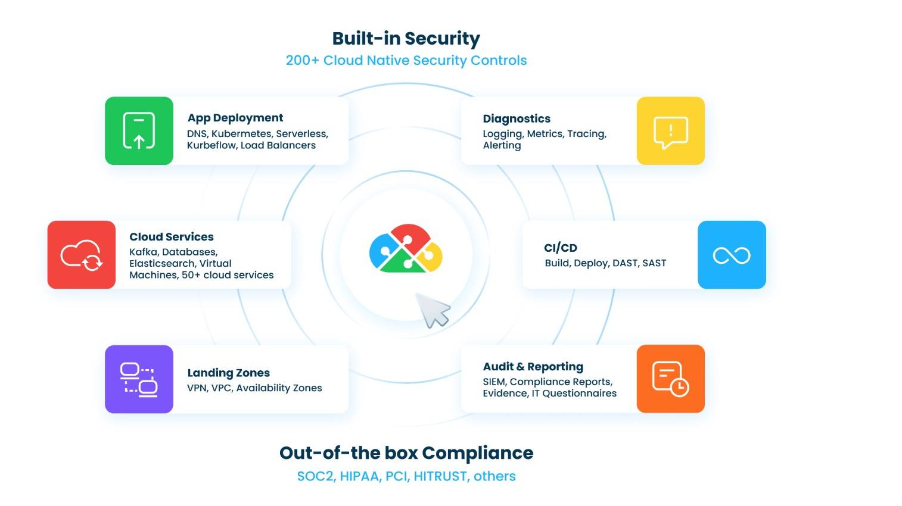

# Overview

### [View all Roadmaps](https://github.com/nholuongut/all-roadmaps) &nbsp;&middot;&nbsp; [Best Practices](https://github.com/nholuongut/all-roadmaps/blob/main/public/best-practices/) &nbsp;&middot;&nbsp; [Questions](https://www.linkedin.com/in/nholuong/)
 

This is a cloud infrastructure automation platform that enables developer self-service with built-in security and compliance for organizations hosting public cloud infrastructure.

You provide high-level application specifications, including cloud services, application containers, packages and configurations, interconnectivity, requirements for multiple environments, and scoped compliance standards. nholuongut uses these specifications to auto-generate required lower-level configurations, provisioning them securely and compliantly while maintaining ongoing operations.

Further protection is supplied by the nholuongut Tenant, an isolated workspace that acts as an additional isolation layer, ideal for segregating production workloads or creating extensible developer sandboxes. A Tenant’s architecture is abstracted from its underlying Infrastructure, and you can create as many Tenants as you need with no degradation in performance.

In addition, nholuongut facilitates logging, monitoring, alerting, and reporting. The following figure shows the platform's various functions.

The customer interfaces with nholuongut via the browser UI, the nholuongut Terraform provider, and API calls while the data and configuration stay within the customer's cloud account. All configurations created and applied by nholuongut can be reviewed and edited in the customer's cloud account.

## 🚀 I'm are always open to your feedback🇻🇳🇻🇳🇻🇳🇻🇳🇻🇳🇻🇳🇻🇳🇻🇳🇻🇳🇻🇳🇻🇳🇻🇳🇻🇳🇻🇳🇻🇳🇻🇳

# **[Contact Me🇻🇳🇻🇳🇻🇳🇻🇳🇻🇳🇻🇳🇻🇳]**
* [Name: Nho Luong]
* [Skype](luongutnho_skype)
* [Github](https://github.com/nholuongut/)
* [Linkedin](https://www.linkedin.com/in/nholuong/)
* [Email Address](luongutnho@hotmail.com)
* [PayPal.Me](https://www.paypal.com/paypalme/nholuongut)

# License🇻🇳🇻🇳🇻🇳🇻🇳🇻🇳🇻🇳🇻🇳🇻🇳
* Nho Luong (c). All Rights Reserved.🌟
