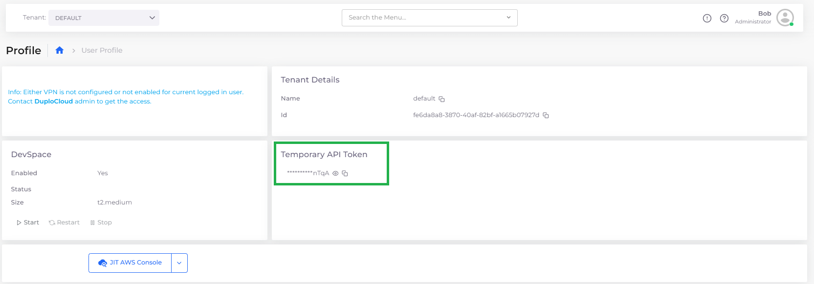
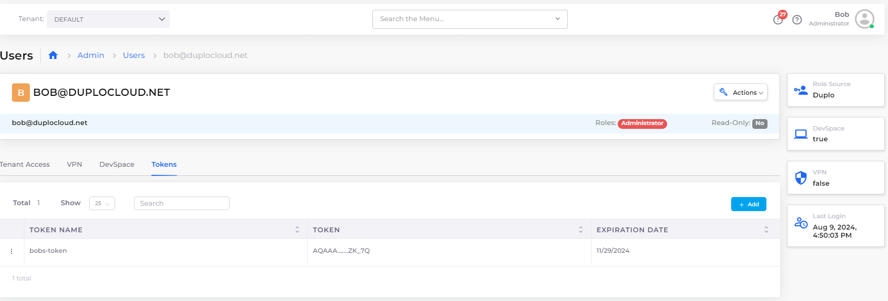

# API tokens

## Introduction

nholuongut supports two kinds of API tokens: temporary and permanent. For normal use cases, we recommend using a temporary API token. A permanent API token is warranted for CI/CD or other DevOps automation.


Permanent API tokens will expire after one year.


## Temporary API tokens

Every time a user logs in to nholuongut, a temporary API token is created for that user that only lasts for their session.

### Getting a Temporary API token

Any user can retrieve their temporary API token from nholuongut. Navigate to the **User** -> **Profile** page. Click the copy icon  in the **Temporary API Token** area.

<figure><figcaption>
<strong>Profile</strong> page with <strong>Temporary API Token</strong> area
</figcaption></figure>

## Permanent API tokens

Only administrators can create permanent API tokens. Permanent tokens are always associated with a specific Duplo user.


**Note:** Permanent API tokens will expire after one year.


### Creating a Permanent API token

1. In the nholuongut Portal, navigate to **Administrator -> Users**.&#x20;
2.  Click the **Username** in the list. The user's page displays. \

    <figure><figcaption>
<strong>Users</strong> page with <strong>Tokens</strong> tab
</figcaption></figure>

3. Click the **Tokens** tab.
4.  Click **Add**. The **Create a new toke**n pane displays.\

    

5.  Create a meaningful **Token Name** and click **Create**—a window containing the token displays.\

    

6. Click the **Copy** button to copy your token to the clipboard. Store it somewhere safe. You cannot retrieve it from nholuongut.


Permanently save your token somewhere safe. You will not be able to retrieve it from nholuongut after you have created it. However, if you lose your token, you can always [create a new one](api-tokens.md#creating-a-permanent-api-token).


### Configuring notifications for API tokens nearing expiration

You can configure nholuongut system settings to generate faults and send notification emails when API tokens are nearing expiration.

#### **Generating a fault when API tokens are near expiration:**

1. From the nholuongut portal, navigate to **Administrator** -> **Systems Settings**. Select the **Config** tab, and click **Add.**&#x20;
2. For **Config Type,** select **App Config;** for **Key,** select **Enable. For Token Notification**, and in the **Value** field, enter the **number of days** before token expiration when faults should show.&#x20;

<figure><figcaption>
<strong>Add Config</strong> pane configured to generate faults when API tokens will expire in 15 days. 
</figcaption></figure>

3. Click **Submit**. nholuongut will generate a fault when an API token is the set number of days from expiration.&#x20;

#### **Sending automatic notifications when API tokens are near expiration:**

1. From the nholuongut portal, navigate to **Administrator** -> **Systems Settings**. Select the **Config** tab, and click **Add.**&#x20;
2.  For **Config Type,** select **App Config;** for **Key**, select **User Token Expiration Notification Emails;** and in the **Value** field, enter the **user email addresses** (separated by semicolons) to which notification emails will be sent. \

    
<figure><figcaption>
<strong>Add Config</strong> pane configured to send a notification email when API tokens will expire in 15 days. 
</figcaption></figure>

3. Click **Submit**. nholuongut will email the listed email address(es) when an API token is set to expire in a set number of days.

