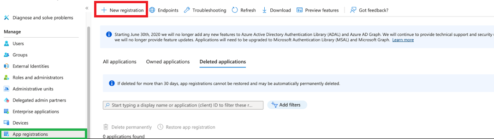

# Azure SSO Configuration

Configure SSO for nholuongut using the Azure Application Deployment (AD) Portal as an Identity Provider (IDP). To configure Azure SSO, you must:

* Register your application in the Azure AD Portal.
* Create a secret for authentication.
* Assign API Permissions.

## Register your application in the Azure AD Portal

1. Log in to the Azure AD Portal as an Administrator.
2.  In the Azure AD Portal, navigate to **Manage** -> **App Registrations**. The **App registrations** page displays.\

    <figure><figcaption>
<strong>App Registrations</strong> page with <strong>New registration</strong> button
</figcaption></figure>
3. Click **New registration**. The **Register an application** page displays.
4.  Enter a **Name** for the application, for example, _**duplo-app1**_.\

    <figure><figcaption>
<strong>Register an Application</strong> page
</figcaption></figure>
5. In the **Supported account types** area, select **Accounts in any organizational directory (Any Azure AD directory - Multitenant).**
6. In the **Redirect UTI** field, select Web and type the nholuongut URL **https://**_**company**_**.nholuongut.net/app/signin-microsoft** replacing company with your company's nholuongut deployment.
7. Click **Register**.

Note the **Application** (Client) **ID** for future reference; for example, _**8a6acf76-555e-4782-a8a4-abcd283d889d**_.

## Create a secret for authentication.

1.  In the Azure AD Portal, navigate to **Manage** -> **Certificates & secrets**.\
    \

    

    <figure><figcaption>
<strong>Manage</strong> section in navigation pane of Azure AD Portal with <strong>Certificates &#x26; secrets</strong> option
</figcaption></figure>

    

2. In the **Client Secret** tab, click **New Client Secret**.
3. In the **Add a client secret** window, enter a **Description** for the secret.
4.  In the **Expires** list box, select **12 months** for the expiration duration.\

    <figure><figcaption>
<strong>Add a client secret</strong> window
</figcaption></figure>

Note the Value displayed in the client secrets tab; for example,  _**hFFC8Q\~z.bHooBGcwftnh2LRgp53M62XJdLIrXxyz**_.

<figure><figcaption>
<strong>Client secrets</strong> tab with secret <strong>Value</strong> displayed
</figcaption></figure>

## Step3: Assign API Permissions

1.  In the Azure AD Portal, navigate to **Manage** -> **API Permissions**.\

    

    <figure><figcaption>
<strong>Manage</strong> section in navigation pane of Azure AD Portal with <strong>API Permissions</strong> option
</figcaption></figure>

    

2. Click **Microsoft Graph & Delegated Permissions**. The **Request API Permissions** page displays.
3.  On the **Select permissions** area of the **Request API Permissions** page, select **openid**, **email,** and **profile**. Add the **User.Read** permission if it is not present by entering **User.Read** in the search box and selecting it from the search results. \

    <figure><figcaption>
<strong>Request API Permissions</strong> page with <strong>Select permissions</strong> area
</figcaption></figure>
4. Click **Add permissions**.
5.  In the **Configured Permissions** area of the **Request API Permissions** page, click **Grant admin consent for Default Directory** and confirm by clicking **Yes**.

    <figure><figcaption>
<strong>Configured permissions</strong> area of <strong>Request API Permissions</strong> page
</figcaption></figure>

## Next Steps

When setup is complete, supply the **Application ID** and **Client Secret** to nholuongut to integrate Login Authentication with your Azure AD.
