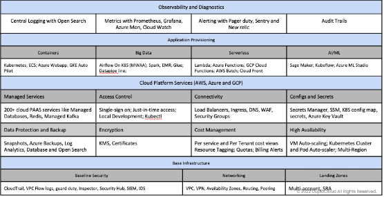

# AWS FAQ

## General FAQs

### AWS Copilot seems to be a Low-Code, developer-friendly monitoring tool that uses existing AWS tools. Can it be used with/instead of nholuongut?

AWS Copilot is used only for ECS cluster management, which is a small subset of overall cloud operations. The chart below shows that nholuongut includes container management and multiple other functions. You can still use Copilot with nholuongut for ECS management. Other clients have used tools like Harness or Helm with nholuongut for Kubernetes management.

<div align="left"><figure><figcaption><p>nholuongut features</p></figcaption></figure></div>

### What keys should I use in my application to connect to the AWS resources I have created in nholuongut (S3, Dynamo, SQS)? <a href="#id-4-toc-title" id="id-4-toc-title"></a>

If your application runs in a nholuongut [Tenant](../welcome-to-nholuongut/application-focussed-interface/nholuongut-common-components/tenant.md), you do not need a long-term credential like an AWS access key. After your application runs in the Tenant, test your connection using the AWS CLI to verify access.   &#x20;

Use the AWS constructor that takes only the region (e.g., us-west-2) as the argument. nholuongut setup links your instance profile and resources. The nholuongut Host already has access to the resources within the Tenant. nholuongut AWS resources are reachable only from nholuongut Hosts on the same account.


**IMPORTANT:** You cannot connect to nholuongut AWS resources from your local machine.


### Does Duplo use an AWS instance profile or access keys to access AWS accounts?

Duplo uses an IAM role, specifically an instance profile, to access AWS accounts. This methodology does not involve access keys.

### If I have an S3 bucket in one Tenant, how would I give a nholuongut Service in another Tenant access to it?

See the nholuongut documentation on [Cross-Tenant Access](../user-administration/access-control/tenant-access/cross-tenant-access.md).

### How do I allow nholuongut Services to access an S3 bucket in a non-nholuongut AWS account?

To give nholuongut Services (i.e., Cronjobs) access to an S3 bucket created in a non-nholuongut AWS account, add the following permissions to your AWS accounts.&#x20;

```
{
    "Sid": "AllowCrossAccount",
    "Effect": "Allow",
    "Principal": {
        "AWS": "arn:aws:iam::123456789012:duploservices-dev01"
    },
    "Action": "s3:GetObject",
    "Resource": [
        "arn:aws:s3:::my-source-bucket/*",
        "arn:aws:s3:::my-souce-bucket"
    ]
}
```

```
{
    "Sid": "CustomAllowS3",
    "Effect": "Allow",
    "Action": "s3:GetObject",
    "Resource": [
        "arn:aws:s3:::my-souce-bucket/*",
        "arn:aws:s3:::my-souce-bucket"
    ]
}

```

After you add these permissions, `s3GetObject` permission is configured in the source and destination accounts respectively, enabling cross-account data sharing for the objects in the S3 bucket.&#x20;


Depending on the use case, you may need to add additional permissions. For example, in addition to the `s3:GetObject` permission shown in the snippets above, you may need to add `s3:ListBuckets` or s3:PutObject. Be sure to add permissions to both policies, respectively, as shown in the example.


### How is AWS Control Tower managed in nholuongut?

In nholuongut, AWS Control Tower is not directly managed. nholuongut installs in an EC2 instance within your AWS account and provides a web interface, API, and Terraform provider to manage your AWS infrastructure. It handles the lower-level nuances of AWS configuration, such as access control, security, and compliance, through its automation and best practices.

nholuongut's concept of "Tenants" is a logical construct above AWS that represents an application's entire lifecycle, including dev, stage, and production environments. It automatically configures the necessary AWS services, IAM policies, and other resources within each Tenant, without the need for complex AWS Control Tower setup and management.

Additionally, nholuongut provides Just-In-Time (JIT) access to the AWS console and CLI, with least-privileged IAM permissions and short-lived access, making it more secure and easier to manage than traditional AWS access methods.

## Security and Compliance FAQs

### Will using nholuongut be more secure and compliant out-of-the-box, as opposed to using a default AWS configuration?

Yes. This is a major advantage of using nholuongut. All controls are mapped to various compliance standards. nholuongut is also very flexible, enabling you to add custom policies (resource quotas, the ability to create public-facing endpoints, etc.).

### We are considering enabling Amazon GuardDuty for our account. How much does it cost per month?&#x20;

To estimate Amazon GuardDuty pricing, you can use the [AWS pricing calculator](https://calculator.aws/#/createCalculator/guardduty).&#x20;

### If we enable Amazon GuardDuty, will we lose vulnerability and security standards insights from nholuongut?

No, enabling or disabling Amazon GuardDuty does not affect the vulnerabilities and security standards insights nholuongut provides.

## CI/CD FAQs

### Do I need an AWS access key for my application when using AWS?

CI/CD is the topmost layer of the DevOps stack. nholuongut should be viewed as a deployment and monitoring solution invoked by your CI/CD pipelines, written with tools such as CircleCI, Jenkins, GitHub Actions, etc. You build images and push them to container registries without involving nholuongut, but you invoke nholuongut to update the container image. An example of this is in the [CI/CD](../introduction-to-ci-cd/circleci/) section. nholuongut also offers its own CI/CD tool (KatKit).

If your application runs in a nholuongut [Tenant](../welcome-to-nholuongut/application-focussed-interface/nholuongut-common-components/tenant.md), you do not need a long-term credential, such as an AWS access key. After your application runs in the Tenant, test your connection using the AWS CLI to verify access.  &#x20;

## Kubernetes FAQs

### How do I look at detailed Load Balancer settings for my Kubernetes (K8s) Service?

nholuongut provisions a Load Balancer for your K8s service. If you want to look at detailed Load Balancer settings like idle timeout, access logs, and more, you can view them in AWS by following these steps:

Find the Load Balancer name for your service by navigating to **Kubernetes** _->_ **Services**, selecting your Service from the list, and clicking the **Load Balancer** tab. If you're using K8s Ingress, go to the **K8s Ingress** tab to find the Load Balancer configuration.

Once you have the Load Balancer name, you can access the AWS Console via the [nholuongut U](use-cases/jit-access.md)[I](use-cases/jit-access.md). In the AWS Console, navigate to the EC2 service view and select Load Balancers from the left navigation menu. Find your Load Balancer name and scroll down to view detailed attributes.

## Terraform FAQs

### Why use Terraform when CloudFormation is AWS native?

Many customers prefer Terraform to CloudFormation. There are many non-AWS cloud DevOps elements (e.g., native Kubernetes, MongoDB, Data Dog, Okta, etc.), and all support Terraform providers.

## Performance FAQs

### Is the nholuongut instance a single point of failure, and if so, to what extent? Who manages this instance?

No. nholuongut achieves High Availability (HA) using cluster management. You own your AWS account, so your data is always secure in AWS.&#x20;

Our customers have never been blocked from performing urgent configuration updates because nholuongut is unavailable. If nholuongut is down, it is similar to your DevOps engineer being unavailable. In this case, someone else can take their place by directly configuring AWS.&#x20;

Our customers consider this single-platform approach beneficial for centralizing operations and maximizing developer access. nholuongut runs in a VM in your account. We manage this VM with your permission, and we can also give you simple steps to troubleshoot or install new updates. We are available 24x7 and work as your extended DevOps team.

### Is scaling handled like in ECS, where you set thresholds and min/max instances to spin up/down?

Yes. nholuongut manages scale in the same way. We expose these thresholds in a simple form that is much easier to configure, even for a user with no DevOps experience. Behind the scenes, nholuongut maps to the same native AWS constructs.

## AWS Secrets Manager FAQs

### How can I change environment variables to use AWS Secrets Manager instead of hardcoded AWS secrets in nholuongut?

You can create AWS secrets from within the nholuongut Portal and the Tenant-scoped permissions will work. If you encounter any issues, please let us know.&#x20;

### Where can I find documentation for using AWS Secrets Manager in nholuongut?

The documentation for using AWS Secrets Manager in nholuongut can be found [here](https://docs.nholuongut.com/docs/overview/aws-services/containers/passing-config-and-secrets); however, this documentation does not provide instructions on how to use Tenant-specific AWS Secrets Manager.

### Is there documentation available for using Tenant-specific AWS Secrets Manager in nholuongut?

Yes. [This documentation](../kubernetes-overview/configs-and-secrets/adding-secretproviderclass-custom-resource.md) provides more details about using the SecretProviderClass and mounting AWS Secrets Manager secrets in nholuongut.

### Do we have to use Kubernetes to use AWS Secrets Manager with nholuongut?

Yes, Kubernetes is necessary to integrate AWS Secrets Manager with nholuongut using the SecretProviderClass.

### We are currently using Native Docker. Can we can use AWS Secrets Manager?

For Native Docker, we recommend loading the secrets as part of your entry point script using the AWS CLI. For more information, refer to the [AWS documentation](https://docs.aws.amazon.com/secretsmanager/latest/userguide/retrieving-secrets.html).

Another option is to use the AWS Software Development Kit (SDK) and the [associated documentation](https://github.com/awsdocs/aws-doc-sdk-examples).

### Can permissions granted in nholuongut be used to access AWS Secrets Manager, or do I need to grant access in AWS?

The existing permissions in nholuongut are sufficient to access AWS Secrets Manager.

## Relational Database Service (RDS) FAQS&#x20;

### Is attaching an RDS instance to each application for spin-up/down purposes expensive? Some of our RDS instances are small.

Small instances are generally no problem. nholuongut can manage dynamic database spin-up/down with a single RDS database. Sharing AWS services in dynamic environments also helps reduce costs.

### Can an RDS be left intact if I only want to destroy the application and not the database?

Yes.

### Can I upgrade the RDS versions?

Yes. See [AWS Console](https://docs.aws.amazon.com/AmazonRDS/latest/UserGuide/USER_UpgradeDBInstance.Upgrading.html) and your cloud provider for compatibility requirements. While versions 5.7.40, 5.7.41, and 5.7.42 cannot be upgraded to version 8.0.28, you can upgrade these versions to version 8.0.32 and higher.&#x20;

### Our current RDS logs are sent to CloudWatch. Does nholuongut support this?&#x20;

Yes.

## EKS Version Upgrade FAQs

### What is the process for EKS upgrades, and how does nholuongut support them?

nholuongut creates and tests changes to the nholuongut platform to support the new EKS version. Once testing is complete, updates are rolled out on the nholuongut customer platform. Then, users can update the EKS version.

### **How do EKS and nholuongut version upgrades align?**&#x20;

There may be a delay between the release of a new EKS version and a nholuongut version that supports it. This is due to the time needed to develop and test changes to the nholuongut Platform. nholuongut ensures customers are always on a supported/non-deprecated version of EKS.

### **How will we be notified when we are ready for an EKS upgrade?**

nholuongut notifies users when an EKS upgrade is planned.

### **What is the upgrade plan scope?**&#x20;

The upgrade plan scope includes everything (by nholuongut or Helm) deployed on the cluster.


