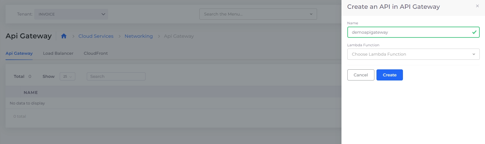

# API Gateway

## Creating an AWS API Gateway REST API

To create an AWS API Gateway using a REST API from the nholuongut Portal, navigate to **Cloud Services** -> **Networking**, and click **Add** on the **Api Gateway** tab. The REST API generates security policies that make the API Gateway accessible to other resources (like Lambda functions) within the Tenant. After the REST API has been created in the nholuongut Portal, all other configurations (e.g., defining methods and resources or pointing to lambda functions) should be done in the AWS Console. The console can be reached from the nholuongut Portal by navigating to **Cloud Services** -> **Networking**, selecting the **Api Gateway** tab, and clicking the **Console** button under the **Actions** menu.&#x20;

<figure><figcaption>
The <strong>Create an API Gateway pane</strong> showing integration of API Gateway and a lambda function
</figcaption></figure>

## Enable local-development access to private AWS API Gateway instances

Make private AWS API Gateway instances (associated with VPC endpoints) accessible from your machines by constructing a URL, as shown below. Replace _**REST\_API\_ID**_ with your API Gateway instance's unique identifier (API ID), _**VPCE\_ID**_ with your VPC Endpoint ID (VPCE ID), _**REGION**_ with the specified AWS region, and STAGE with the development stage (e.g., `prod`, `dev`, `test`).

\
`https://{`_**`REST_API_ID`**_`}-{`_**`VPCE_ID`**_`}.execute-api.{`_**`REGION`**_`}.amazonaws.com/{`_**`STAGE`**_`}`\

The resulting URL will point to the specific API Gateway instance associated with the API ID and VPC Endpoint ID in the specified AWS region and stage. With this URL, you can make requests over the default open VPN to the private API Gateway.&#x20;
