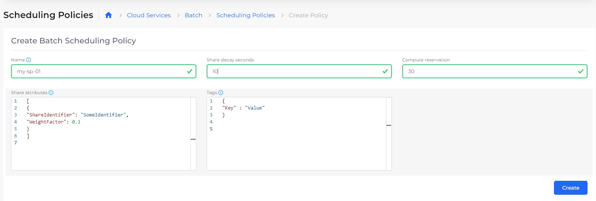
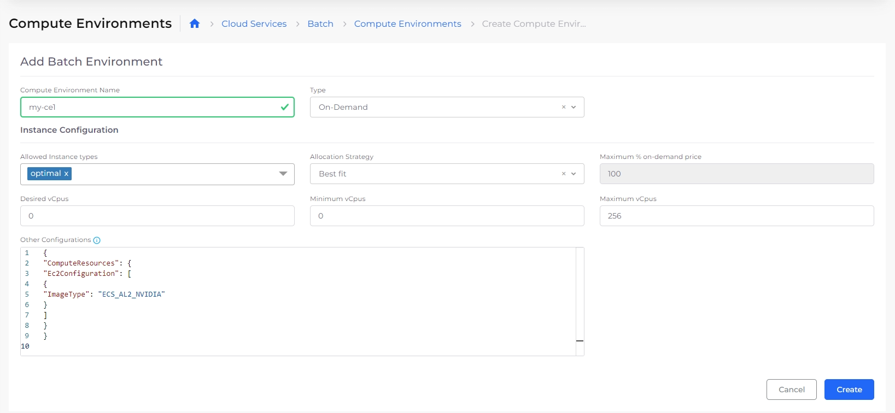
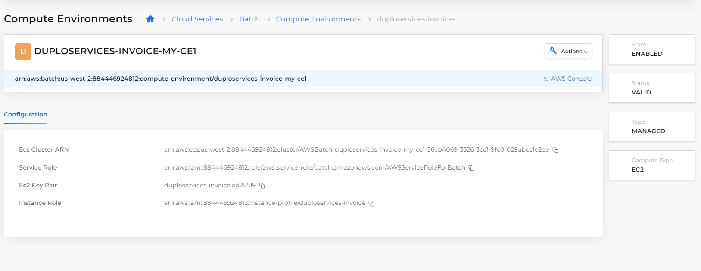
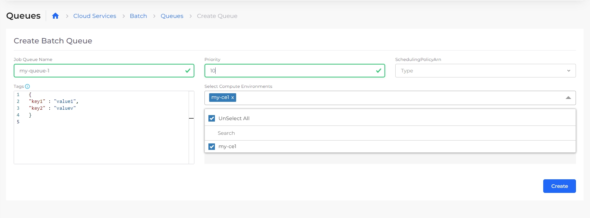
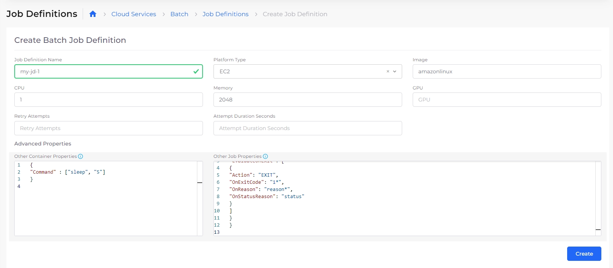
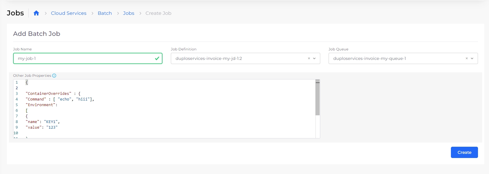
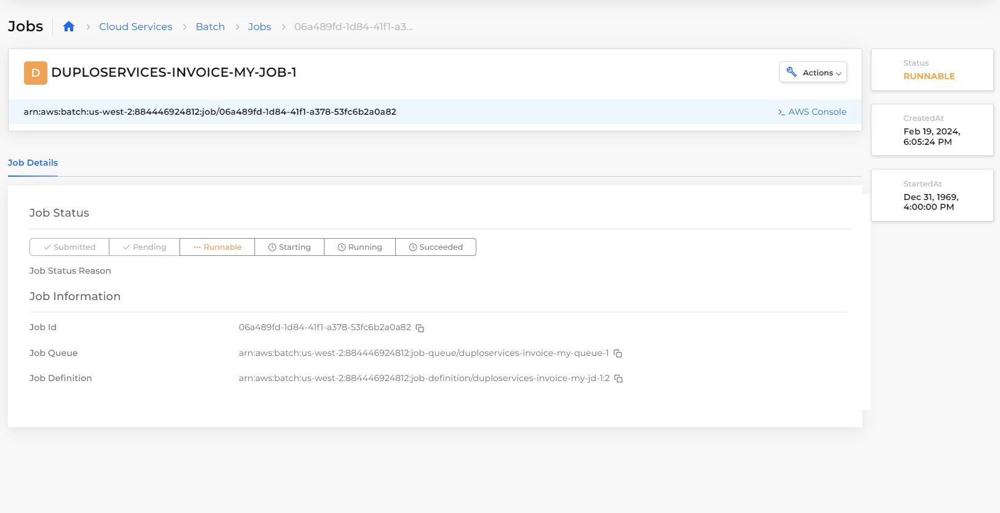

# Batch

You can perform [AWS batch job](https://docs.aws.amazon.com/batch/latest/userguide/jobs.html) processing directly in the nholuongut Portal without the additional overhead of installed software, allowing you to focus on analyzing results and diagnosing problems.

## Step 1: Create batch job scheduling policies (optional)&#x20;

Create scheduling policies to define when your batch job runs.&#x20;

1. From the nholuongut Portal, navigate to **Cloud Services** -> **Batch** page, and click the **Scheduling Policies** tab.
2. Click **Add**. The **Create Batch Scheduling Policy** page displays.
3.  Create batch job scheduling policies using the [AWS documentation](https://docs.aws.amazon.com/batch/latest/userguide/scheduling-policies.html). The fields in the AWS documentation map to the fields on the nholuongut **Create Batch Scheduling Policy** page.\


    <figure><figcaption><p>The <strong>Create Batch Scheduling Policy</strong> page in the nholuongut Portal</p></figcaption></figure>
4. Click **Create**.

## Step 2: Configure compute environments

[AWS compute environments](https://docs.aws.amazon.com/batch/latest/userguide/getting-started-eks.html#getting-started-eks-step-1) (Elastic Compute Cloud \[EC2] instances) map to nholuongut Infrastructures. The settings and constraints in the computing environment define how to configure and automatically launch the instance.

1. In the nholuongut Portal, navigate to **Cloud Services** -> **Batch**.&#x20;
2. Click the **Compute Environments** tab.
3. Click **Add**. The **Add Batch Environment** page displays.
4. In the **Compute Environment Name** field, enter a unique name for your environment.
5. From the **Type** list box, select the environment type (On-Demand, Spot, Fargate, etc.).
6.  Modify additional defaults on the page or add configuration parameters in the **Other Configurations** field, as needed. \


    <figure><figcaption><p>The <strong>Add Batch Environment</strong> page in the nholuongut Portal</p></figcaption></figure>
7. Click **Create**. The compute environment is created.&#x20;

<figure><figcaption><p>The <strong>Compute Environments</strong> window in the nholuongut Portal showing the configured environment. </p></figcaption></figure>

## Step 3: Create batch job queues

After you define job definitions, create queues for your batch jobs to run in. For more information, see the [AWS instructions for creating a job queue](https://docs.aws.amazon.com/batch/latest/userguide/create-job-queue-ec2.html).

1. From the nholuongut Portal, navigate to **Cloud Services** -> **Batch** page, and click the **Queues** tab.
2.  Click **Add**. The **Create Batch Queue** page displays.\


    <figure><figcaption><p>The AWS Batch <strong>Create Batch Queue</strong> page in the nholuongut Portal.</p></figcaption></figure>
3. Create batch job queues using the [AWS documentation](https://docs.aws.amazon.com/batch/latest/userguide/job\_queues.html). The fields in the AWS documentation map to the fields on the nholuongut **Create Batch Queue** page.
4. Click **Create**. The batch queue is created.&#x20;


In the **Priority** field, enter a whole number. Job queues with a higher priority number are run before those with a lower priority number in the same compute environment.&#x20;


## Step 4: Create batch job definitions

Before you can run AWS batch jobs, you need to create job definitions specifying how batch jobs are run.

1. From the nholuongut Portal, navigate to **Cloud Services** -> **Batch**, and click the **Job Definitions** tab.
2.  Click **Add**. The **Create** **Batch Job Definition** page displays.\


    <figure><figcaption><p>The <strong>Create Batch Job Definition</strong> page in the nholuongut Portal.</p></figcaption></figure>
3. Define your batch jobs using the [AWS documentation](https://docs.aws.amazon.com/batch/latest/userguide/job\_definitions.html). The fields in the AWS documentation map to the fields on the nholuongut **Create Batch Job Definition** page.
4.  Click **Create**. The batch job definition is created. \


    <figure><figcaption><p>The <strong>Batch Job Definition</strong> configuration is shown in the nholuongut Portal.</p></figcaption></figure>

## Step 5: Create a batch job

Add a job for AWS batch processing. See the [AWS documentation](https://docs.aws.amazon.com/batch/latest/userguide/jobs.html) for more information about batch jobs.

1. After you [configure your compute environment](batch.md#configuring-compute-environments), navigate to **Cloud Services** -> **Batch** and click the **Jobs** tab.&#x20;
2.  Click **Add**. The **Add Batch Job** page displays.\


    <figure><figcaption><p>The <strong>Add Batch Job</strong> page in the nholuongut Portal.</p></figcaption></figure>
3. On the **Add Batch Job** page, fill the **Job Name**, **Job Definition**, **Job Queue**, and **Job Properties** fields.
4. Optionally, if you created a [scheduling policy](batch.md#step-1-create-batch-job-scheduling-policies-optional) to apply to this job, paste the [YAML code below](batch.md#applying-a-scheduling-policy-to-a-batch-job-optional) into the **Other Properties** field.&#x20;
5. Click **Create**. The batch job is created.&#x20;

## Create a batch job with a scheduling policy (optional)

As you [create a batch job](batch.md#step-5-create-a-batch-job), paste the following YAML code into the **Other Properties** field on the **Add Batch Job** page. Replace the scheduling priority override value ("1" in this example) with an integer representing the job's scheduling priority, and replace SHARE\_IDENTIFIER with the job's share identifier. For more information, see the [AWS documentation](https://docs.aws.amazon.com/cli/latest/reference/batch/submit-job.html).&#x20;

```yaml
  {    

    "schedulingpriorityoverride": 1,

    "ShareIdentifier": "SHARE_IDENTIFIER"

}
```

## View batch jobs

Navigate from the nholuongut Portal to **Cloud Services** -> **Batch**, and click the **Jobs** tab. The jobs list displays.&#x20;

<figure><figcaption><p>The <strong>Job</strong> list shows the <strong>Batch Job</strong> in the nholuongut Portal. </p></figcaption></figure>

Click the name of the job to view job details such as job status, ID, queue, and definition.&#x20;

<figure><figcaption><p>The <strong>Jobs</strong> window shows the running batch job in the nholuongut Portal.</p></figcaption></figure>

## Run AWS batch jobs

Use the [AWS Best Practices Guide](https://docs.aws.amazon.com/batch/latest/userguide/best-practices.html) for information about running your AWS batch jobs.
