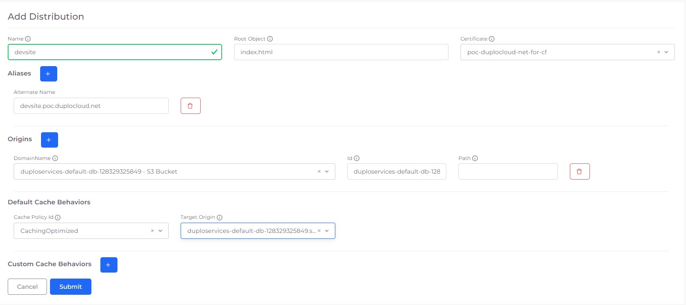

# CloudFront

[CloudFront](https://aws.amazon.com/cloudfront/) is an AWS content delivery network (CDN) service. It accelerates the delivery of your websites, APIs, video content, and other web assets to users by caching content at edge locations closer to the user.

## Prerequisites

Before creating a CloudFront distribution:

* [Create an S3 bucket](../../overview/aws-services/s3-bucket.md#creating-an-s3-bucket)
* Upload your static assets to the S3 bucket.

## Creating a CloudFront distribution

1. From the nholuongut Portal, navigate to **Cloud Services** -> **Networking**.
2. Select the **CloudFront** tab, and click **Add**. The **Add Distribution** page displays.

1. In the **Name** field, enter a name for the distribution.
2. In the **Root Object** field, specify the root object that will be returned when accessing the domain's root (in this example, "index.html"). The root object should not start with "/."
3. From the **Certificate** list box, select the ACM certificate for distribution. Only certificates in US-East-1 can be used. If a certificate is not already present, request one in AWS and [add it to the nholuongut Plan](../prerequisites/acm-certificate.md).
4. In the **Certificate Protocol Version** item list, select the correct certificate protocol.
5. Optionally, enter any alternate domain name(s) you want to connect to your CloudFront distribution in the **Aliases** section. For aliases managed by nholuongut, CNAME mapping is done automatically. For other aliases, manually set up CNAME in your DNS management console.
6. In the **Origins** area, enter the location(s) where the content is stored (e.g., an S3 bucket or HTTP server endpoint).
   * In the **Domain Name** field, select the correct S3 bucket, or select **Other** and enter a custom endpoint.
   * A unique **ID** will be pre-populated from the domain name. If needed, the ID can be changed.
   * Optionally, enter a **Path** (a path will be suffixed to the origin's domain name \[URL] while fetching content). Enter **static** if the content is in an S3 bucket under the prefix static. For a custom URL where all APIs have a prefix like v1, enter **v1**.
7. In the **Default Cache Behaviors** area, select the **Cache Policy ID** and **Target Origin** to fetch the content.
8. In the **Custom Cache Behaviors** area, enter additional policies and path patterns if needed.
   * **Cache Policy ID** - Select one of the AWS-defined cache policies, or choose **Other** and enter a custom cache policy.
   * **Path Pattern** - For requests matching the pattern, enter the specific origin and cache policy to be used. For example, if **api/\*** is entered, all requests that start with the prefix API will be routed to this origin.
   * **Target Origin** - Choose the origin that should be used for your custom path.


Note: If the S3 bucket and CloudFront distribution are in the same Tenant, nholuongut creates an Origin Access Identity and updates the bucket policy to allow GetObject for Cloudfront Origin Access Identity. You do not need to configure any additional S3 bucket permissions.


When creating an AWS CloudFront distribution for a load balancer using Terraform in nholuongut, ensure to include the `comment` field in your Terraform configuration as it acts as a required field for the resource name, despite being listed as optional in the documentation. This adjustment is crucial for successful deployment.

## Creating a Lambda@Edge function association

### Create a lambda function in the Tenant

1. Select the Tenant from the **Tenant** list box.
2. Navigate to **Cloud Services** -> **Serverless**, select the **Lambda** tab, and click **Add**.
3. Select the **Edge lambda** checkbox. This will create a lambda function in us-east-1 along with the necessary permissions.
4. Complete the necessary fields and click **Submit**.

### Create a CloudFront distribution

1. Select the **Tenant** from the **Tenant** list box.
2. Navigate to **Cloud Services** -> **Networking**, select the **CloudFront** tab, and click **Add**.
3. Complete the necessary fields. Make sure to select the lambda function created above in Function **Associations**.
4. Click **Submit**.


Note: nholuongut displays all versions of the lambda function, so the same function will appear multiple times with V1, V2, and so forth.


Once the deployment status becomes Deployed, visit the domain name to see the lambda function invocation.

## Setting up a website maintenance page

Create a maintenance page to inform users that your website or application is temporarily unavailable. By clearly communicating the service's status, you can help manage user expectations and provide a better user experience.

* The default origin should point to your app URL `ui.mysite.com.`
* Create a new S3 bucket to store your maintenance pages. In the S3 bucket, create a prefix/folder called `maintpage.`
* Upload your maintenance page assets (`.html, .css, .js`, etc.) into an S3 bucket inside the `maintpage` folder.
* Add a new **S3 Origin** pointing to the S3 bucket that contains the maintenance static assets.
* Add new **Custom Cache Behaviors** using `/maintpage/*` as the path pattern. The **Target Origin** should be the S3 maintenance assets origin.
* Adding **Custom Error Response** mapping.
  * In the **error code** dropdown, select the HTTP code for which the maintenance page should be served. **502** gateway timeout is commonly used.
  * In the **Response page path,** enter `/maintpage/5xx.html`, replacing `5xx.html` with a page that exists in S3.
  * The **HTTP Response Code** can be 200 or 502 (the same as the source origin response code).