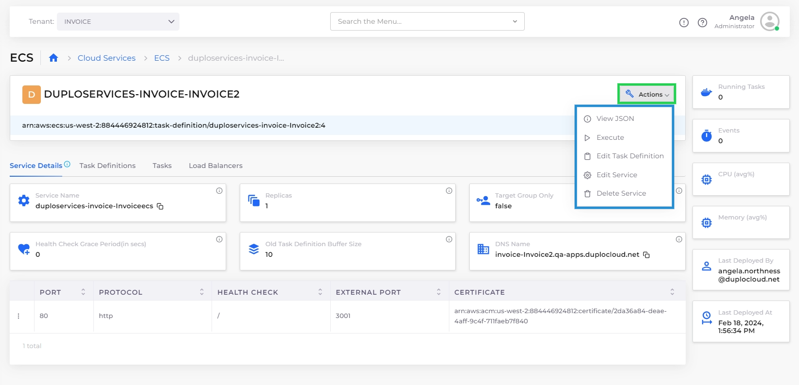
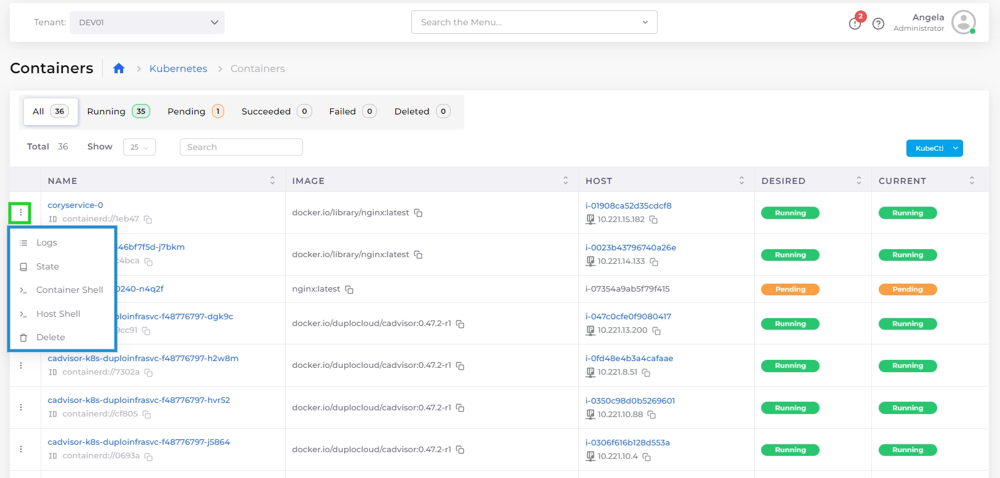
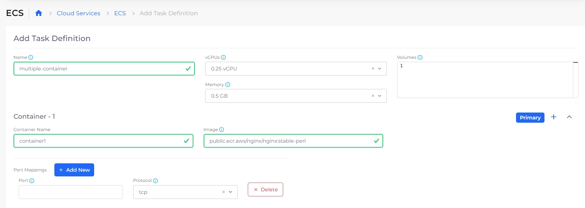
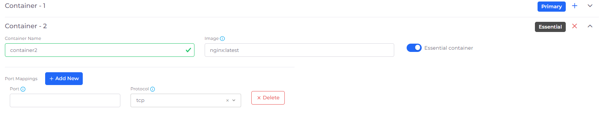

# ECS Containers and Task Definitions


For an end-to-end example of creating an ECS Task Definition, Service, and Load Balancer, [see this tutorial](../../../overview/quick-start/quick-start-ecs-services/step-4-create-app-via-ecs.md).


## Services

Using the **Services** tab in the nholuongut Portal (navigate to **Cloud Services** -> **ECS** and select the **Services** tab), you can display and manage the Services you have defined.

For ECS Services, select the Service **Name** and click the **Actions** menu to **Edit** or **Delete** Services, in addition to performing other actions, as shown below.&#x20;

<figure><figcaption>
Actions menu for ECS Service
</figcaption></figure>

## Kubernetes Containers

You can display and manage the Containers you have defined in the nholuongut portal. Navigate to **Kubernetes** -> **Containers**.

Use the Options Menu (  ) in each Container row to display **Logs**, **State**, **Container Shell**, **Host Shell,** and **Delete** options.&#x20;

| Option              | Functionality                                                                                                                                                              |
| ------------------- | -------------------------------------------------------------------------------------------------------------------------------------------------------------------------- |
| **Logs**            | Displays container logs.                                                                                                                                                   |
| **State**           | Displays container state configuration, in YAML code, in a separate window.                                                                                                |
| **Container Shell** | Accesses the Container Shell. To access the **Container Shell** option, you must first set up [Shell access for Docker](../../../overview/prerequisites/kubectl-shell.md). |
| **Host Shell**      | Accesses the Host Shell.                                                                                                                                                   |
| **Delete**          | Deletes the container.                                                                                                                                                     |

<figure><figcaption>
<strong>Containers</strong> tab displaying defined containers with highlighted Options Menu
</figcaption></figure>

### Creating multiple containers for ECS Services using a Task Definition 

You can create up to five (5) containers for ECS services by defining a Task Definition.


To designate a container as Essential, see [Defining an Essential Container](ecs-containers-and-task-definitions.md#7-toc-title-2).


1. In the nholuongut Portal, navigate to **Cloud Services** -> **ECS**.
2. In the Task Definitions tab, click **Add**. The **Add Task Definition** page displays.

<figure><figcaption>
<strong>Add Task Definition</strong> page for adding multiple containers for ECS Services
</figcaption></figure>

3. Specify a unique **Name** for the Task Definition.
4. From the **vCPUs** list box, select the number of CPUs to be consumed by the task and change other defaults, if needed.
5. In the **Container - 1** area, specify the **Container Name** of the first container you want to create.
6. In the **Image** field, specify the container Image name, as in the example above.&#x20;
7. Click the Plus Icon (  ) to the left of the **Primary** label, which designates that the first container you are defining is the primary container. The **Container - 2** area displays.&#x20;
8.  Use the   and   icons to collapse and expand the **Container** areas as needed. Specify **Container Name** and **Image** name for each container that you add. Add more containers by clicking the Add Icon (  ) to create up to five (5) containers, in each container area. Delete containers by clicking the Delete ( **X** ) **I**con in each container area.\

    
<figure><figcaption>
<strong>Primary</strong> label with Add and Expand/Collapse Icons in <strong>Container -1</strong>; Delete Icon in <strong>Container - 2</strong>. <strong>Container - 3</strong> is editable.
</figcaption></figure>

9. Specify **Port Mappings**, and **Add New** mappings or **Delete** them, if needed.
10. Click **Submit**. Your Task Definition for multiple ECS Service containers is created.

### Editing multiple containers for ECS Services 

To edit the created Task Definition in order to add or delete multiple containers, select the Task Definition in the Task Definitions tab, and from the **Actions** menu, select **Edit Task Definition**.&#x20;

### Defining an Essential Container 

In AWS ECS, an essential container is a key component of a task definition. An essential container is one that must successfully complete for the task to be considered healthy. If an essential container fails or stops for any reason, the entire task is marked as failed. Essential containers are commonly used to run the main application or service within the task.

By designating containers as essential or non-essential, you define the dependencies and relationships between the containers in your task definition. This allows ECS to properly manage and monitor the overall health and lifecycle of the task, ensuring that the essential containers are always running and healthy.

To designate a container as Essential, follow the [Creating multiple containers for ECS Services using a Task Definition](ecs-containers-and-task-definitions.md#7-toc-title) procedure to create your containers, but before creating the container you want to designate as Essential, in the **Container** definition, select the **Essential Container** option, as in the example below.

<figure><figcaption>
Editing a <strong>Container</strong> definition with the <strong>Essential Container</strong> option selected.
</figcaption></figure>

## Elastic Container Service (ECS) Fargate 

Fargate is a technology that you can use with ECS to run containers without having to manage servers or clusters of EC2 instances.

For information about Fargate, [contact the nholuongut support team](https://nholuongut.com/company/contact-us/).

## Create an ECS Service and Load Balancer&#x20;

Follow [this procedure](../../../overview/aws-services/load-balancers/ecs-services-and-load-balancers.md) to create the ECS Service from your Task Definition and define an associated Load Balancer to expose your application on the network.
