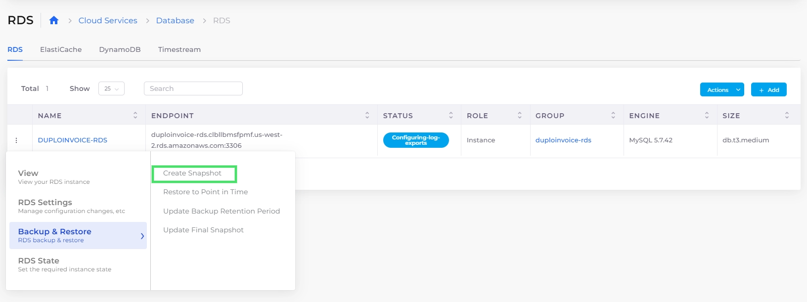
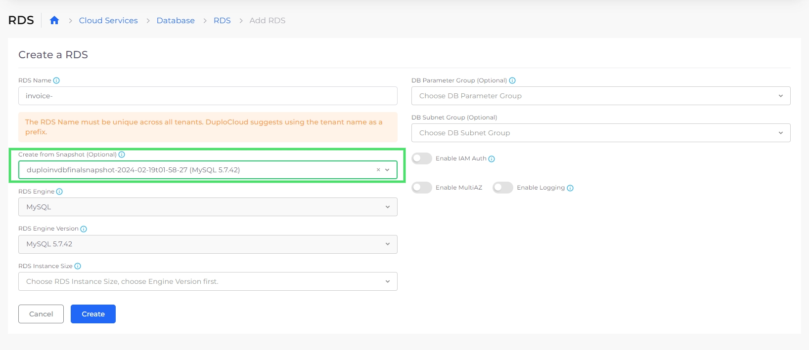
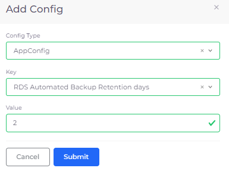

# Backup and restore

## Creating a snapshot 

Create a [snapshot ](https://docs.aws.amazon.com/AmazonRDS/latest/UserGuide/USER\_WorkingWithAutomatedBackups.html)of an RDS.

1. In the nholuongut Portal, navigate to **Cloud Services** -> **Database**.
2. In the **RDS** tab, in the row containing your RDS instance, click the **Actions** menu icon (  ) and select **Backup & Restore** -> **Create Snapshot**.&#x20;
3. **Confirm** the snapshot request. Once taken, the snapshot displays in the **Snapshot** tab.

<figure><figcaption>
<strong>RDS</strong> Tab with <strong>Actions</strong> menu for <strong>DUPLODEV01-DOCS</strong> instance with <strong>Create Snapshot</strong> option highlighted
</figcaption></figure>

## Restoring a snapshot 

Once backups are available, you can restore them on the next instance creation when you [create an RDS](./#0-toc-title).

<figure><figcaption>
<strong>Create a RDS</strong> page with <strong>Create from Snapshot</strong> option
</figcaption></figure>

## Restoring snapshots to a point in time

You can restore available RDS snapshots to a specific point in time.

1. In the nholuongut Portal, navigate to **Cloud Services** -> **Database**.
2. In the **RDS** tab, select an RDS instance containing [snapshots](backup-and-restore.md#0-toc-title).
3. Click the **Snapshots** tab.
4. Click the Actions menu and select **Backup & Restore** -> **Restore to Point in Time**. The **Restore Point in Time** pane displays.
5. In the **Target Name** field, append the RDS name to the prefilled _`TENANT_NAME`_ prefix.
6. Select either the **Last Restorable Time** or **Custom date and time** option. If you select the **Custom date and time** option, specify the date and time in the format indicated.
7. Click **Submit**. Your selected RDS is restored to the point in time you specified.&#x20;

## Setting an RDS automated backup retention period 

&#x20;can set backup retention periods in the nholuongut Portal.

1. In the nholuongut Portal, navigate to **Administrator** -> **System Settings**.
2. Select the **System Config** tab.
3. Click **Add**. The Config pane displays.
4. From the **Config Type** list box, select **AppConfig**.
5. From the **Key** list box, select **RDS Automated Backup Retention days**.
6. In the **Value** field, enter the number of days to retain the backup, from one (**1**) to thirty-five (**35**) days.
7. Click Submit. The System Configs area in the System Config tab is updated with the retention period you entered for the **RDS Automated Backup Retention days** key.

## Updating or skipping final snapshot

To update or skip the final snapshot, navigate to **Cloud Services** -> **Database**, and click the **RDS** tab. Select the name of the RDS database for which you want to update or skip the final snapshot.&#x20;

From the **Actions** menu list box, select **Backup & Restore** -> **Update Final Snapshot**.

<figure><figcaption>
The <strong>Actions</strong> menu for the DUPLOINVDB database with <strong>Update Final Snapshot</strong> highlighted
</figcaption></figure>

The **Update Final Snapshot** pane for the database displays. To skip the final snapshot upon database deletion, select **Skip Final Snapshot**. Click **Update**.&#x20;

<figure><figcaption></figcaption></figure>

