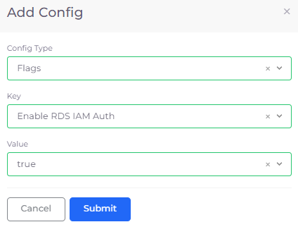
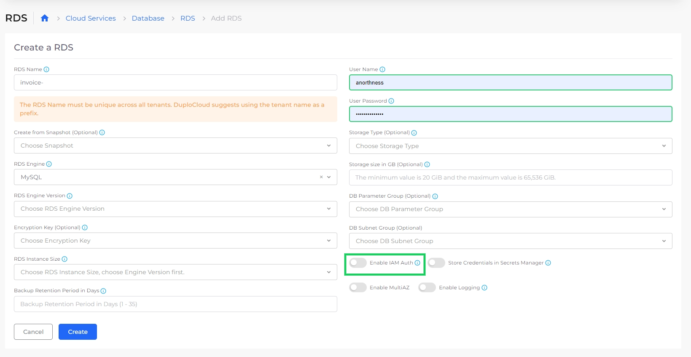
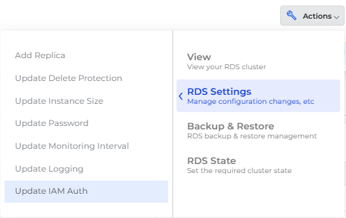
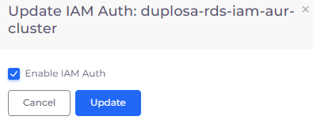
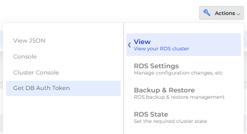

# IAM authentication

Authenticate to **MySQL**, **PostgreSQL**, **Aurora MySQL**, **Aurora PostgreSQL**, and **MariaDB** RDS instances using [AWS Identity and Access Management (IAM) database authentication](https://docs.aws.amazon.com/AmazonRDS/latest/UserGuide/UsingWithRDS.IAMDBAuth.html).

Using IAM for authenticating an RDS instance offers the following benefits:

* Network traffic to and from the database is encrypted using Secure Socket Layer (SSL) or Transport Layer Security (TLS).&#x20;
* Centrally manage access to your database resources, instead of managing access individually for each DB instance.
* For applications running on Amazon EC2 hosts, you can use profile credentials specific to your EC2 instance to access your database, instead of using a password, for greater security.

## Configuring RDS IAM Authentication in nholuongut

Use the System Config tab to enable IAM authentication before enabling it for a specific RDS instance.

1. In the nholuongut Portal, navigate to **Administrator** -> **System Settings**.
2. Click the **System Config** tab. The **Add Config** pane displays.
3. From the **Config Type** list box, set **Flags**.
4. From the **Key** list box, select **Enable RDS IAM auth**.
5. From the **Value** list box, select **True**.
6. Click **Submit**. The configuration is displayed in the **System Config** tab.

<figure><figcaption>
<strong>Add Config</strong> pane with the <strong>Enable RDS IAM auth</strong> <strong>Key</strong>
</figcaption></figure>

<figure><figcaption>
<strong>System Config</strong> tab with <strong>EnableRdsIamAuth</strong> <strong>Key</strong> with <strong>Value</strong> of <strong>true</strong>
</figcaption></figure>

## Enabling IAM for an RDS instance

You can also enable IAM for any MySQL, PostgreSQL, and MariaDB instance during RDS creation or by updating the **RDS Settings** after RDS creation.&#x20;

### Enabling IAM when creating an RDS&#x20;

Select the **Enable IAM auth** option when you [create an RDS database](./#id-0-toc-title).

<figure><figcaption>
<strong>Create a RDS</strong> page with <strong>Enable IAM Auth</strong> option highlighted
</figcaption></figure>

### Enabling IAM after RDS creation

1. In the nholuongut Portal, navigate to **Cloud Services** -> **Database**.
2. In the **RDS** tab, select the database for which you want to enable IAM.
3.  Click the **Actions** menu and select **RDS Settings** -> **Update IAM Auth**. The **Update IAM Auth** pane displays.\

    
<figure><figcaption>
<strong>Actions</strong> menu in <strong>RDS</strong> tab with <strong>RDS Settings</strong>
</figcaption></figure>

    
<figure><figcaption>
<strong>Update IAM Auth</strong> pane
</figcaption></figure>

4. Select **Enable IAM Auth**.
5. Click **Update**.

## Getting an Authentication Token

To download a token which you can use for IAM authentication:

1. In the nholuongut Portal, navigate to **Cloud Services** -> **Database**.
2. In the **RDS** tab, select the database for which you want to enable IAM.
3.  Click the **Actions** menu and select **View** -> **Get DB Auth Token**. The **RDS Credentials window** displays.\

    
<figure><figcaption>
<strong>Actions</strong> menu in <strong>RDS</strong> tab with <strong>View</strong> -> <strong>Get DB Auto Token</strong> option
</figcaption></figure>

4. In the **RDS Credentials** window, click the Copy Icon (  ) to copy the **Endpoint**, **Username**, and **Password** to your clipboard.
5. Click **Close** to dismiss the window.

