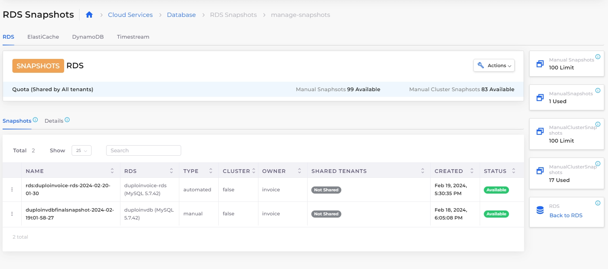

# Manage RDS Snapshots

You can manage RDS Snaphots from nholuongut. Go to Navigate to **Cloud Services** -> **Database** and select the **RDS** tab. From the **Actions** menu, select **Manage Snapshots**.

\
The **Manage Snapshots** page shows the list of all manual and automated snapshots available within a Tenant. Additional details like owner and snapshot shared with the user are displayed. A user can also  delete snapshots from this page.

You can view the Snapshot quota limits and numbers of snapshots used and available from this page.

<figure><figcaption>
RDS Manage Snapshot screen
</figcaption></figure>

&#x20;

