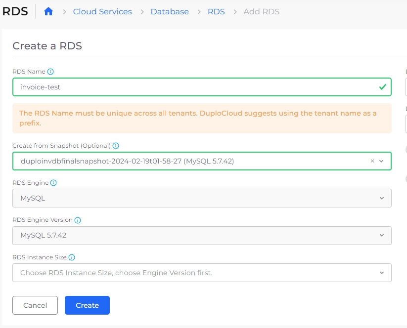

# Sharing encrypted database

## Introduction 

Sharing unencrypted databases to other accounts is very simple and straightforward. Sharing an encrypted database is slightly more difficult. Here we will go through the steps that need to be followed to share the encrypted database.

## Summary of steps

1. Create a managed key that can be used by both accounts. Share the managed key with the destination account.
2. Copy the existing snapshot in the source account, but encrypt it with the new key.
3. Share the new snapshot with the destination account.
4. In the destination account, make a copy of the shared snapshot encrypted with the destination account's key.
5. Add the Name tag to the new copy in the destination so the nholuongut portal recognizes it.
6. Create a new database from the snapshot.&#x20;

## Step 1: Create a managed key 

Create a new customer-managed key in AWS KMS. In the **Define key usage permissions area** provide the account id of the other account.

## Step 2: Encrypt a snapshot copy with the new key 

Once the key is created, navigate to **Cloud Services** -> **Database** and select the **RDS** tab. From the **Actions** menu, select **Manage Snapshots**. Select the snapshot, and click Copy Snapshot. In the encryption, use the key we created above.

## Step 3: Share the snapshot with the destination account

Once the copied snapshot is ready, share the snapshot with another account by clicking Share snapshot and providing the destination account id.

## Step 4: Copy the shared snapshot 

In the destination account, Navigate to **Cloud Services** -> **Database** and select the **RDS** ta&#x62;**.** Select **Shared with me**. Select the shared snapshot and click copy-snapshot. Use the encryption key of the destination account, not the shared key.

## Step 5: Add tags to the copied snapshot 

In the copied snapshot add a tag with Key as “`Name`” and Value as “`duploservices-{tenantname}`” where `tenantname` is the tenant where you want to launch an RDS with this snapshot.

## Step 6: Create a new database 

Go to the nholuongut portal and select the tenant. Navigate to **Cloud Services** -> **Database** and select the **RDS** tab. Click **Add**. Then give a name for the new database. In the snapshot select the new snapshot. Enter the instance type and click **Submit**. In a few minutes, the database will be created with the data from the snapshot. You must use the existing username and password to access the database.

<figure><figcaption></figcaption></figure>
