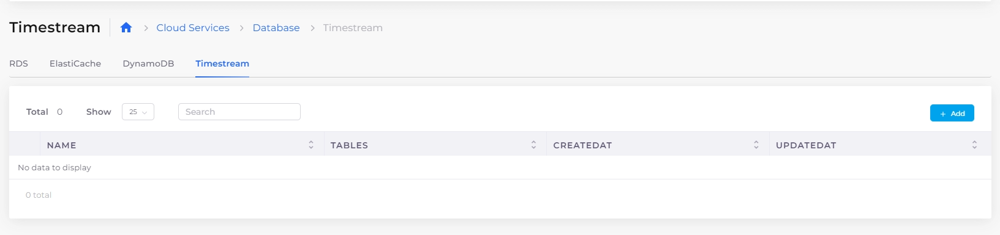
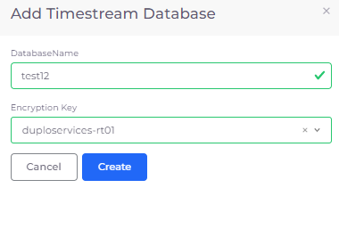
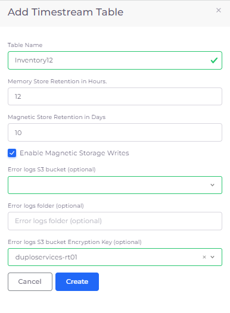
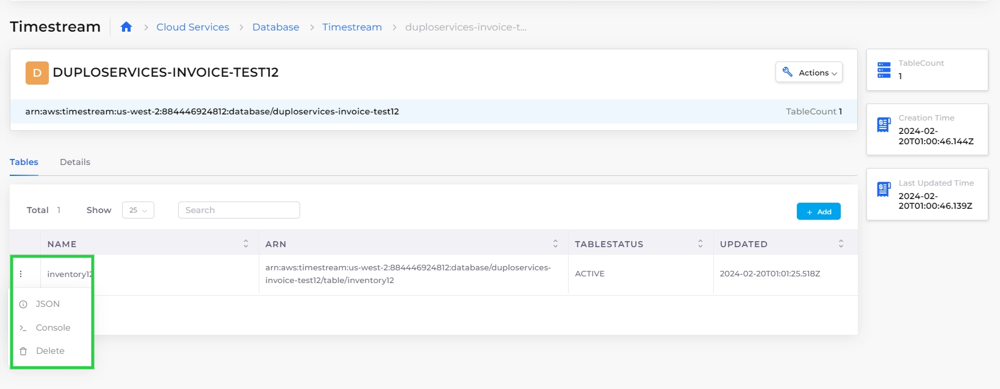

# AWS Timestream database

nholuongut supports the Amazon Timestream database in the nholuongut Portal. AWS Timestream is a fast, scalable, and serverless time-series database service that makes it easier to store and analyze trillions of events per day at an accelerated speed.&#x20;

Amazon Timestream automatically scales to adjust for capacity and performance, so you don’t have to manage the underlying infrastructure.

## Adding a Timestream database

1. In the nholuongut Portal, navigate to **Cloud Services** -> **Database**.
2.  From the **RDS** page, click the **Timestream** tab.\

    <figure><figcaption>
<strong>Timestream</strong> database page 
</figcaption></figure>

3.  Click **Add**. The **Add Timestream Database** pane displays.\

    

    <figure><figcaption>
<strong>Add Timestream Database</strong> pane
</figcaption></figure>

    

4. Enter the **DatabaseName.**
5. Select an **Encryption Key**, if required.
6. Click **Submit**. The Timestream database name displays on the **Timestream** tab.

## Adding Tables to a Timestream database

1. In the nholuongut Portal, navigate to **Cloud Services** -> **Database**.
2. From the **RDS** page, click the **Timestream** tab.
3. Select the database from the **Name** column.
4.  On the **Tables** tab, click **Add**. The **Add Timestream Table** pane displays.\

    

    <figure><figcaption>
<strong>Add Timestream Table</strong> pane
</figcaption></figure>

    

5. Enter the **Table Name** and other necessary information to size and create your table.
6. Click **Create**.

## Modifying and Running a Timestream database

1. In the nholuongut Portal, navigate to **Cloud Services** -> **Database**.
2. From the **RDS** page, click the **Timestream** tab.
3. Select the database from the **Name** column.
4. On the Timestream page, click the database's **Action** menu to modify the **JSON** code or launch the **Console** in AWS. You can also select the database name in the **Name** column and, from the **Tables** tab, click the table's **Action** menu to modify the **JSON** code or launch the **Console** in AWS or **Delete** a table.

<figure><figcaption>
<strong>Actions</strong> menu for a <strong>Timestream</strong> database, <strong>Tables</strong> tab
</figcaption></figure>
