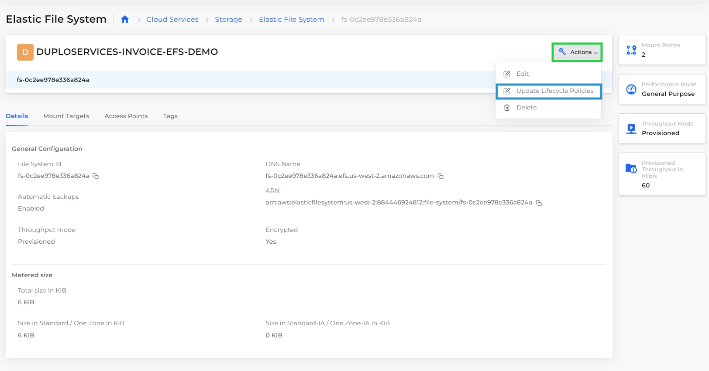

# Elastic File System (EFS)

Amazon Elastic File System (Amazon EFS) is a scalable, fully managed file storage service. It offers a simple and scalable file storage solution for use with AWS cloud services and on-premises resources. It is designed to provide shared file storage for multiple instances, enabling concurrent access, as well.

See the [AWS Documentation](https://docs.aws.amazon.com/efs/latest/ug/storage-classes.html) for more information.

## Prerequisites

Before you create an EFS, you must configure the EFS Volume Controller for your Infrastructure.

1. In the nholuongut portal, navigate to **Administrator** -> **Infrastructure**. The **Infrastructure** page displays.
2. Select your Infrastructure from the **Name** column.&#x20;
3. Click the **Settings** tab.
4. Click **Add**. The **Infra - Set Custom Data** pane displays.
5. From the **Settings Name** list box, select **Enable EFS Volume Controller**.
6. Select **Enable**.
7. Click **Set**.

In the **Settings** tab, your configuration **Enable EFS Volume Controller** is set to **true**.&#x20;

<figure><figcaption><p>Infrastructure page Settings tab with configuration <strong>Enable EFS Volume Controller</strong> set to <strong>true</strong>.</p></figcaption></figure>

## Creating an EFS in the nholuongut Portal

1. In the DuploClod Portal, navigate to **Cloud Services** -> **Storage.**
2. Click the **EFS** tab.&#x20;
3.  Click **Add**. The **Add Elastic File System** page displays.\


    <figure><figcaption><p><strong>Actions</strong> menu for a <strong>Timestream</strong> database, <strong>Table</strong> tab</p></figcaption></figure>
4. In the **Name** field, enter a name for the EFS you want to create.
5. In the **Creation Token** field, enter a string of up to 64 ASCII characters.
6. From the **Performance Mode** list box, select **General** or **Max I/O**. Select General for most file systems. Selecting **Max I/O** allows scaling to higher levels of aggregate throughput and operations per second with a tradeoff of slightly higher latencies for most file operations. You can not change this setting after the file system has been created.&#x20;
7. From the **Throughput Mode** list box, select **Bursting** or **Provisioned**. If you select Provisioned, you must also set a value from **1** to **1024** for **Provisioned Throughput (in MiB)**. After you create the file system, you can decrease the file system's throughput in Provisioned mode or change between the throughput modes, as long as more than 24 hours have passed since the last decrease in throughput or throughput mode change.
8.  Change other defaults as needed as click **Create**. The EFS is created and displayed in the **EFS** tab. Select the EFS from the **Name** column and view the configuration in the **Details** tab.\


    .png>)


**Max I/O** mode is not supported on file systems using [One Zone storage classes](https://docs.aws.amazon.com/efs/latest/ug/storage-classes.html).


Information about EFS **Mount Targets** and **Access Points** is available in their respective tabs.

.png>)

```bash
btoa(`#!/bin/bash
sudo su
echo "confirm it is running" >> /tmp/startup_log
apt-get install -y nfs-common
cd /
mkdir efs
mount -t nfs4 -o 
nfsvers=4.1,rsize=1048576,wsize=1048576,hard,timeo=600,retrans=2,nore
svport fs-121345b8.efs.us-west-2.amazonaws.com:/ efs
echo "fs-121345b8.efs.us-west-2.amazonaws.com:/ /efs nfs4 
defaults,_netdev 0 0" >> /etc/fstab`);
```

## Updating EFS Lifecycle Policies

You can update the policies for EFS Lifecycle management in the nholuongut Portal. See the [AWS Documentation](https://docs.aws.amazon.com/efs/latest/ug/storage-classes.html) for more information.


If you want to disable an EFS Lifecycle Management Policy that you previously created, you must do so in the AWS Portal. You can not disable a Lifecycle Management Policy by using the nholuongut portal.


1. In the DuploClod Portal, navigate to **Cloud Services** -> **Storage.**
2. Click the **EFS** tab.&#x20;
3.  Select the EFS from the **Name** column. The EFS page displays.\


    <figure><figcaption><p>EFS page with <strong>Actions</strong> menu and <strong>Update Lifecycle Policies</strong> highlighted</p></figcaption></figure>
4.  From the **Actions** menu, select **Update Lifecycle Policies**. The **Update EFS Lifecycle Policies** pane displays.\


    <div align="left">

    <figure><figcaption><p><strong>Update EFS Lifecycle Policies</strong> pane</p></figcaption></figure>

    </div>
5. From the **Transition to IA** list box, select the time duration (in **days**) to elapse before transitioning files to the IA storage class.
6. Optionally, select **Transition to Primary Storage Class**, if appropriate.
7.  Click **Submit**. The EFS Lifecycle Policies are updated and can be viewed in the **Lifecycle Policies** tab.\


    <figure><figcaption><p><strong>Lifecycle Policies</strong> tab</p></figcaption></figure>
