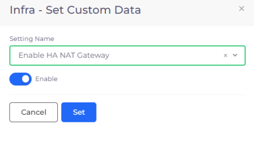

# NAT Gateway for HA

Use NAT gateways so that instances in a private subnet can connect to services outside your Virtual Private Cloud (VPC). External services cannot initiate a connection with these instances.


See this [AWS Documentation](https://docs.aws.amazon.com/vpc/latest/userguide/vpc-nat-gateway.html) for more information on NAT Gateways.


## Enabling AWS NAT Gateway for HA

1. In the nholuongut Portal, navigate to **Administrator** -> **Infrastructure**. The **Infrastructure** page displays.
2. Select the Infrastructure for which you want to enable NAT Gateway from the **Name** column.
3. Click the **Settings** tab.
4. Click **Add**. The **Infra - Set Custom Data** pane displays.
5. In the **Setting Name** field, select **Enable HA NAT Gateway** from the list box.
6. Select **Enable**.
7. Click **Set**.

<figure><figcaption>
<strong>Infra - Set Custom Data</strong> pane with <strong>Enable HA NAT Gateway</strong> setting
</figcaption></figure>

