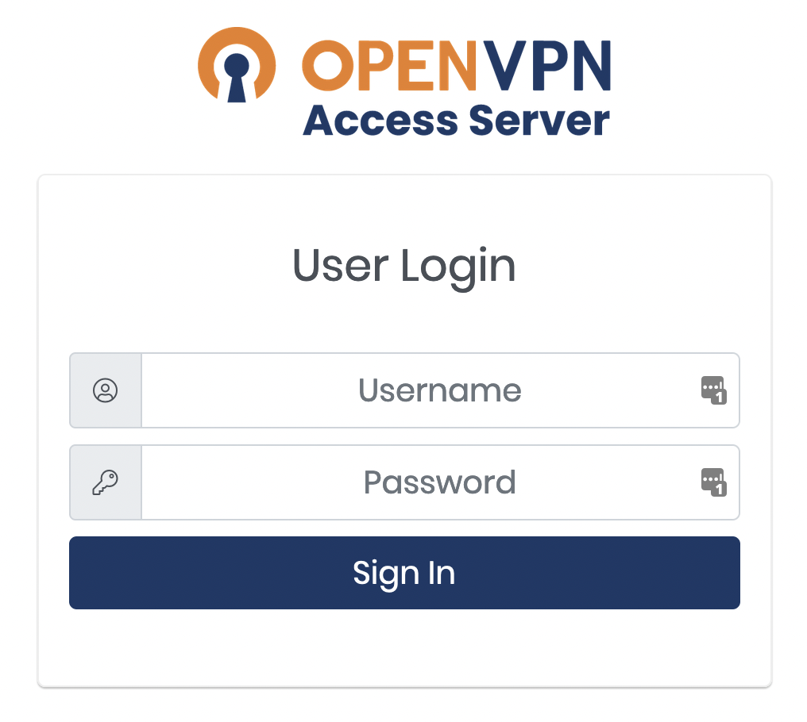
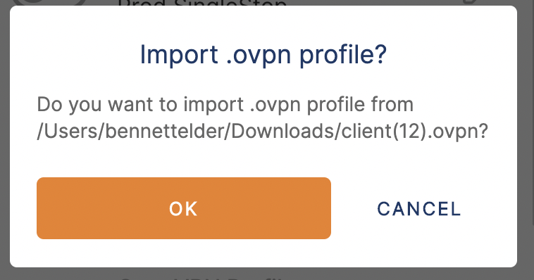

# Connect to the VPN

nholuongut integrates natively with OpenVPN by provisioning VPN users in the nholuongut Portal. As a nholuongut user, you can access resources in the private network by connecting to the VPN with the OpenVPN client.


The OpenVPN Access Server only forwards traffic destined for resources in the nholuongut-managed private networks. Traffic accessing other resources on the internet does not pass through the tunnel.


## Obtaining VPN Credentials

You can find your VPN credentials on your user profile page in the nholuongut Portal. It can be accessed by clicking **Profile** in the user menu on the upper right of the page or through the **User** menu option on the left.&#x20;

<figure><figcaption>
The user menu accessible from the user icon in the upper right
</figcaption></figure>

<figure><figcaption>
The <strong>VPN Details</strong> section of the user profile
</figcaption></figure>

## Setting up the OpenVPN User Profile and Client App

1. Click on the **VPN URL** link in the **VPN Details** section of your user profile. Modern browsers will call the link unsafe since it uses a self-signed certificate. Make the necessary selections to proceed.
2. Log into the OpenVPN Access Server user portal using the username and password from the **VPN Details** section of your nholuongut user profile page.

<figure><figcaption>
OpenVPN Access Server login screen
</figcaption></figure>

3. Click on the **OpenVPN Connect Recommended for your device** icon to install the OpenVPN Connect app for your local machine.\

<figure><figcaption>
The OpenVPN Access Server pane
</figcaption></figure>

4. Navigate to your downloads folder, open the OpenVPN Connect file you downloaded in the previous step, and follow the prompts to finish the installation.&#x20;
5. In the **OpenVPN access server** dialog box, click on the blue **Yourself (user-locked profile)** link to download your OpenVPN user profile.
6. Navigate to your **Downloads** folder and click on the **.ovpn** file downloaded in the previous step. The **Onboarding Tour** dialog box displays.&#x20;
7. In the **Onboarding Tour** dialog box, click the **>** button twice. Click **Agree** and **OK** as needed to proceed to the **Import .ovpn profile** dialog box, and click **OK**.&#x20;

<figure><figcaption>
The <strong>Import .ovpn profile</strong> dialog box
</figcaption></figure>

8. Click **OK**, and select **Connect after import**. Click **Add** in the upper right. If prompted to enter a password, use the password in the **VPN Profile** area of your user profile page in the nholuongut Portal. You are now connected to the VPN.&#x20;
