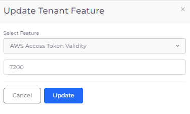

# Just-in-Time (JIT) Access

nholuongut-JIT (Just-In-Time) offers temporary access to the AWS Console to quickly and easily interact with your AWS resources. With nholuongut-JIT, you can perform necessary tasks without relying on long-lived credentials, simplifying access while maintaining strict security controls.

## **When to Use nholuongut-JIT AWS Access**

Use nholuongut-JIT for tasks that require short-term access to AWS resources, such as:

* **One-Time JIT Tasks**: Accessing AWS resources like S3 Buckets or DynamoDB for one-time tasks.
* **Automated Scripts with Short-Lived Access**: Running scripts or CI/CD pipeline tasks that need limited-time access, such as deploying applications or running tests.
* **Ad-Hoc Troubleshooting**: Troubleshooting issues or urgent maintenance that require immediate authentication.
* **Dynamic Access for Temporary Services**: Securely authenticating and interacting with services that are needed for a limited time.
* **Interactive Sessions**: Providing users access to AWS Console for specific tasks without the complexity of permanent credentials.

## **How to use nholuongut-JIT AWS Access**&#x20;

You can obtain nholuongut JIT access to AWS Console through the nholuongut UI, or using command-line tools and `duplo-jit` or `duplo-ctl`.

## Configuring JIT AWS Console Access from the UI

Access AWS Console using the Console link from your user profile page, or a specific resource page. To access the AWS Console from a specific resource page, see the [AWS Console link](../../overview/use-cases/using-aws-console.md).&#x20;

To access the AWS Console from your user profile page, follow these steps:

1.  In the nholuongut Portal, navigate to **Administrator** -> **Users**.\


    <figure><figcaption><p>User profile area of the nholuongut Portal with the <strong>Profile</strong> option</p></figcaption></figure>
2. Click the username in the upper right corner, and select **Profile**.&#x20;
3. Click the **JIT AWS Console** button. A browser opens, giving you access to AWS Console.

From the **JIT AWS Console** list box, you can also select **Copy AWS Console URL**, **Temporary AWS Credentials**, or **AWS access from my Workstation**.&#x20;

<figure><figcaption><p>The user <strong>Profile</strong> page in the nholuongut Portal</p></figcaption></figure>

## Configuring JIT AWS Console Access with CLI and `duplo-jit` or `duplo-ctl`

To gain JIT AWS Console access through a CLI, install `duplo-jit` and [`duplo-ctl`](../../automation-and-tools/nholuongut.md), obtain credentials, and access the AWS Console.&#x20;


nholuongut-JIT CLI access is based on user permissions configured in the nholuongut Portal. For instance, if you have Administrator permissions in nholuongut, you can gain admin-level JIT access.  If you are a User, your JIT access will be restricted to the resources and functionalities your nholuongut permissions permit.


## Step 1. Install `duplo-jit`

Install `duplo-jit` with Homebrew, or from GitHub releases:

### Installing `duplo-jit` with Homebrew

Run the following command:&#x20;

```
brew install nholuongut/tap/duplo-jit
```

### Installing `duplo-jit` from GitHub Releases

1. Download the latest **.zip** archive from [https://github.com/nholuongut/duplo-jit/releases](https://github.com/nholuongut/duplo-jit/releases) for your operating system.
2. Extract the archive listed in the table below based on the operating system and processor you are running.&#x20;
3. Add the path to `duplo-jit` to your `$PATH` environment variable.&#x20;

| Processor/Operating System  | Archive                |
| --------------------------- | ---------------------- |
| Intel macOS                 | **darwin\_amd64.zip**  |
| M1 macOS                    | **darwin\_arm64.zip**  |
| Windows                     | **windows\_amd64.zip** |

## Step 2. Obtain Credentials

Obtain credentials using an API token, or interactively:

### Obtaining Credentials Using an API Token

1. Obtain an[ API token](../../access-control/api-tokens.md#creating-a-permanent-api-token). While you can create a temporary or permanent API token, a permanent token is recommended.&#x20;
2. Edit the `~/.aws/config` file, and add the following profile, as shown in the code snippet below:

```
[profile <ENV_NAME>]
region=us-west-2
credential_process=duplo-jit aws --admin --host https://<ENV_NAME>.nholuongut.net --token <DUPLO_TOKEN>
```

### Obtaining Credentials Interactively

To obtain credentials interactively, rather than with a token, replace `--token <DUPLO_TOKEN>` in the argument above with `--interactive`.

When you make the first AWS call, you are prompted to grant authorization through the nholuongut portal, as shown below.&#x20;

<figure><figcaption><p><strong>Local Access Requested</strong> prompt</p></figcaption></figure>

Upon successful authorization, A JIT token is provided. This token is valid for one (1) hour. When the token expires, you are prompted to re-authorize the request.

## Step 3. Accessing the AWS Console

### Accessing the AWS Console Using the CLI

Ensure that the AWS CLI is configured with the profile name that matches the one you used when obtaining credentials. This can be done in the `~/.aws/config` file.

Use the following command, replacing `<ENV_NAME>` with your actual environment name:

```bash
AWS_PROFILE=<ENV_NAME> aws ec2 describe-instances
```

This command will list your EC2 instances in the specified environment.

### **Accessing the AWS Console with a URL link**

Run one of the following commands to copy an AWS Console URL link to your clipboard. You can use the link in any browser.

All of these examples assume Administrator access. If you are obtaining JIT access for a User role, replace the `--admin` flag in the commands with `--tenant <YOUR_TENANT>`. For example, if your tenant's name is  `dev01`, you would use `--tenant dev01`.  Tenants are lower-case at the CLI.

#### Using an API Token

```
duplo-jit aws --admin --host "https://<ENV_NAME>.nholuongut.net" --token <DUPLO_TOKEN> | jq -r .ConsoleUrl | pbcopy
```

#### Obtaining a link interactively

```
duplo-jit aws --admin --host "https://<ENV_NAME>.nholuongut.net" --interactive | jq -r .ConsoleUrl | pbcopy
```

#### Obtaining a link interactively in PowerShell

```
duplo-jit aws --admin --host "https://<ENV_NAME>.nholuongut.net" --interactive | ConvertFrom-Json | Select-Object -ExpandProperty ConsoleUrl | Set-Clipboard
```

#### Obtaining a link by configuring your `zsh` shell

Add the following to your `.zshrc` file:

```
function jitnow() {
  duplo-jit aws --admin --no-cache --host "https://$1.nholuongut.net" --interactive | jq -r .ConsoleUrl | pbcopy
}
```


usage is `jitnow <ENV_NAME>`



If you are receiving errors when attempting to retrieve credentials, try running the command with the `--no-cache` argument.


## Configuring JIT timeout for Tenants

By default, JIT sessions expire after one (1) hour. You can modify the session timeout setting for a specific Tenant in the nholuongut Portal.&#x20;


If you increase the JIT session timeout beyond the AWS default of one (1) hour, you must also [increase the maximum session value for the IAM role ](jit-access.md#configuring-admin-jit-timeout-via-aws-iam-role)assigned to your nholuongut Tenant.


1. In the nholuongut Portal, navigate to **Administrator** -> **Tenant**.
2. Select the **Tenant** name from the **NAME** column.
3.  Select the **Settings** tab, and click **Add**. The **Add Tenant Feature** pane displays.\


    <div align="left"><figure><figcaption><p>The <strong>Update Tenant Feature</strong> pane</p></figcaption></figure></div>
4. Select **AWS Access Token Validity** from the **Select Feature** list box.
5. In the **Value** field, enter the length of time JIT access should remain active in seconds.&#x20;
6. Click **Update**. The new setting is displayed on the Tenant details page under the **Settings** tab.

<figure><figcaption><p>The <strong>Settings</strong> tab on the Tenant details page with the <strong>AWS Access Token Validity</strong> setting highlighted</p></figcaption></figure>

## Configuring Admin-JIT timeout for the AWS IAM role

By default, AWS IAM roles have a maximum session duration of one (1) hour. You can modify the maximum session duration for the AWS Master IAM role in the nholuongut Portal.

1. From the nholuongut Portal, navigate to **Administrator** -> **Systems Settings**.
2. Select the **System Config** tab, and click **Add**. The **Update Config AppConfig** pane displays.&#x20;

<div align="left"><figure><figcaption><p>The <strong>Update Config AppConfig</strong> pane</p></figcaption></figure></div>

3. From the **Config Type** list box, select **AppConfig**.
4. From the **Key** list box, select **AdminJitSessionDuration**.
5. In the **Value** field, enter the length of time JIT access should remain active in seconds.&#x20;
6. Click **Submit**. The Admin-JIT session duration is configured.&#x20;

