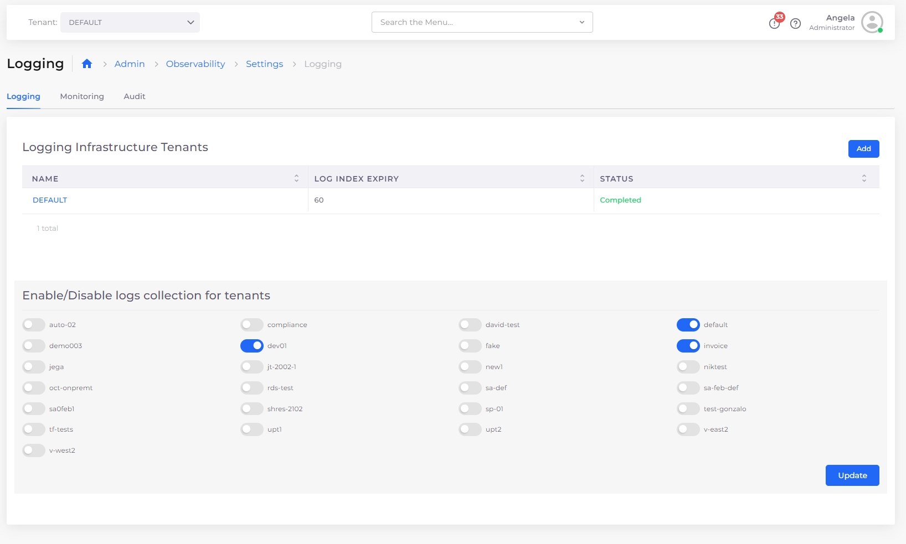

# Set up logging

## Prerequisites

* If you need to make changes to the [Control Plane Configuration, follow this procedure to do so](../../../aws-user-guide/use-cases/central-logging/custom-log-collection.md#updating-the-control-plane-by-editing-the-service-description), before enabling logging. Note that you cannot modify the Control Plane Configuration after you set up logging.
* Docker applications use `stdout` for writing log files, collecting logs, placing them in the Host directory, mounting them into [Filebeat ](https://www.elastic.co/beats/filebeat)containers, and sending them to [AWS Elasticsearch](https://aws.amazon.com/what-is/elasticsearch/).  If you need to customize the log collection and you use folders other than `stdout`, for example, [follow this procedure](../../../aws-user-guide/use-cases/central-logging/custom-log-collection.md#customizing-elastic-filebeat-logging).  Note that you cannot customize the log collection after you set up logging.

## Setting up logging&#x20;

1. In the nholuongut Portal, navigate to **Administrator** -> **Observability** -> **Settings** -> **Logging**.
2. From the **Tenant** list box at the top of the nholuongut Portal, select the **Default** Tenant.
3.  Click the **Create Logging** link. The **Enable Logging** page displays.\

    

    <figure><figcaption>
<strong>Create Logging</strong> link
</figcaption></figure>

    

4.  Use the **Enable Logging** page to deploy logging for the Control Plane, which uses OpenSearch and Kibana to retrieve and display log data for the **Default** Tenant. In the **Cert ARN** field, enter the ARN certificate for the **Default** Tenant. Find the ARN by selecting the **Default** Tenant from the **Tenant** list box at the top of the nholuongut Portal; navigating to **Administrator** -> **Plans**; selecting the Plan that matches your Infrastructure **Name**; and clicking the **Certificates** tab.\

    

    <figure><figcaption>
<strong>Enable Logging</strong> page
</figcaption></figure>

    

5. Click **Submit**. Data gathering takes about fifteen (15) minutes. When data gathering is complete, graphical logging data is displayed in the **Logging** tab.&#x20;
6. After logging has been enabled for the Control Plane, finish the logging setup by enabling the Log Collector to collect logs per Tenant. This feature is especially useful for Tenants that are spread across multiple regions. In the nholuongut Portal, navigate to **Administrator** -> **Observability** -> **Settings -> Logging**. &#x20;
7.  In the **Logging** tab, on the **Logging Infrastructure Tenants** page, click **Add.**\

    <figure><figcaption>
<strong>Add</strong> button on the <strong>Logging Infrastructure Tenants</strong> page
</figcaption></figure>
8. Select the Tenants for which you want to configure logging, using the **Select Tenants to enable logging** area, as in the example below. The [Control Plane configuration](../../../aws-user-guide/use-cases/central-logging/custom-log-collection.md#updating-the-control-plane-by-editing-the-service-description) is deployed for each Tenant that you select in the Infrastructure, specified in **Infrastructure Details**.

<figure><figcaption>
<strong>Logging</strong> tab with logging setup complete
</figcaption></figure>


The Log Collector uses [Elastic Filebeat](https://www.elastic.co/guide/en/beats/filebeat/current/filebeat-overview.html) containers that are deployed within each Tenant.&#x20;

When you enable a Tenant for logging, the Filebeat service starts up and begins log collection. View the Filebeat containers by navigating to **Kubernetes** -> **Containers** in the nholuongut Portal. In the row of the container for which you want to view the logs, click on the menu icon and select **Logs**.


## How nholuongut configures logging for you

When you perform the steps above to configure logging, nholuongut does the following:

### Control Plane deployment

1. **An EC2 Host is added** in the Default tenant, for example, **duploservices-default-oc-diagnostics**.
2. **Services are added** in the Default tenant, one for OpenSearch and one for Kibana. Both services are pinned to the EC2 host using [allocation tags](../../../extras-1/creating-advanced-functions.md). Kibana is set up to point to ElasticSearch and exposed using an internal load balancer.
3. **Security rules from within the internal network to port 443 are added** in the **Default** Tenant to allow log collectors that run on Tenant hosts to send logs to ElasticSearch. &#x20;

### Log Collector deployment

1. A Filebeat service (`filebeat-duploinfrasvc)` is deployed for each Tenant where central logging is enabled.&#x20;
2. The `/var/lib/docker/Containers` are mounted from the Host into the Filebeat container. The Filebeat container references ElasticSearch, which runs in the **Default** Tenant. Inside the container, Filebeat is configured so that every log line is added with metadata information consisting of the Tenant name, Service names, Container ID, and Hostname, enabling ease of search using these parameters with ElasticSearch.   &#x20;
