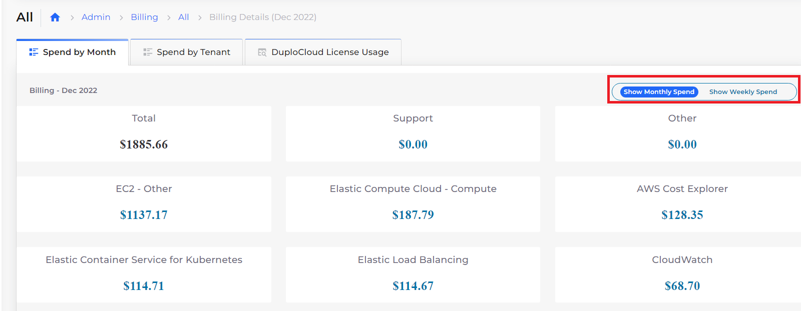
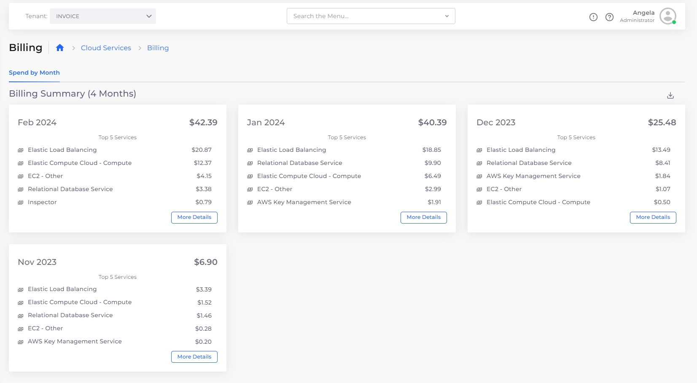

# Billing and Cost management

Usage costs for resources can be viewed and managed in the nholuongut Portal, by month or week, and by Tenant. You can also explore historical resource costs.&#x20;

## Prerequisites

To enable the billing feature, you must:

1. Enable access to billing data in AWS by following the steps in this [AWS document](https://docs.aws.amazon.com/awsaccountbilling/latest/aboutv2/control-access-billing.html) .
2. [Apply cost allocation tags](cost-allocation-tags.md) so that nholuongut can retrieve billing data.

## View billing details for AWS

To view the Billing page for AWS in the nholuongut Portal, navigate to **Administrator** -> **Billing**. &#x20;

You can view usage by:

* Time
  * Select the **Spend by Month** tab and click **More Details** to display monthly and weekly spending options. &#x20;
* Tenant
  * Select the **Spend by Tenant** tab.

<figure><figcaption>
<strong>Spend by Month</strong> tab with monthly and weekly options displayed
</figcaption></figure>


You must first enable the billing feature to view or manage usage costs in the nholuongut Portal.


## View billing details by Tenant

To view the billing details by Tenant in the nholuongut Portal, navigate to **Cloud Services** -> **Tenant**. Select the Tenant you want to view billing details for from the list box in the upper left.

<figure><figcaption>
The <strong>Billing</strong> dashboard for the Invoice Tenant
</figcaption></figure>

The dashboard displays the top five spending services for the Tenant for each month. Click **More Details** to display monthly and weekly spending options. &#x20;

