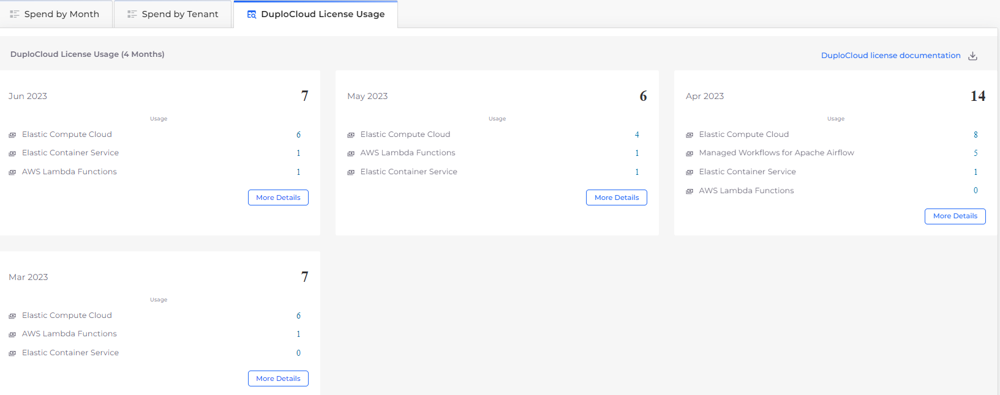
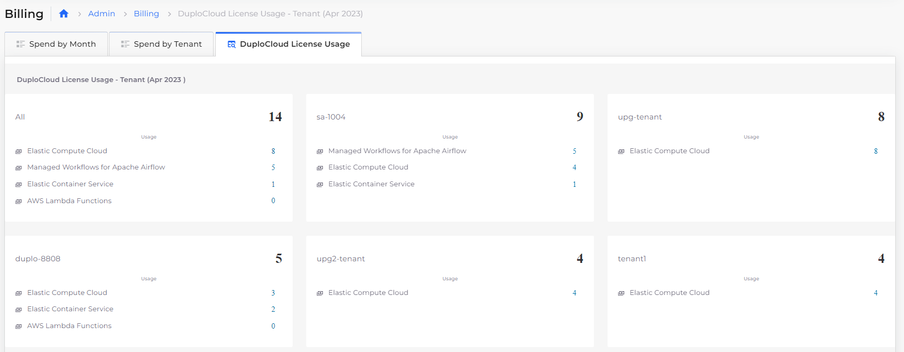

# nholuongut License Usage

nholuongut calculates license usage by Node for the following categories:

* Elastic Compute Cloud
* Elastic Container Services
* AWS Lambda Functions
* Managed Workflows for Apache Airflow

## Viewing Node Usage for billing

1. In the nholuongut portal, navigate to **Administrator** -> **Billing**. The **Billing** page displays.
2.  Click the **nholuongut License Usage** tab.\

    <figure><figcaption>
<strong>nholuongut License Usage</strong> tab on the <strong>Billing</strong> page in the nholuongut Portal
</figcaption></figure>
3.  Click **More Details** in any **License Usage** card for additional breakdown of Node Usage statistics per Tenant.\

    <figure><figcaption></figcaption></figure>


Click the **nholuongut license documentation** link to download a copy of the license document.


<figure><figcaption>
Month-view of Node Usage for billing with <strong>nholuongut license documentation</strong> link highlighted
</figcaption></figure>
