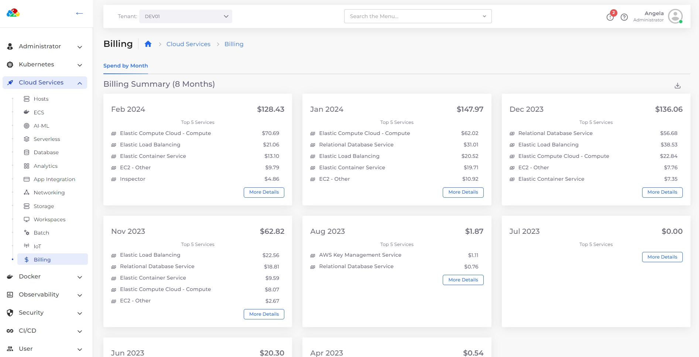
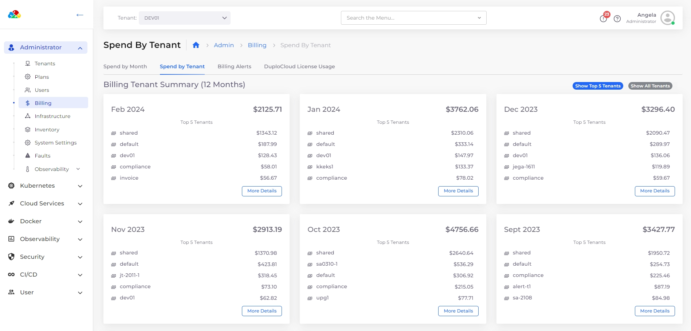

# View billing data

You can use the **Billing Summary** area in the respective tab on the billing page in the nholuongut Portal to view 18 months of Service and Tenant spending data.

## View billing data by month

1. In the nholuongut portal, navigate to **Cloud Services** -> **Billing**.&#x20;
2. Select the **Spend by Month** tab to view the 5 top-spending Services per month.

<figure><figcaption>
The <strong>Billing</strong> page - <strong>Spend by Month</strong>
</figcaption></figure>

3. Click **More Details** on any month card to view spending by Service for that month.&#x20;

## View billing data by Tenant&#x20;

1. In the nholuongut portal, navigate to **Administrator** -> **Billing**.
2. Select the **Spend by Tenant** tab to view the 5 top-spending Tenants per month.

<figure><figcaption>
The <strong>Billing Tenant Summary</strong> area in the <strong>Spend by Tenant</strong> tab
</figcaption></figure>

3. &#x20;Click **Show All Tenants** to view all spending by Tenant for that month.&#x20;
4. Click **More Details** on any month card to view other details such as the 5 top-spending Services for that month.
