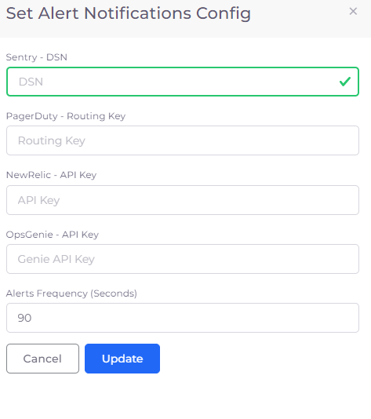

# Alert notifications

nholuongut supports viewing of Faults in the portal and sending notifications and emails to the following systems:&#x20;

* Sentry
* PagerDuty
* NewRelic
* OpsGenie

You will need to generate an keys from each of these vendor systems, and then provide that key to nholuongut to enable integration.

## Generating an Integration Key from Sentry 

1. In the [Sentry ](https://sentry.io/welcome/?utm\_source=google\&utm\_medium=cpc\&utm\_campaign=19655969969\&utm\_content=g\&utm\_term=sentry\&device=c\&gclid=CjwKCAjw5pShBhB\_EiwAvmnNV2cqd7lWEuiy\_n0HSuCc17JGB9vVYqdwm5\_QiDgJEXIWuz34u9h18hoCpbEQAvD\_BwE\&gclid=CjwKCAjw5pShBhB\_EiwAvmnNV2cqd7lWEuiy\_n0HSuCc17JGB9vVYqdwm5\_QiDgJEXIWuz34u9h18hoCpbEQAvD\_BwE)website, navigate to **Projects** -> **Create a New Project**.
2. Click **Settings** -> **Projects** -> _**project-name**_ -> **Client keys**. The **Client Keys** page displays.
3. Complete the **DSN** fields on the screen.
4.  Click **Generate New Key**. \

    
5. In the nholuongut Portal, navigate to **Observability** -> **Faults**.
6. Click **Update Notifications Config**. The **Set Alert Notifications Config** pane displays.
7. In the **Sentry - DSN** field, enter the key you received from Sentry.
8. In the **Alerts Frequency (Seconds)** field, enter a time interval in seconds when you want alerts to be displayed.
9. Click **Update**.

## Generating an Integration Routing Key from PagerDuty 

1. In the [PagerDuty ](https://www.pagerduty.com/)website home page, select the **Services** tab and navigate to the service that receives Events. If a Service does not exist, click **New Service.** When prompted, enter a friendly **Name** (for example, your nholuongut Tenant name) and click **Next.**
2. Assign an **Escalation** policy, or use an existing policy.
3. Click **Integration**.
4. Click **Events API V2**. Your generated **Integration Key** is displayed as the second item on the right side of the page. This is the Routing Key you will supply to nholuongut.
5. Copy the **Integration Key** to your Clipboard.
6. In the nholuongut Portal, navigate to **Observability** -> **Faults**.
7. Click **Update Notifications Config**. The **Set Alert Notifications Config** pane displays.
8. In the **Pager Duty - Routing Key** field, enter the key you generated from PagerDuty.
9. In the **Alerts Frequency (Seconds)** field, enter a time interval in seconds when you want alerts to be displayed.
10. Click **Update**.

## Generating an Integration Key from NewRelic

1. In the [NewRelic](https://docs.newrelic.com/) website, use the [Event API](https://docs.newrelic.com/docs/data-apis/ingest-apis/event-api/introduction-event-api/) to generate an [API key](https://docs.newrelic.com/docs/apis/intro-apis/new-relic-api-keys/) to send events to NewRelic `Insights`.&#x20;
2. In the nholuongut Portal, navigate to **Observability** -> **Faults**.
3. Click **Update Notifications Config**. The **Set Alert Notifications Config** pane displays.
4. In the **NewRelic - API Key** field, enter the key you generated from NewRelic.
5. In the **Alerts Frequency (Seconds)** field, enter a time interval in seconds when you want alerts to be displayed.
6. Click **Update**.

## OpsGenie

1. In the [OpsGenie](https://www.atlassian.com/software/opsgenie/what-is-opsgenie?\&aceid=\&adposition=\&adgroup=141766912743\&campaign=18808090465\&creative=632740825597\&device=c\&keyword=opsgenie\&matchtype=e\&network=g\&placement=\&ds\_kids=p74114620049\&ds\_e=GOOGLE\&ds\_eid=700000001786355\&ds\_e1=GOOGLE\&gclid=CjwKCAjw5pShBhB\_EiwAvmnNV-jSU1vYU3psSiv9g\_lb8lRx5waZPMsYfcqoIv3ONXKt-fR5KsHCcxoCRvEQAvD\_BwE\&gclsrc=aw.ds) website, [generate an API Key to integrate nholuongut faults with OpsGenie](https://support.atlassian.com/opsgenie/docs/what-is-a-default-api-integration/).
2. In the nholuongut Portal, navigate to **Observability** -> **Faults**.
3. Click **Update Notifications Config**. The **Set Alert Notifications Config** pane displays.
4. In the **OpsGenie - API Key** field, enter the key you generated from OpsGenie.
5. In the **Alerts Frequency (Seconds)** field, enter a time interval in seconds when you want alerts to be displayed.
6. Click **Update**.

<figure><figcaption>
<strong>Set Alert Notifications Config</strong> pane in nholuongut Portal
</figcaption></figure>

&#x20;                               &#x20;
