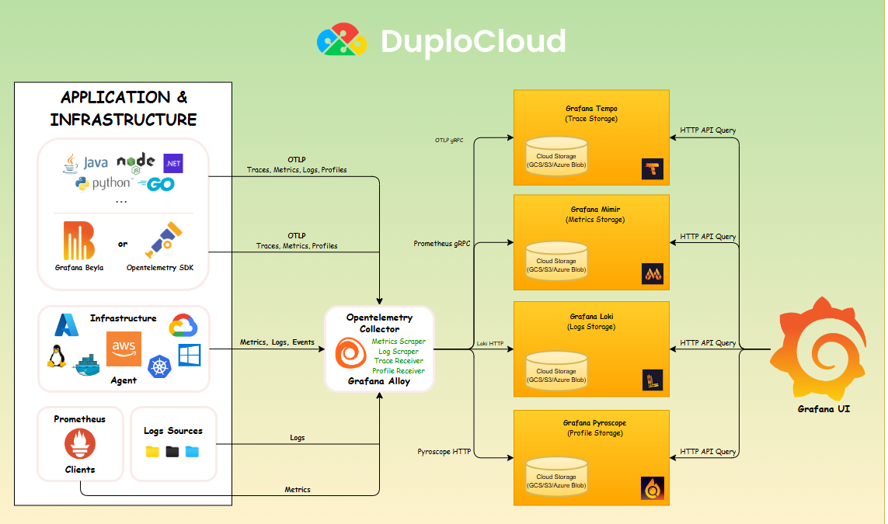
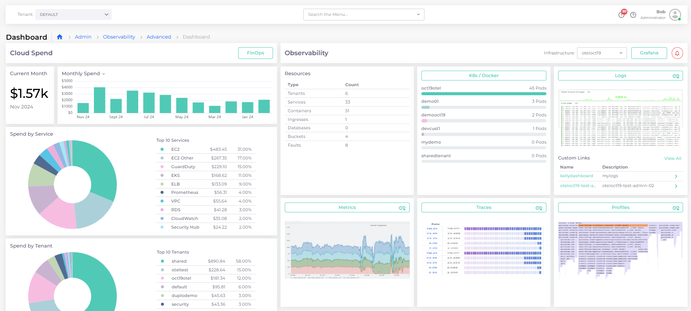
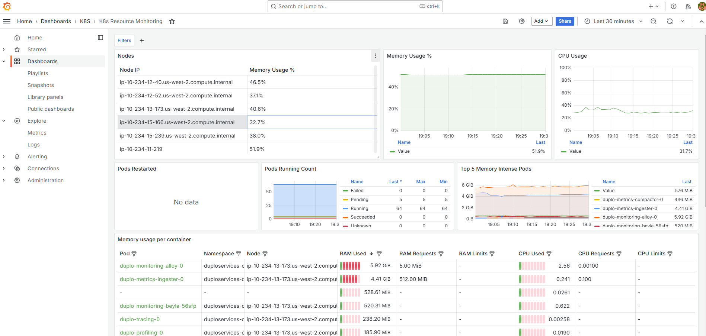

# Architecture

Advanced Observability Suite (AOS) is based on OpenTelemetry. The following graphic shows the various components.


The OTel stack consists of 50 or more components and hundreds of configurations. If you need to change your OpenTelemetry configuration, contact your nholuongut support team.


<figure><figcaption>
nholuongut Advanced Observability Suite Architecture
</figcaption></figure>

## Viewing the nholuongut Deployment of the OpenTelemetry Stack

To view the complete deployment of the OpenTelemetry stack:

1. In the nholuongut Portal, navigate to **Administrator** -> **Observability** -> **Advanced** -> **Dashboard**.
2. In the **Observability** area, click the **K8s/Docker** card. The Grafana K8s Resource Monitoring dashboard launches, giving you a detailed view of resources and monitoring for Kubernetes nodes, Docker containers, and Pods.

<figure><figcaption>
The AOS <strong>Dashboard</strong> containing the <strong>K8s/Docker</strong> card
</figcaption></figure>

<figure><figcaption>
The Grafana <strong>K8s Resource Monitoring</strong> dashboard
</figcaption></figure>

## Viewing OpenTelemetry Data in nholuongut

OpenTelemetry data is stored in S3 Buckets, which you can view in the nholuongut Portal.


OpenTelemetry data is stored in S3 Buckets in a Tenant that nholuongut preconfigures for you during Onboarding. nholuongut documentation refers to this Tenant as _**OpenTelemetry\_Tenant**_ (in bold italics), but the name may vary if a different name was chosen during setup.


1. In the nholuongut Portal, select the _**OpenTelemetry\_Tenant**_ from the **Tenant** list box at the top of the Portal.
2. Navigate to **Cloud Services** -> **Storage** and select the **S3** tab to view the data. This data setup is deployed and managed via [Flux Helm](architecture.md#viewing-the-nholuongut-deployment-of-the-opentelemetry-stack) release infrastructure.

<figure><figcaption>
<strong>S3 Bucket</strong> containing OpenTelemetry data in the OpenTelemetry Tenant <strong>OCT19OTEL</strong>
</figcaption></figure>

To view a complete list of Kubernetes deployments, containers, and S3 buckets in an OpenTelemetry deployment, select the _**OpenTelemetry\_Tenant**_ from the **Tenant** list box at the top of the Portal and navigate to **Kubernetes** -> **Services**.

<figure><figcaption>
 Kubernetes deployments, containers, and S3 buckets in an OpenTelemetry deployment in Tenant <strong>OCT19OTEL</strong>
</figcaption></figure>

To view a complete list of Docker Containers in an OpenTelemetry deployment, select the _**OpenTelemetry\_Tenant**_ from the **Tenant** list box at the top of the Portal and navigate to **Kubernetes** -> **Containers**.

<figure><figcaption>
Docker Containers in an OpenTelemetry deployment in Tenant <strong>OCT19OTEL</strong>
</figcaption></figure>
