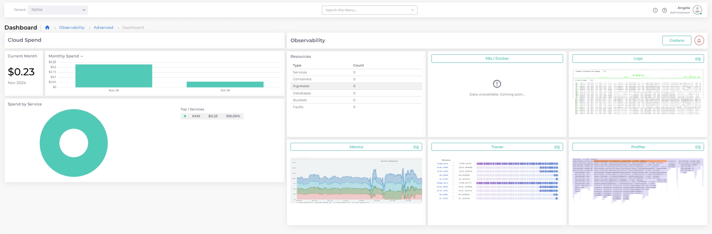

# Tenant Dashboard

The **Tenant AOS Dashboard** provides cost and observability data by Tenant for granular infrastructure management. It is accessible to non-administrators who have access to the selected Tenant.&#x20;

To access the **Tenant AOS Dashboard**, navigate to **Observability** -> **Advanced** -> **Dashboard**.

<figure><figcaption>
The <strong>Tenant AOS Dashboard</strong> in the nholuongut Portal
</figcaption></figure>

## Selecting a Tenant

You can use the **Tenant** list box at the top of the Tenant AOS Dashboard to select the Tenant for which you want to view metrics.

## Viewing Tenant Cloud Spend Data

The **Cloud Spend** area, on the left side of the **Tenant AOS Dashboard**, offers a comprehensive view of expenses for the selected Tenant. It includes the following expenditure categories:

* **Current Month**: Displays the current month’s spend for the selected Tenant.
* **Spend By Service**: Displays a breakdown of cloud spending by Service.

<figure><figcaption>
The <strong>Tenant AOS Dashboard</strong>, <strong>Cloud Spend</strong> area
</figcaption></figure>

## Viewing Tenant Observability Data

The **Observability** area, on the right side of the **Tenant AOS Dashboard,** gives health and performance data for a selected Tenant.&#x20;

**Grafana**: The **Grafana** button in the **Observability** header opens the Grafana console, where you can add, customize, or edit your AOS dashboards, query your logs, metrics, and traces, and more. For additional information, see the [Grafana documentation](https://grafana.com/docs/grafana/latest/).&#x20;

Under the **Observability** header are data cards displaying various metrics.

* **Resources**: This field lists the type and number of nholuongut resources, such as Services, containers, and Ingresses, in the selected Tenant.&#x20;
* **K8s/Docker**: Kubernetes and Docker metrics specific to the Tenant, assisting in container workload management.
* **Logs**: Access Tenant-specific logs for tracking, troubleshooting, and compliance.
* **Metrics**: Displays performance metrics relevant to the Tenant’s resources.
* **Traces**: View traces specific to the Tenant for performance and latency monitoring of the Tenant’s applications.
* **Profiles**: Access profiling data for in-depth application insights and performance tuning.

For Grafana-generated metrics (e.g., **K8s/Docker**, **Logs**, **Metrics**, **Traces**, **Profiles**), you can click on the card (header or visual data) to open the corresponding detailed view in the Grafana console. Additionally, you [customize your data sources and dashboards](customizing-dashboards.md).

<figure><figcaption>
The <strong>Tenant AOS Dashboard</strong>, <strong>Observability</strong> area
</figcaption></figure>

