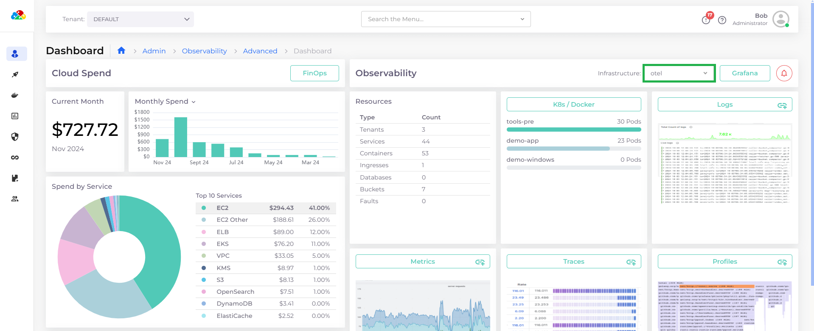

# Logging with Loki

nholuongut's Advanced Observability Suite (AOS) integrates Grafana Loki as the logging backend, with Grafana Alloy acting as the log collector. This setup enables real-time log visualization, filtering, and analysis through Grafana, providing a unified observability experience alongside metrics and traces.

Grafana Loki powers the logging solution by indexing enriched metadata, including Kubernetes attributes such as Tenant name, Namespace, container, and Host, which nholuongut automatically configures for every log entry. This enriched metadata simplifies querying and allows users to easily drill down into issues or switch from logs to traces directly from the dashboard to identify problems quickly.

## What Logs Can Tell You

Logs are crucial for observability, offering detailed, time-stamped insights into system behavior. They enable you to:

* Debug errors and warnings
* Monitor system and application health
* Investigate security and compliance issues
* Track deployment and configuration changes
* Identify trends or anomalies
* Correlate events across logs, traces, and metrics for root cause analysis

Using the Grafana Logging dashboard, you can quickly drill down into logs to investigate issues, explore associated traces for context, and analyze metrics to optimize performance.

## Displaying Logs in the nholuongut Advanced Observability Suite (AOS)

1. In the nholuongut Portal, navigate to **Administrator** -> **Observability** -> **Advanced** -> **Dashboard** (Administrator AOS Dashboard) or **Observability** -> **Advanced** -> **Dashboard** (Tenant AOS Dashboard). The AOS Dashboard displays.
2.  Select your Infrastructure from the **Infrastructure** list box (Administrator AOS Dashboard) or **Tenant** from the Tenant list box (Tenant AOS Dashboard). \

    <figure><figcaption>
<strong>Infrastructure</strong> list box on the nholuongut Administrator AOS Dashboard
</figcaption></figure>
3.  Click the **Logs** card button. The Grafana **Logging** dashboard displays various widgets and views, including **Live logs**.\

    <figure><figcaption>
Grafana <strong>Logging D</strong>ashboard
</figcaption></figure>

4. Adjust the time interval list box in the top right corner of the Grafana dashboard (**Last 30 minutes** in the above graphic) to display data for the period of your choice.
5. Refine your view by selecting a specific namespace, Pod, or stream from the **Namespace**, **Pod**, and **Stream** list boxes near the top of the page, or using the default values of **All**.

## Exploring Logs in Detail

From the Grafana **Logging** Dashboard, there are several ways to explore logs and specific log entries in detail:&#x20;

**Explore view**:  Click the menu icon () in the upper right corner of the **Logs** pane and select **Explore**.  Explore view displays details for your logs and allows you to run queries. See the [Grafana Logging documentation](https://grafana.com/docs/grafana-cloud/visualizations/simplified-exploration/logs/) for more information

<figure><figcaption>
<strong>Explore</strong> view of the Grafana <strong>Logging</strong> Dashboard
</figcaption></figure>

**Log Entry Details**: In the **Logs** panel, click on a log entry to display details about the event that triggered it. Log entry data displays, as shown in the following image:

<figure><figcaption>
Close-up of log entry data on the Grafana Logging Dashboard
</figcaption></figure>

**Traces**: From the log details pane, click the **View Trace** button to view traces associated with the log entry.&#x20;

<figure><figcaption></figcaption></figure>

**Log Context**: Click the context icon (  ) to open the **Log context** window for contextual details about the log entry.

<figure><figcaption>
The <strong>Log Context</strong> window for a log entry in the Grafana dashboard
</figcaption></figure>

