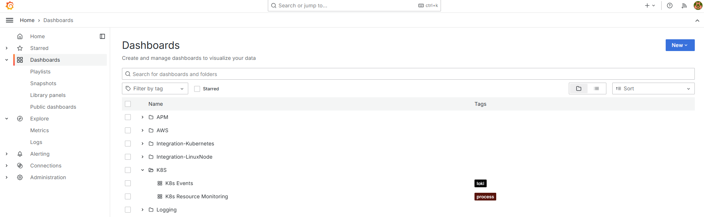
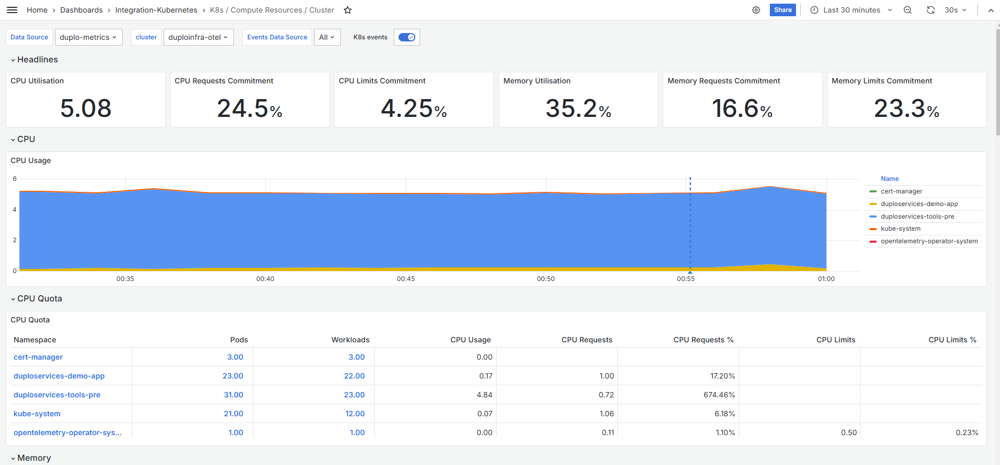

# Metrics with Mimir

nholuongut's Advanced Observability Suite (AOS) metrics pipeline leverages [AWS CloudWatch](https://docs.aws.amazon.com/AmazonCloudWatch/latest/monitoring/WhatIsCloudWatch.html) for capturing critical metrics such as CPU utilization, memory usage, and Lambda execution times, [Grafana Mimir](https://grafana.com/oss/mimir/) as the backend for scalable and high-availability metrics storage, [Grafana](https://grafana.com/) as the visualization tool for intuitive dashboard creation, and [Grafana Alloy](https://grafana.com/docs/alloy/latest/) for bundling tools like Beyla and OpenTelemetry SDKs to collect metrics from applications and infrastructure. Out-of-the-box metrics combine with custom application-level metrics, to create unified dashboards that correlate infrastructure and application performance for a comprehensive view of system health.

## About RED Metrics

RED metrics (Rate, Errors, Duration) are critical for monitoring and understanding the health and performance of distributed systems and microservices. When integrated into a Grafana dashboard using [OpenTelemetry](https://opentelemetry.io/), they provide essential insights for diagnosing issues and optimizing performance, such as: &#x20;

* **Rate**: Tracks the number of requests per second, indicating the system's throughput. A sudden drop can highlight service degradation or bottlenecks.
* **Errors**: Measures the percentage or count of requests that fail. This helps quickly identify stability issues or breaking changes in your service.
* **Duration**: Monitors the time to process requests, providing insights into system latency. High durations can indicate inefficiencies or resource constraints.

## Displaying Metrics in the nholuongut Advanced Observability Suite (AOS)

1. In the nholuongut Portal, navigate to **Administrator** -> **Observability** -> **Advanced** -> **Dashboard** (Administrator AOS Dashboard) **or Observability** -> **Advanced** -> **Dashboard** (Tenant AOS Dashboard). The AOS Dashboard displays.
2. Select your Infrastructure from the **Infrastructure** list box (Administrator AOS Dashboard) or **Tenant** from the Tenant list box (Tenant AOS Dashboard).&#x20;
3. Click the **Metrics** card button. The Grafana **APM** -> **RED Metrics** Dashboard displays. The graphic below shows the **RED** (Request, Error, Duration) Dashboard.

<figure><figcaption>
The <strong>Beyla RED Metrics</strong> Dashboard
</figcaption></figure>

## Exploring Detailed Metrics

From the Grafana **Beyla RED** Dashboard, navigate to Grafana **Dashboards** in the left pane. Various out-of-box metrics and visualizations are available to you without creating specific queries.&#x20;

<figure><figcaption>
Grafana <strong>Dashboards</strong> page.
</figcaption></figure>

For example, by selecting **K8s Resource Monitoring** from the **Dashboards** page, you can view numerous Kubernetes widgets depicting resource usage of Kubernetes Pods and containers, among other helpful performance data.&#x20;

<figure><figcaption>
The Grafana dashboard displaying compute resource information for a K8s cluster
</figcaption></figure>

Click the **Add** button and select from the displayed list to add additional customizations and visualizations to a dashboard.

