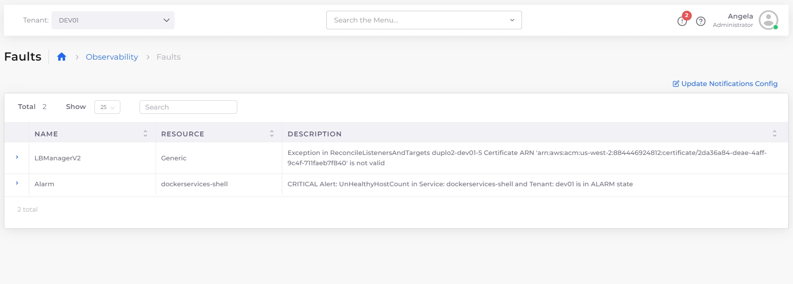
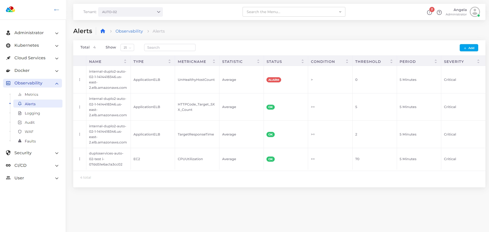
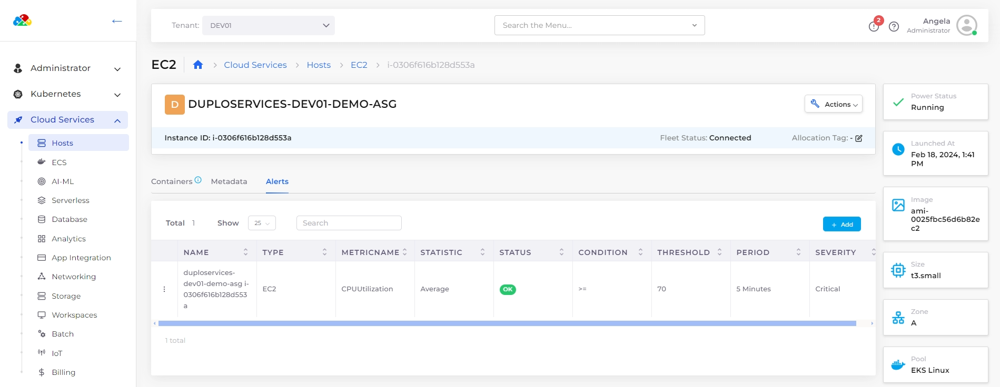

# Faults and Alerts

## Introduction 

Faults that happen in the system, be it Infrastructure creation, container deployments, Application health checks, or any Triggered Alarms can be tracked in the nholuongut portal under Faults Menu.

## Viewing Faults 

You can look at Tenant-specific faults under **Observability** -> **Faults** or all the faults in the system under **Administrator** -> **Faults**.

<figure><figcaption>
The <strong>Faults</strong> page showing faults for the DEV01 Tenant
</figcaption></figure>

## Configuring Tenant-level fault settings 

To configure faults for a Tenant, navigate to **Administrator** -> **Tenants** and select the Tenant from the **NAME** column. In the **Settings** tab, click **Add**. Select or enter the appropriate feature on the **Add Tenant Feature** pane.

### Muting faults for stopped Tenants

1. From the nholuongut portal, navigate to **Administrator** -> **Tenants**.
2. Select the Tenant from the **NAME** column.
3. Select the **Settings** tab, and click **Add**. The **Add Tenant Feature** pane displays.

<figure><figcaption>
The <strong>Add Tenant</strong> pane
</figcaption></figure>

4. From the **Select Feature** list box, select **Other**.
5. In the **Configuration** field, enter **tenant\_instances\_stopped**.
6. In the **Value** field, enter **True**.
7.  Click **Add**. Faults for stopped Tenants will be muted.\

    <figure><figcaption>
The <strong>Settings</strong> tab on the SA-12 <strong>Tenant</strong> details page in the nholuongut Platform
</figcaption></figure>

## Creating Alerts 

You can set the AWS Alerts for the individual metrics, click on the bell icon on any of the metrics. A form to create an alert shows up. You can provide the necessary information and create the alert.

## Viewing Alerts

* View general alerts from the nholuongut Portal in the **Observability** -> **Alerts**.
* Select the **Alerts** tab for alerts pertaining to a specific resource, such as **Hosts**.

<figure><figcaption>
General <strong>Alerts</strong> page under <strong>Observability</strong> in the nholuongut Portal
</figcaption></figure>

<figure><figcaption>
<strong>Alerts</strong> tab under <strong>Cloud Services</strong> -> <strong>Hosts</strong> in the nholuongut Portal
</figcaption></figure>
