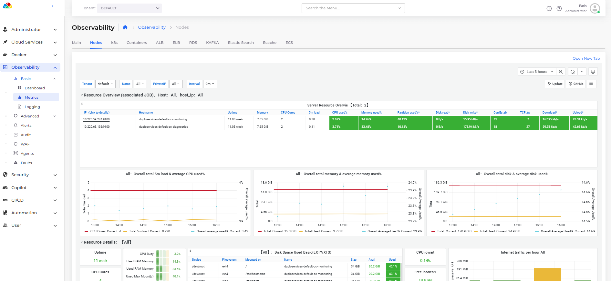

# Metrics

In the nholuongut Portal, navigate to **Observability** -> **Standard** -> **Metrics** to view various metrics per Tenant.&#x20;


Several out-of-the-box dashboards are available for various services. You can customize these, configure them, and add them to your standard view.


<figure><figcaption>
Standard <strong>Metrics</strong> with <strong>Nodes</strong> tab selected
</figcaption></figure>
