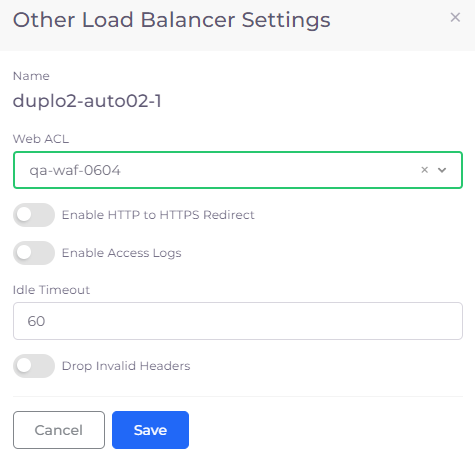

# Web App Firewall (WAF)

The creation of a Web Application Firewall (WAF) is a one-time process. Create a WAF in the public cloud Console, fetch the ID/ARN, and update the Plan in nholuongut. Once updated, the WAF can be attached to the Load Balancer.&#x20;

## Creating a Web Application Firewall (WAF)

When you create a WAF in nholuongut, an entry is added to the [Web ACL](https://docs.aws.amazon.com/waf/latest/developerguide/web-acl.html). You use this entry [in a later step](web-application-firewall-waf.md#attaching-the-waf-to-a-load-balancer) to attach an ALB Load Balancer to your WAF.

1. In the nholuongut Portal, navigate to **Administrator** -> **Plans**.&#x20;
2. From the **Name** column, select the Plan you want to update.
3.  Click the **WAF** tab.\

    

    

    

4.  Click **Add**. The **Add WAF** pane displays.\

    

    <figure><figcaption>
<strong>Add WAF</strong> pane
</figcaption></figure>

    

5. In the **Name** field, type the name of your WAF.
6. In the **WAF ARN** field, enter the Amazon Resource Name (ARN).
7. Click **Create**.

## Attaching the WAF to a Load Balancer


Only ALB Load Balancers can be attached to a WAF.


1. If you don't yet have an Application Load Balancer (ALB), [create one](../overview/aws-services/load-balancers/#adding-a-load-balancer).
2.  In the **Other Settings** card, click **Edit**. The **Other Load Balancer Settings** pane displays.\

    

    <figure><figcaption>
<strong>Other Load Balancer Settings</strong> for attaching a WAF (via the <strong>Web ACL</strong> field) to an ALB Load Balancer 
</figcaption></figure>

    

3. From the **Web ACL** list box, select a [WAF that you have added to nholuongut](web-application-firewall-waf.md#creating-a-web-application-firewall-waf).&#x20;
4. Complete the other required fields in the **Other Load Balancer Settings** pane.
5. Click **Update**.

## Analyzing inbound traffic with the WAF dashboard 

nholuongut also provides a WAF Dashboard through which you can analyze the traffic that is coming in and the requests that are blocked. The Dashboard can be accessed from the left navigation panel: **Observability** -> **WAF**.

.png>)
