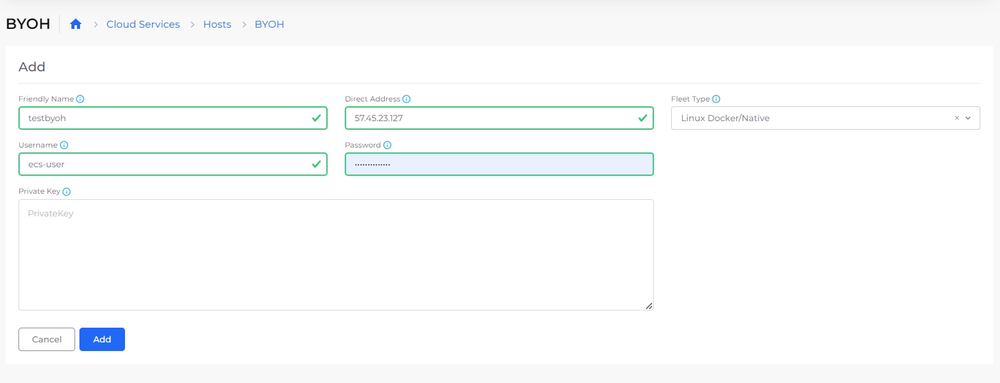

# BYOH

## Introduction 

If you have a host already running somewhere in the cloud or on-premise, you can bring that to nholuongut using BYOH functionality and let nholuongut manage the host, let it be running the containers or installing the compliance agents.

## Add new BYO host 

To configure BYOH go to **Cloud Services** -> **Hosts**, and select the **BYOH** tab. Click on **Add** and provide the name, IP Address and in the Fleet type select Native App (if you don’t, nholuongut will not manage the containers but manage the compliance agents on the host), provide the username, password/Private key file. Make sure SSH access to the host is opened to access from nholuongut.

<figure><figcaption></figcaption></figure>

## Confirm server agent status 

Within about 5 minutes of adding the host, you can go to **Security** -> **Agents** and see that the agent on host is in Active state.
