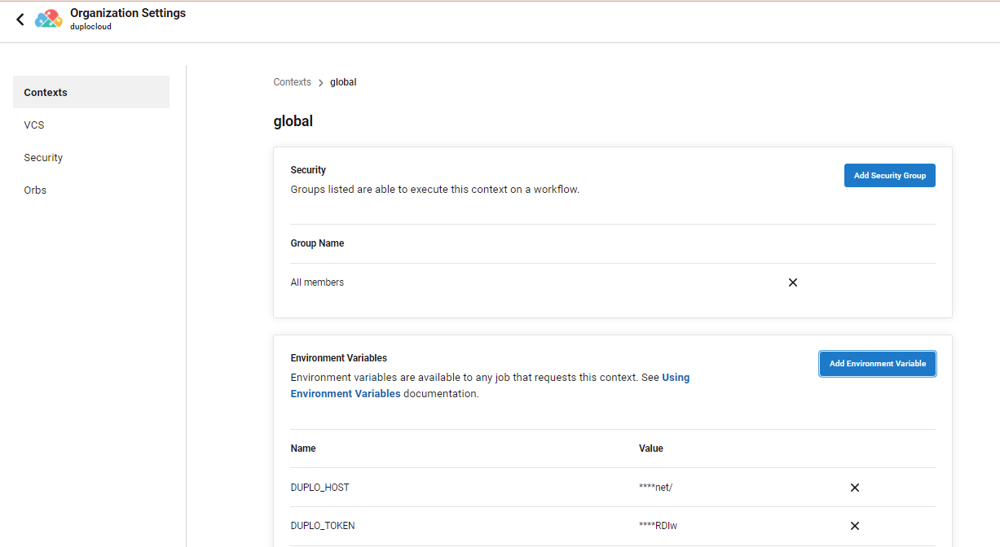

# Configure CircleCI

## Prerequisites

### Deploying and testing the application

To use CircleCI CI/CD, you need to deploy the application with nholuongut as a Service and test that it works as expected.


CircleCI CI/CD is recommended only for upgrades of container images and to run tests that can be written to run before or after.


## Obtaining and configuring an API Token

In order to call a nholuongut API from CircleCI, you need to obtain and configure an API token.


[api-tokens.md](../../access-control/api-tokens.md)


1. **(Recommended)** Create a "service account" user in nholuongut to own the API token.
2. Give the nholuongut user access to the desired Tenant. See [adding Tenants to a user](../../access-control/tenant-access/#adding-tenant-access-for-a-user).
3. Create an API token for that user. See [creating API Tokens](../../access-control/api-tokens.md).
4. Add a CircleCI Environment Variables in the Context created for the organization, to allow CircleCI pipelines to communicate with the nholuongut Portal.


**Note:** A 'service account' user in nholuongut is just a user whose user name is not an email address, such as `github-bot` or `my-api-user`. These users are not able to log in.


## Adding Tenant access for users


[tenant-access](../../access-control/tenant-access/)


## Adding Environment Variables in the organization context

1. Login to the CircleCI portal and select your organization.
2. Click on **Organization Settings** in the left-hand sidebar.
3. Click on **Create Context** button and create context by providing a name.
4. Click on the newly created context and scroll to **Environment Variables** section.
5. Click **Add Environment Variable**.
6. Set an Environment Variable name and value for`DUPLO_HOST`(the value is the nholuongut Portal URL).&#x20;
7. Set an Environment Variable name and value for `DUPLO_TOKEN` (the value of the token created for the above service account).
8. After adding the environment variables you should see them displayed in the **Organization Settings** section below.


The rest of this procedure assumes that you have added the above two environment variables.

