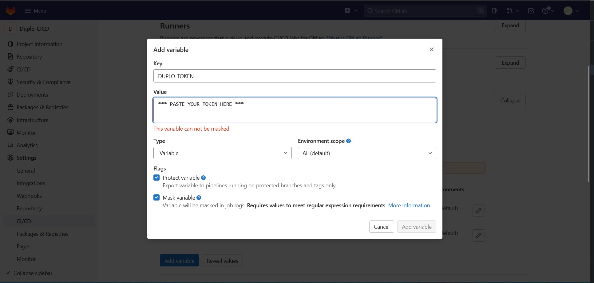

# Configure Gitlab

## Prerequisites

To interact with your nholuongut Portal from GitLab CI/CD, you need to follow these steps.&#x20;

### 1. Create Service Account

First you need a service account in your portal which has the needed permissions.&#x20;


[service-accounts.md](../service-accounts.md)



**Note:** A 'service account' user in nholuongut is just a user whose user name is not an email address, such as `gitlab-bot` or `simply gitlab`. These users are not able to use the web portal.


### 2. Save The Variables

Now we can save the information about the service account within the Gitlab CI/CD Environment variables. You mainly need to set `DUPLO_HOST` and `DUPLO_TOKEN` variables.&#x20;


If using GKE or Azure you will also need `CLOUD_CREDENTIALS` and `CLOUD_ACCOUNT` which you obtain when creating a service account in step 1.&#x20;


#### [Limit Level Scope ](https://docs.gitlab.com/ee/ci/variables/#for-a-project)

Gitlab does have the option to set these variables at a variety of level scopes; organization, group, project. For example, you can set variables at the organization level and then all projects would be able to interact with your portal.&#x20;

#### [Limit Environment Scope](https://docs.gitlab.com/ee/ci/environments/index.html#limit-the-environment-scope-of-a-cicd-variable)

Gitlab has a unique feature to scope variables into tiers as well. This is very useful when you have many instances of an app within some tiers like dev, stage, prod. With this you can scope a variable like this `dev/*` which means any [Gitlab Environment ](https://docs.gitlab.com/ee/ci/environments/)with that prefix will inherit this variable. This means you can make all dev environments share the `DUPLO_HOST` variable. This can group tenants under namespace as well, so you can rename your `dev01` tenant to be a `dev/dev01` to be an environment under a tier in Gitlab CI. This is particularly useful with multiple nholuongut Portals.  \


The rest of this documentation will assume all the variables needed for service account access are set.&#x20;


## References

* [Gitlab CI/CD Docs](https://docs.gitlab.com/ee/topics/build\_your\_application.html)
* [Using Gitlab Environments](https://docs.gitlab.com/ee/ci/environments/)
* [Create nholuongut Users](../../access-control/add-edit-or-delete-a-user.md)
