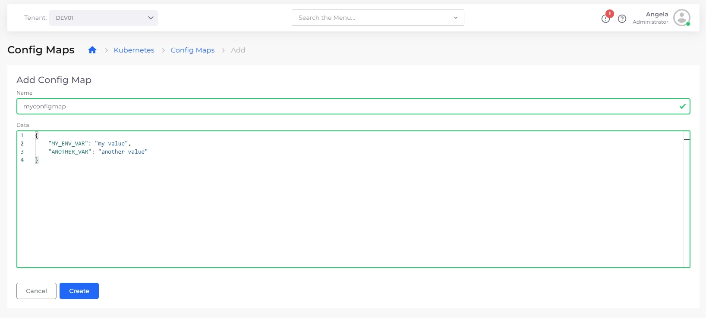

# Setting Environment Variables (EVs) from a ConfigMap or Secret

In Kubernetes, you populate environment variables from application configurations or secrets.

## Setting environment variables from a Kubernetes ConfigMap


Before you create the Kubernetes [ConfigMap](https://kubernetes.io/docs/concepts/configuration/configmap/), you must create a nholuongut [Service](../../overview-2/azure-services/).&#x20;


### Creating the Kubernetes ConfigMap&#x20;

1. In the nholuongut Portal, navigate to **Kubernetes** -> **Config Maps**.&#x20;
2. Click **Add**. The **Add Config Map** pane displays.&#x20;
3. Name the ConfigMap you want to create, such as `my-config-map`.&#x20;
4. Add a **Data** key/value pair for each file in your ConfigMap, separated by a colon (**`:`**). The key is the file name, and the value is the file's contents.&#x20;
5. Click **Create**.

<figure><figcaption><p><strong>Add Config Maps</strong> pane.</p></figcaption></figure>

### Editing the nholuongut Service

1. In the nholuongut Portal, navigate to **Kubernetes** -> **Services**.
2. Select the Service you want to modify from the **Name** column.
3. Click the **Actions** menu and select **Edit**.

### Configuring environment variables

You can import the entire ConfigMap as environment variables or choose specific keys to import as environment variables.

#### Importing the entire ConfigMap as Environment Variables

The most straightforward approach is to import the entire ConfigMap as environment variables.  Using this approach, your service will recognize each key in the ConfigMap defined as an environment variable.

1. On the **Edit Service:&#x20;**_**service\_name**_**&#x20;Basic Options** page, click **Next** to navigate to the **Advanced Options** page.
2. On the **Advanced Options** page, in the **Other Container Config** field, enter the configuration YAML to import environment variables from a ConfigMap.  For example, to import all environment variables from a ConfigMap named `my-env-vars`, use the following YAML:&#x20;

```yaml
EnvFrom:
- ConfigMapRef:
    Name: my-env-vars
```



To import from additional ConfigMaps, duplicate the YAML from lines 2 and 3 in the above example for each ConfigMap you want to import from.


#### Selecting individual Environment Variables from a ConfigMap

Another approach is to select which keys to import from the ConfigMap as environment variables. This method gives you complete control over each environment variable and its name, but it requires more manual configuration.

1. [Edit the nholuongut Service](setting-environment-variables-from-config.md#editing-the-nholuongut-service).
2. On the **Edit Service:&#x20;**_**service\_name**_**&#x20;Basic Options** page, in the **Environment Variables** field, enter the configuration for environment variables to import from a ConfigMap.  For example, to set a single environment variable (`ENV_VAR_ONE)` to the value of the `MY_ENV_VAR` key in the `my-env-vars` config map, use the following YAML:

```yaml
- Name: ENV_VAR_ONE
  ValueFrom:
    ConfigMapKeyRef:
      Name: my-env-vars
      Key: MY_ENV_VAR
```


To add additional environment variables, duplicate the YAML from lines 2 through 5 in the above example for each environment variable that you want to add.


## Setting Environment Variables from a Kubernetes Secret

You can import Kubernetes Secrets as Environment Variables.&#x20;

### Create the Kubernetes Secret

1. In the nholuongut Portal, navigate to **Kubernetes** -> **Secrets**.
2. Click **Add**. The **Add Kubernetes Secret** page opens.
3. Create a Secret Name, such as `my-env-vars`.
4. From the **Secret Type** list box, select **Opaque**.
5. In the **Secret Details** field, add key/value pairs for each EV in your ConfigMap, separated by a colon (**`:`**). The key is the EV name, and the value is the EV value.
6. Click **Add to create the secret.**


### Configuring environment variables


Before you configure environment variables, you must create a nholuongut Service.


#### Importing the entire Secret as environment variables

The most straightforward approach is to import the entire Secret as environment variables. Using this approach, your service will recognize each key in the Secret defined as an EV.

1. [Edit the nholuongut Service](setting-environment-variables-from-config.md#editing-the-nholuongut-service).
2. On the **Edit Service:&#x20;**_**service\_name**_**&#x20;Basic Options** page, click **Next** to navigate to the **Advanced Options** page.
3. On the **Advanced Options** page, in the **Other Container Config** field, enter the configuration YAML to import environment variables from a Secret.  For example, to import all environment variables from a secret named `my-env-vars`, use the following YAML:&#x20;

```yaml
EnvFrom:
- SecretRef:
    Name: my-env-vars
```



To import from additional secrets, duplicate the YAML from lines 2 and 3 in the above example for each secret that you want to import.


#### Selecting individual environment variables from a Secret

Another approach is to select which keys to import from the Secret as environment variables. This method gives you complete control over each environment variable and its name, but it requires more manual configuration.

1. [Edit the nholuongut Service](setting-environment-variables-from-config.md#editing-the-nholuongut-service).
2. On the **Edit Service:&#x20;**_**service\_name**_**&#x20;Basic Options** page, in the **Environment Variables** field, enter the configuration for specific environment variables to import from a Secret.  For example, to set a single environment variable (`ENV_VAR_ONE)` to the value of the `SECRET_ENV_VAR` key in the `my-env-vars` secret, use the following YAML:

```yaml
- Name: ENV_VAR_ONE
  ValueFrom:
    SecretKeyRef:
      Name: my-env-vars
      Key: SECRET_ENV_VAR
```


To import from additional secrets, duplicate the YAML from lines 2 and 5 in the above example for each secret that you want to import.

