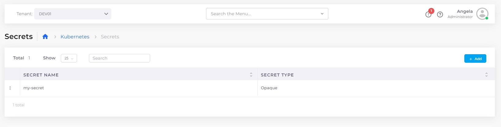

# Setting Kubernetes Secrets

### Setting Kubernetes Secrets

To securely manage sensitive information in your deployment, set and reference Kubernetes secrets in the nholuongut Portal.

1. In the nholuongut Portal, navigate to **Kubernetes** -> **Secrets**. The **Kubernetes Secrets** page displays.
2. Click **Add**.
3. Fill in the fields (**Secret Name, Secret Type, Secret Details, Secret Labels**, and **Secret Annotations**).
4. Click **Add**. The Kubernetes Secret is set.

<figure><figcaption>
<strong>Kubernetes Secrets</strong> page.
</figcaption></figure>

### Troubleshooting Secret Format Issues

When entering a Kubernetes secret with a private key in Duplo, ensure the data is formatted as key/value pairs with all keys and values as strings. If you encounter format errors, it's likely due to non-string values or incorrect multiline string formatting. Use the `|` character to indicate multiline strings and manually split a single-line private key into multiple lines for compatibility. Matching the format of an existing, working secret can also aid in resolving these issues.

### Managing Kubernetes Secrets Effectively

To enhance the security and management of Kubernetes secrets, consider the following strategies:

* **Utilize Centralized Secret Management Tools:** Centralize the management of secrets to streamline access and control.
* **Implement Access Controls:** Define who can access or modify secrets to minimize risk.
* **Regularly Rotate Secrets:** Change secrets periodically to reduce the impact of potential breaches.
* **Audit Access Logs:** Keep track of who accesses secrets and when, to detect unauthorized access or anomalies.

By integrating these practices, you can ensure a more secure and efficient handling of secrets within your Kubernetes environment.