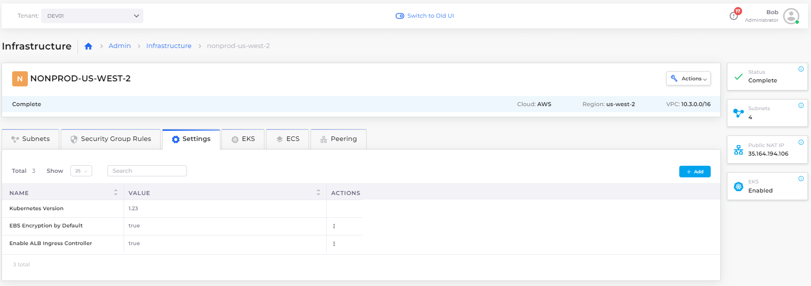
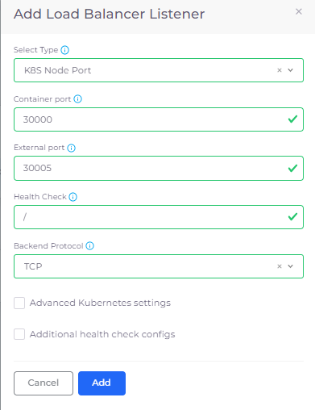
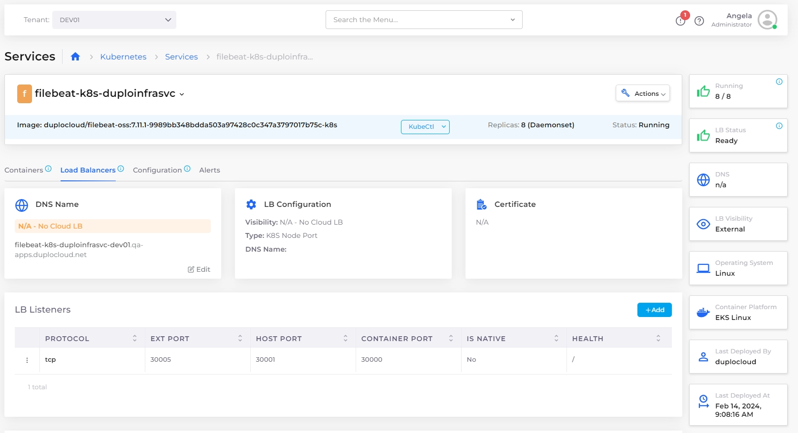
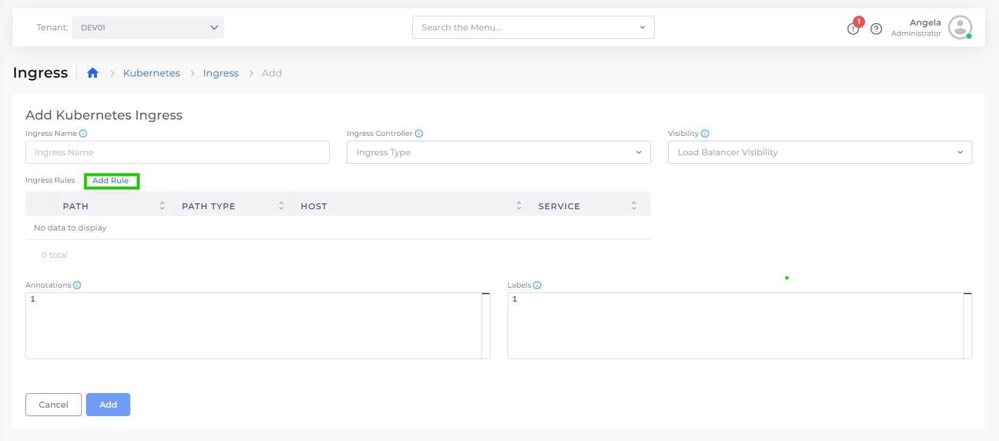
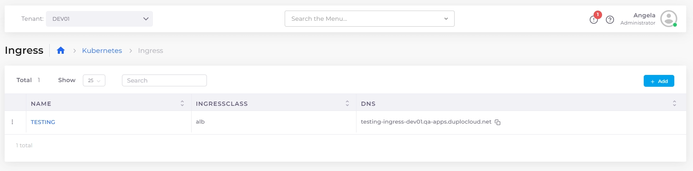
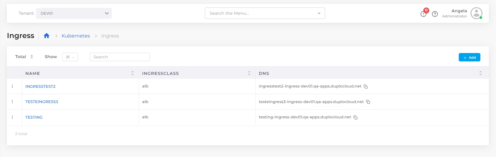

# EKS Ingress

Ingress controllers abstract the complexity of routed Kubernetes application traffic, providing a bridge between Kubernetes services and services that you define.

## Prerequisites

### Creating Services with EKS

See the nholuongut documentation for instructions to add [Tenants](../../overview/use-cases/tenant-environment/), [Hosts](../../overview/use-cases/hosts-vms/), and [Services](../../overview/aws-services/).&#x20;

### Enabling the AWS Application Load Balancer&#x20;

An administrator needs to enable the AWS Application Load Balancer controller for your Infrastructure before you can use Ingress.

1. In the nholuongut Portal, navigate to **Administrator ->** **Infrastructure** and select the Infrastructure name from the **NAME** column.&#x20;
2. Select the **Settings** tab, and click **Add**. The **Infra - Custom Data** pane displays.
3. From the **Setting Name** list box, select **Enable ALB Ingress Controller**.
4. Select **Enable**.
5. Click **Set**. In the Settings tab, the **Enable ALB Ingress Controller** setting displays a value of **true**.&#x20;

<figure><figcaption>
The <strong>Settings</strong> tab on the <strong>Infrastructure</strong> page
</figcaption></figure>

## Adding a Load Balancer with Kubernetes NodePort

Add a Load Balancer listener that uses Kubernetes (K8s) NodePort.&#x20;

1. In the nholuongut Portal, navigate to **Kubernetes** -> **Services**.&#x20;
2. Select your Service name from the **NAME** column.
3. Select the **Load Balancers** tab.
4.  Click **Configure Load Balancer**. The **Add Load Balancer Listener** pane appears.\

    
<figure><figcaption>
<strong>Add Load Balancer Listener</strong> pane
</figcaption></figure>

5. In the **Select Type** field, select **K8S Node Port**.&#x20;
6. Enter the **Container port** and **External port**.
7. Optionally, enable **Advanced Kubernetes settings**. &#x20;
8. Kubernetes Health Check and Probes are enabled by default. To manually configure Health Check settings, select **Additional health check configs**.
9. Click **Add**. The Load Balancer listener is displayed under **LB Listeners** on the **Load Balancers** tab.

<figure><figcaption>
The <strong>Add Load Balancer</strong> Listener pane in the nholuongut Portal
</figcaption></figure>

5. In the **Select Type** field, select **K8S Node Port**.&#x20;
6. Complete the Container port and External port fields.
7. In the Health Check field, enter `/`.&#x20;
8. Complete the other required fields in the **Add Load Balancer Listener** pane as needed.&#x20;
9. Click **Add**. The Load Balancer displays in the **Load Balancers** tab.

<figure><figcaption>
The <strong>Load Balancers</strong> tab for the <strong>filebeat-k8s-duploinfrasvc</strong> Service
</figcaption></figure>

## Adding a Kubernetes Ingress

1. Select **Kubernetes** -> **Ingress** from the navigation pane.
2. Click **Add**. The **Add Kubernetes Ingress** page displays.

<figure><figcaption>
The <strong>Add Kubernetes Ingress</strong> page in the nholuongut Portal
</figcaption></figure>

3. Enter a name in the **Ingress Name field.**
4. From the **Ingress Controller** list box, select the [Ingress Controller that you defined previously](adding-ingress.md#enabling-the-aws-application-load-balancer).
5. From the **Visibility** list box, select either **Internal Only** or **Public**.&#x20;
6. From the **Certificate ARN** list box, select the appropriate ARN.
7. To expose your services over HTTP or HTTPS, enter the listener ports in the **HTTP Listener Port** and **HTTPS Listener Port** fields.&#x20;
8. In the **Target Type** field, specify how you want to route traffic to Pods. You can choose between **Instance (Worker Nodes)** or **IP (Pod IPs)**.&#x20;
   * **Instance (Worker Nodes)** routes traffic to all EC2 instances within the cluster on the NodePort opened for your Service. To use the Instance target type, the Service must be **NodePort** or **LoadBalancer** type.
   * **IP (Pod IPs)** routes traffic directly to the Pod IP. The network plugin must use secondary IP addresses on ENI (e.g., amazon-vpc-cni-k8s) for the Pod IP to use IP mode. The Service can be of any type (e.g., ClusterIP, NodePort, or LoadBalancer). IP mode is required for sticky sessions to work with Application Load Balancers.


To add a Kubernetes Ingress, you must define rules. [Continue to the next section to add rules](adding-ingress.md#add-rules-to-kubernetes-ingress-and-complete-ingress-setup) to Kubernetes Ingress and complete the setup.&#x20;


### Defining Ingress rules

1. On the **Add Kubernetes Ingress** page, click **Add Rule**. The **Add Ingress Rule pane** displays.&#x20;

<figure><figcaption>
<strong>Add Kubernetes Ingress</strong> page with highlighted <strong>Add Rule</strong> option
</figcaption></figure>

<figure><figcaption>
The <strong>Add Ingress Rule</strong> pane
</figcaption></figure>

2. Specify the **Path** (**/** in the example above) and **Path Type** (**Exact**, **Prefix**, or **Implementation Specific**).
3. Optionally, enter a Host in the **Host** field.
4. Select the **Service Name** (the **Container Port** field is automatically completed), or, use the toggle switch to enable **Use Container Port Name**, and manually complete the **Service Name** and **Container Port Name** fields. &#x20;
5. Click **Add Rule**. The rule will be displayed on the **Add Kubernetes Ingress** page. Repeat steps 1-7 to add additional rules.

### Configuring Ingress redirect configurations and annotations

1.  On the **Add Kubernetes Ingress** page, click **Add Redirect Config**. The **Add Redirect Config** pane displays.\

    
<figure><figcaption>
The <strong>Add Redirect Config</strong> pane
</figcaption></figure>

2. In the **Name** field, enter a descriptive name for the Ingress redirect configuration.&#x20;
3. &#x20;In the **Host** field, specify the domain name for which this redirect rule will apply.
4. In the **Path** field, Define the path that should trigger the redirect.
5. Enter the **Port** for the backend service or redirect.
6. Enter the **Protocol** to enforce (e.g., HTTPS).
7. If Applicable, in the **Query** field, specify query parameters for the redirect.
8. In the **Status Codes** field, enter the HTTP status code for the redirect.
9. Optionally, in the **Annotations** field, enter additional configuration options specific to the Ingress controller.
10. Click **Add** to add the Kubernetes Ingress with defined rules and configurations. The Ingress you added displays in the **K8S Ingress** tab.\

    <figure><figcaption>
 <strong>The Ingress</strong> page displaying the added Ingress
</figcaption></figure>


nholuongut Platform supports defining multiple paths in Ingress.&#x20;


## Viewing Ingress

### Viewing Ingress details in the nholuongut Portal

When Ingress is configured, view details by navigating to **Kubernetes** -> **Ingress**, and selecting your Ingress from the **NAME** column.

<figure><figcaption>
 <strong>Ingress</strong> page with multiple Ingresses
</figcaption></figure>

### Viewing Ingress details using `curl` Commands

You can also view Ingress details using `curl` commands. Curl commands are configured with the DNS names and paths (as defined in your Ingress rules) in the format: `curl http://<dns1>/<path1>`. The responses from these requests will show how traffic is being routed according to the Ingress configuration. For example, see the following three commands and responses:&#x20;

Command: `curl http://ig-nev-ingress-ing-t2-1-duplopoc.net/path-x/`

Respons&#x65;**:** `this is service1`

Command: `curl http://ing-doc-ingress-ing-t2-1-duplopoc.net/path-y/`

Respons&#x65;**:**  `this is service2`

Command: `curl http://ing-public-ingress-ing-t2.1.duplopoc.net/path-z/`

Respons&#x65;**:** `this is ING2-PUBLIC`
