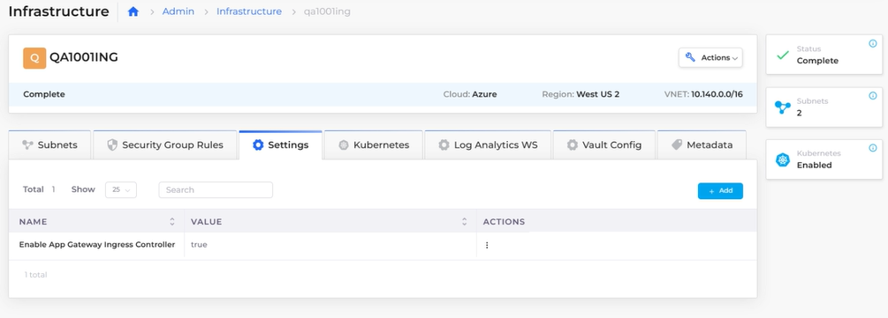
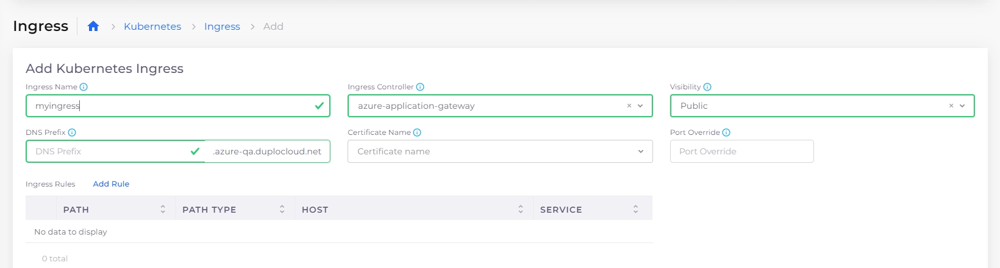
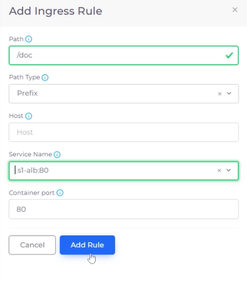
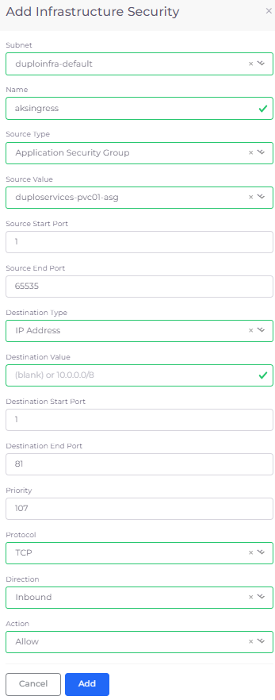
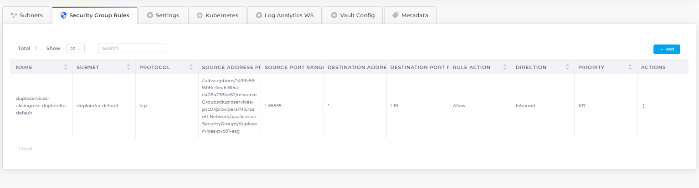

# AKS Ingress

Ingress controllers abstract the complexity of routed Kubernetes application traffic, providing a bridge between Kubernetes services and services that you define.


To add an SSL certificate to a service using Kubernetes Ingress, see the nholuongut documentation for [using SSL certificates with Ingress](https://docs.nholuongut.com/docs/overview-2/prerequisites/import-ssl-certificates).


## Prerequisites

### Creating Services with AKS

To run the Load Balancers, you must create one or more Services. To add a service, follow the steps in the [Services](../../../overview-2/azure-services/containers-and-services/#adding-a-nholuongut-service) topic. In this example, we created two Services named **s1-alb** and **s4-nlb**.&#x20;

<figure><figcaption>
The <strong>Kubernetes Services</strong> page showing two Services running 
</figcaption></figure>

### Enabling the Ingress Controller

Before you add an Ingress rule, you need to enable the Ingress Controller for the application gateway.

1. In the nholuongut Portal, navigate to **Administrator** -> **Infrastructure**.
2. Select the Infrastructure from the **NAME** column.
3. Select the **Settings** tab, and click **Add**. The **Infra-Set Custom Data** pane displays.
4. In the **Setting Name** list box, select **Enable App Gateway Ingress Controller**. **Enable** the setting and click **Set**. The **Enable App Gateway Ingress Controller** setting value is **true**.

<figure><figcaption>
<strong>Enable App Gateway Ingress Controller</strong> configured with <strong>true</strong> value
</figcaption></figure>

## Adding a Load Balancer Listener using K8S NodePort

1. In the nholuongut Portal, navigate **Kubernetes** -> **Services**.
2. Select the Service from the **NAME** column.
3. Click the **Load Balancers** tab.
4.  Click **Configure Load Balancer**. The **Add Load Balancer Listener** pane appears.\

    <figure><figcaption>
The <strong>Load Balancer</strong> tab on the Service details page
</figcaption></figure>
5. In the **Select Type** field, select **K8S Node Port**.&#x20;
6. In the **Health Check** field, add the Kubernetes Health Check URL for this container.&#x20;
7. Complete the other fields in the **Add Load Balancer Listener** and click **Add**.


Using Kubernetes Health Check allows AKS's Application Load Balancer to determine whether your Service is running properly.&#x20;


## Adding Kubernetes Ingress

1. In the nholuongut Portal, navigate to **Kubernetes** -> **Ingress**.
2. Click **Add**. The **Add Kubernetes Ingress** page displays.
3.  Supply the **Ingress Name**, select the Ingress Controller (in this example, **azure-application-gateway**), and set **Visibility** to **Public**.\

    <figure><figcaption>
<strong>Add Kubernetes Ingress</strong> page
</figcaption></figure>
4. In the **DNS Prefix** field, provide the DNS prefix to expose services.
5. From the **Certificate ARN** list box, select the certificate ARN to expose services over HTTPS.
6. Optionally, in the **Port Override** field, select a port to override. This field allows configuring frontend listeners to use ports other than 80/443 for HTTP/HTTPS. If you use a port other than 80, you must define an additional Security Group rule for that port. See [this section](./#adding-a-security-group-rule-for-a-port-value-other-than-80) for more information.

### Configuring Ingress rules

1.  On the **Add Kubernetes Ingress** page, click **Add Rule**. The **Add Ingress Rule** pane displays.\

    
<figure><figcaption>
<strong>Add Ingress Rule</strong> pane
</figcaption></figure>

2. Enter a **Path**.
3. In the **Path Type** list box, select **Exact**, **Prefix,** or **Implementation Specific**.
4. In the **Service Name** field, select the Service (**s1-alb:80** in this example).&#x20;
5. Click **Add Rule** to add the Ingress rule.
6. Repeat steps 1-5 to add additional rules. In this example, we added a second rule for Service **s4-nlb:80**.
7. On the **Add Kubernetes Ingress** page, click **Add** to create the Ingress.


The nholuongut Platform supports defining multiple rules/paths in Ingress.


### Adding a Security Group Rule


Port **80** is configured by default when adding Ingress. If you want to use a custom port number, add a security group rule for the custom port.&#x20;


1. In the nholuongut Portal, navigate to **Administrator** -> **Infrastructure**.
2. Select the Infrastructure from the **NAME** column.
3. Select the **Security Group Rules** tab.&#x20;
4.  Click **Add**. The **Add Infrastructure Security** pane displays.\

    
<figure><figcaption>
<strong>Add Infrastructure Security</strong> pane
</figcaption></figure>

5. Define the rule and click **Add**. The rule is added to the **Security Group Rules** list.

<figure><figcaption>
The <strong>Security Group Rules</strong> tab
</figcaption></figure>

## Viewing Ingress

### Viewing Ingress details in the nholuongut Portal

When Ingress is configured, view details by navigating to **Kubernetes** -> **Ingress**, and selecting your Ingress from the **NAME** column.

<figure><figcaption>
The <strong>Kubernetes Ingress</strong> page
</figcaption></figure>

### Viewing Ingress details using `curl` Commands

You can also view Ingress details using `curl` commands. Curl commands are configured with the DNS names and paths (as defined in your Ingress rules) in the format: `curl http://<dns1>/<path1>`. The responses from these requests will show how traffic is being routed according to the Ingress configuration. For example, see the following three commands and responses:

Command: `curl http://ig-nev-ingress-ing-t2-1.duplopoc.net/path1/`

Respons&#x65;**:** `this is IG-NEV`

Command: `curl http://ing-doc-ingress-ing-t2-1.duplopoc.net/path2/`

Response: `this is ING-DOC`

Command: `curl http://ing-public-ingress-ing-t2.1.duplopoc.net/path3/`

Response: `this is ING2-PUBLIC`
