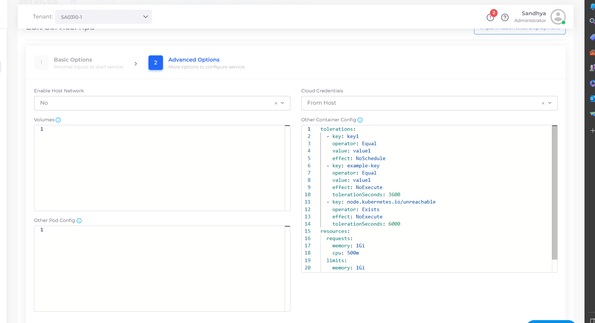

# Pod Toleration

nholuongut supports the customization of many Kubernetes (K8s) YAML operators, such as [`tolerations`](https://kubernetes.io/docs/concepts/scheduling-eviction/taint-and-toleration/). If you are using a Docker container, you can specify the `tolerations` operator configuration in the **Other Container Config** field in the container definition in nholuongut

## Specifying Pod Toleration

1. In the nholuongut Portal, navigate to **Kubernetes** -> **Services**. The **Services** page displays.
2. Select the **Service** from the **NAME** column.
3.  From the **Actions** menu, select **Edit**. The **Edit Service** page displays.\


    <figure><figcaption><p><strong>Edit</strong> option in <strong>Actions</strong> menu on <strong>Edit Service</strong> page</p></figcaption></figure>


4. Click **Next** to proceed to the **Advanced Options** page.
5.  In the **Other Container Config** field, add the `tolerations` operator YAML you have customized for your container. \


    <div align="left">

    <figure><figcaption><p><strong>Other Container Config</strong> field in <strong>Advanced Options</strong> page</p></figcaption></figure>

    </div>


6. Click **Update**. Your container has been updated with your custom specifications for the `tolerations` operator.&#x20;

### Example Code: `tolerations` operator YAML

In this example:

* If a Pod is running and a taint matching `key1` exists on the node, then the Pod will not schedule the node (`NoSchedule`).
* If a Pod is running and a taint matching `example-key` exists on the node, then the Pod stays bound to the node for `6000` seconds and then is evicted (`NoExecute`). If the taint is removed before that time, the Pod will not be evicted.


```yaml
tolerations:
  - key: key1
    operator: Equal
    value: value1
    effect: NoSchedule
  - key: example-key
    operator: Exists
    effect: NoExecute
    tolerationSeconds: 6000
```

