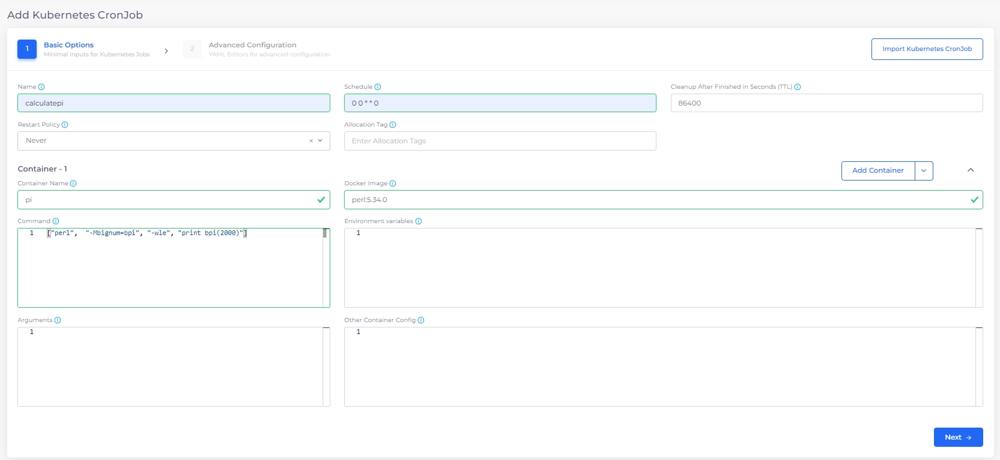
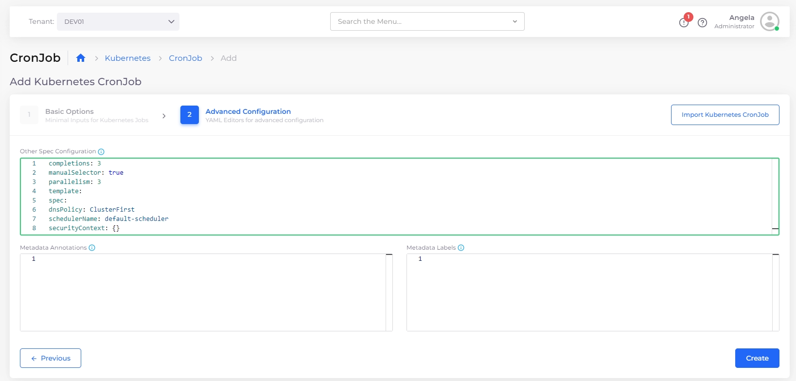
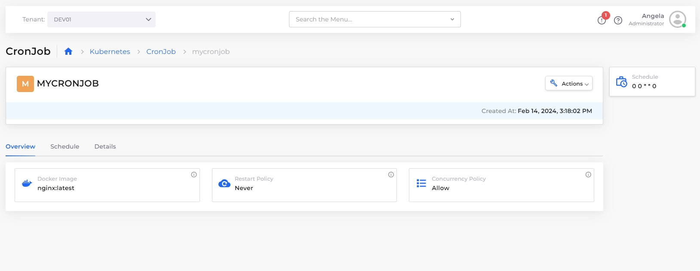
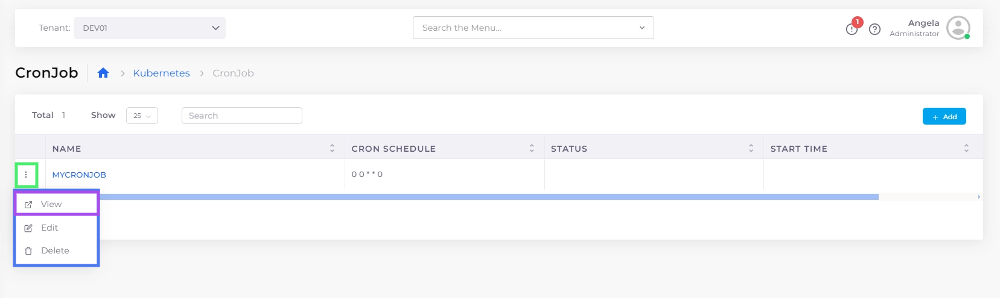
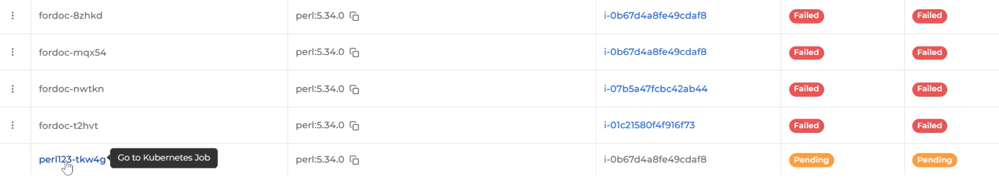

# CronJobs

A [Kubernetes ](https://kubernetes.io/)CronJob is a variant of a [Kubernetes Job](jobs.md) you can schedule to run at periodic intervals.

See the Kubernetes [CronJob](https://kubernetes.io/docs/concepts/workloads/controllers/cron-jobs/) documentation for more information.

## Creating a Kubernetes CronJob in the nholuongut portal

1. In the nholuongut Portal, navigate to **Kubernetes** -> **CronJob**.
2. Click **Add**. The **Add Kubernetes CronJob** page displays.
3. In the **Basic Options** step, specify the Kubernetes CronJob name.
4. In the **Schedule** field, specify the Cron Schedule in Cron Format. Click the Info Tip icon for examples. When specifying a **Schedule** in Cron Format, ensure you separate each value with a space. For example, `0 0 * * 0` is a valid Cron Format input; `00**0` is not. See the [Kubernetes documentation](https://kubernetes.io/docs/concepts/workloads/controllers/cron-jobs/#writing-a-cronjob-spec) for detailed information about Cron Format.
5. In the **Container - 1** area, specify the **Container Name** and associated **Docker Image**.

<figure><figcaption>
The <strong>Add Kubernetes CronJob</strong> page with <strong>Container Nam</strong>e and <strong>Docker image</strong> fields filled.
</figcaption></figure>

6. In the **Command** field, specify the command attributes for **Container - 1**. Click the Info Tip icon for examples. Select and copy commands as needed.

<figure><figcaption>
The <strong>Add Kubernetes CronJob</strong> page with the <strong>Command</strong> options window open.
</figcaption></figure>

<figure><figcaption>
The <strong>Add Kubernetes CronJob</strong> page with the <strong>Command</strong> field for <strong>Container - 1</strong> filled<strong>.</strong>
</figcaption></figure>

7. To run the Kubernetes CronJob to completion, you must specify a Kubernetes [Init Container](https://kubernetes.io/docs/concepts/workloads/pods/init-containers/).  Click the **Add Container**  button and select the **Add Init Container** option. The **Init Container - 1** area displays.

<figure><figcaption>
<strong>Add Init Container</strong> area.
</figcaption></figure>

8. In the **Init Container - 1** area, specify the **Container Name** and associated **Docker Image**.
9. Click **Next** to open the **Advanced Configuration** step.
10. In the **Other Spec Configuration** field, specify the Kubernetes CronJob spec (in YAML) for **Init Container - 1**. Click the Info Tip icon (  ) for examples. Select and copy commands as needed

<figure><figcaption>
The <strong>Other Spec Configuration</strong> window on the <strong>Add Kubernetes CronJob, Advanced Configuration</strong> page<strong>.</strong>
</figcaption></figure>

<figure><figcaption>
The <strong>Add Kubernetes CronJob</strong> page with the <strong>Other Spec Configuration</strong> field completed<strong>.</strong>
</figcaption></figure>

11. Click **Create**. The Kubernetes CronJob is created and displayed on the **CronJob** page. It will run according to the schedule you specified.&#x20;

<figure><figcaption>
<strong>K8s CronJob</strong> tab displaying Kubernetes Job <strong>CALCULATEPI.</strong>
</figcaption></figure>

## Viewing a Kubernetes CronJob&#x20;

## Managing Kubernetes CronJobs faults

You can manage/override Kubernetes Jobs faults on a Tenant or CronJob level. If a CronJob fails, and no Tenant- or Job-level fault setting is configured, nholuongut will generate a fault by default.&#x20;

### **Tenant-level Kubernetes CronJobs faults**

Enable or disable faults for failed Kubernetes CronJobs in a specific Tenant.

1. From the nholuongut Portal, navigate to **Administrator** -> **Tenant.**
2. Click the Tenant name in the **NAME** column.&#x20;
3. Select the **Settings** tab, and click **Add**. The **Add Tenant Feature** pane displays.&#x20;
4. From the **Select Feature** list box, select **Enable K8s job fault logging by default**, and use the toggle switch to enable or disable the setting.&#x20;
5.  Click **Add**. The CronJobs fault setting is added. \

    
<figure><figcaption>
The <strong>Add Tenant Feature</strong> pane with <strong>Enable K8s Job fault logging by default</strong> enabled
</figcaption></figure>

You can view the CronJobs fault setting on the **Tenants** page (Navigate to **Administrator** -> **Tenant**, select the Tenant name) under the **Settings** tab. If the value is **true**, nholuongut will generate a fault. If the value is **false**, nholuongut will not generate a fault.&#x20;

<figure><figcaption>
The <strong>Tenant</strong> details page, <strong>Setting</strong>s tab, showing the configured Jobs fault setting
</figcaption></figure>

### **Jobs-level Kubernetes CronJobs faults**

You can configure the faults for a specific CronJob when creating the CronJob in nholuongut. Fault settings added this way override Tenant-level settings. On the **Add Kubernetes Job** page, in the **Metadata Annotations** field, enter:&#x20;

`nholuongut.net/fault/when-failed: true.` or&#x20;

`nholuongut.net/fault/when-failed: false.`

When the value is true and the CronJob fails, nholuongut will generate a fault. When the value is false and the CronJob fails, a fault will not be generated.&#x20;

## Viewing a Kubernetes CronJob&#x20;

1. In the nholuongut Portal, navigate to **Kubernetes** -> **CronJobs**.
2. Select the Kubernetes CronJob you want to view and click the **Overview, Schedule**, and **Details** tabs for more information about the CronJob schedule and history.&#x20;

You can also view details of a Kubernetes CronJob by clicking on the **menu icon** (  ) icon to the left of the job name and selecting **View**.

<figure><figcaption>
<strong>Overview</strong> tab for Kubernetes Job <strong>MYCRONJOB.</strong>
</figcaption></figure>

<figure><figcaption>
CronJob options menu with <strong>View</strong> option highlighted.
</figcaption></figure>

### Using the Container page to view linked Kubernetes CronJobs

You can view Kubernetes CronJobs linked to containers by clicking the container name on the **Containers** page (**Kubernetes** -> **Containers**). \

<figure><figcaption>
Clicking the Container <strong>Name</strong> on the <strong>Containers</strong> page to view a linked K8s CronJob
</figcaption></figure>

You can filter container names by using the search field at the top of the page, as in this example:

<figure><figcaption>
Highlighted search field on the <strong>Containers</strong> page 
</figcaption></figure>

## Editing a Kubernetes CronJob

1. In the nholuongut Portal, navigate to **Kubernetes** -> **CronJob**.
2. Select the Kubernetes CronJob you want to edit.&#x20;
3. Click the **options menu** (  ) icon to the left of the Kubernetes CronJob name and select **Edit**.

You can edit and modify the following fields in the nholuongut Portal:

* **Cleanup After Finished in Seconds**
* **Other Spec Configuration**
* **Metadata Annotations**
* **Labels**

<figure><figcaption>
CronJob options menu with <strong>Edit</strong> option highlighted
</figcaption></figure>

## Deleting a Kubernetes CronJob

1. In the nholuongut Portal, navigate to **Kubernetes** -> **CronJob.**
2. Select the Kubernetes CronJob you want to delete.&#x20;
3. Click the Options Menu () icon to the left of the Kubernetes CronJob name and select **Delete**.

<figure><figcaption>
CronJob options menu with <strong>Delete</strong> option highlighted
</figcaption></figure>

