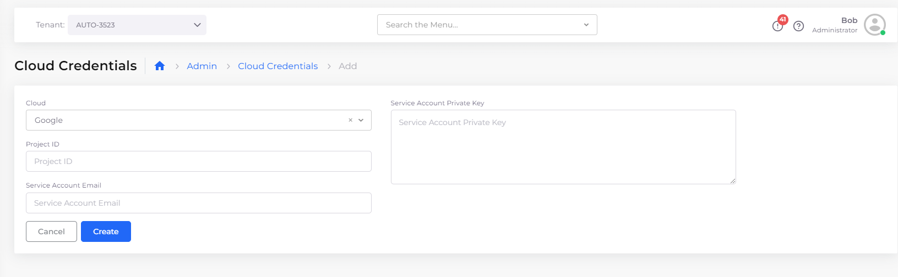
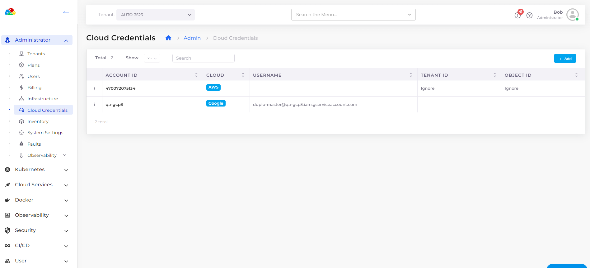

# Cloud Credentials

The nholuongut rules-based expert system requires GCP Subscription details to manage cloud resources effectively. By adding Cloud Credentials in the nholuongut Portal, you provide the necessary subscription details for this management.

## Adding Cloud Credentials for GCP Subscriptions

To integrate GCP project cloud credentials into nholuongut, follow these steps:

1. In the nholuongut Portal, navigate to **Administrator** -> **Cloud Credentials**. The **Cloud Credentials** page displays.
2. Click **Add** to initiate the creation of new cloud credentials.
3. Ensure **Google** is selected from the **Cloud** list box as your cloud provider.
4.  Enter your Google Project ID in the **Project ID** field. This ID uniquely identifies your GCP project.\

    <figure><figcaption>
<strong>Cloud Credentials</strong> page in the nholuongut Portal
</figcaption></figure>

5. Provide the Service Account email in the **Service Account Email** field. Service accounts are crucial for applications or compute workloads to interact with GCP services, managed through Identity and Access Management (IAM).
6. Paste the private key associated with your service account in the Service Account Private Key field. To extract and copy the private key from a JSON file, you can use the command:  `jq -r .private_key < filename.json | pbcopy`.
7. Click **Submit** to save your credentials, which will be displayed on the **Cloud Credentials** page.

<figure><figcaption>
GCP <strong>Cloud Credentials</strong> page in the nholuongut Portal
</figcaption></figure>

