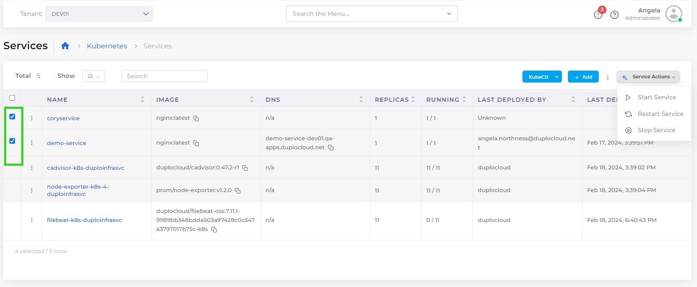
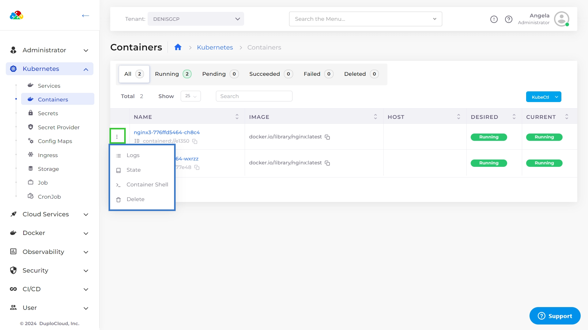

# GKE Containers and Services


For an end-to-end example of creating an GKE Service, see this [tutorial](../../quick-start/).


## Creating a nholuongut GKE Service

1. In the nholuongut Portal, navigate to **Kubernetes** -> **Services**.&#x20;
2. Click **Add**. The **Basic Options** section of the **Add Service** page displays.
3. In the **Service Name** field, give the Service a name (without spaces).&#x20;
4. From the **Cloud** list box, select **Google**.&#x20;
5. From the **Platform** list box, select **GKE Linux**.&#x20;
6. In the **Docker Image** field, enter the Docker image.&#x20;
7. Optionally, enter any allocation tags in the **Allocation Tag** field.&#x20;
8. From the **Replica Strategy** list box, select a replication strategy. Refer to the informational ToolTip (  ) for more information.
9. Specify the number of replicas in the **Replicas** field (for Static replica strategy). The number of replicas you define must be less than or equal to the number of Hosts in the fleet.
10. In the **Replica Placement** list box (for Static or Horizontal Pod Autoscaler replication strategies) select **First Available**, **Place on Different Hosts**, **Spread Across Zones**, or **Different Hosts and Spread Across Zones**. Refer to the informational ToolTip (  ) for more information.
11. Optionally, enter variables in the **Environmental Variables** field.&#x20;
12. In the **Force StatefulSets** list box, select **Yes** or **No** (for Static or Horizontal Pod Autoscaler replication strategies).
13. Optionally, select **Tolerate spot instances** (for Static or Horizontal Pod Autoscaler replication strategies)

<figure><figcaption>
The <strong>Add Service, Basic Options</strong> page
</figcaption></figure>

14. Click **Next.** The **Add Service, Advanced Options** page displays.
15. Configure advanced options as needed. For example, you can implement [Kubernetes Lifecycle Hooks](../../../kubernetes-overview/kubernetes-lifecycle-hooks.md) in the **Other Container Config** field (optional).&#x20;
16. Click **Create**. The Service is created.&#x20;

## Viewing Services 

1. From the nholuongut Portal, navigate to **Kubernetes** -> **Services**. Select the Service from the **NAME** column. The Service details page displays.

<figure><figcaption>
The <strong>Service</strong> details page
</figcaption></figure>

## Starting, Stopping, and Restarting Multiple nholuongut Services 

Using the Services page, you can start, stop, and restart multiple services simultaneously.

1. In the nholuongut Portal, navigate to **Kubernetes** -> **Services**.&#x20;
2. Use the checkbox column to select multiple services you want to start or stop at once.
3. From the **Service Actions** menu, select **Start Service**, **Stop Service**, or **Restart Service**. The selected Services are started, stopped, or restarted as you specified.

<figure><figcaption></figcaption></figure>

## Managing Kubernetes Containers

In the nholuongut Portal, you can display and manage the containers you have defined.

1. Select the Tenant from the **Tenan**t list box in the upper left.
2. Navigate to **Kubernetes** -> **Containers.**
3. Select the Options Menu (  ) in each container row to display **Logs**, **State**, **Container Shell**, **Host Shell,** and **Delete** options.&#x20;

<table><thead><tr><th width="374">Option</th><th>Functionality</th></tr></thead><tbody><tr><td><strong>Logs</strong></td><td>Displays container logs.</td></tr><tr><td><strong>State</strong></td><td>Displays container state configuration, in YAML code, in a separate window.</td></tr><tr><td><strong>Container Shell</strong></td><td>Accesses the Container Shell. To access the <strong>Container Shell</strong> option, you must first set up <a href="../../prerequisites/shell-access-for-docker.md">Shell access for Docker</a>.</td></tr><tr><td><strong>Host Shell</strong></td><td>Accesses the Host Shell.</td></tr><tr><td><strong>Delete</strong></td><td>Deletes the container.</td></tr></tbody></table>

<figure><figcaption>
The <strong>Kubernetes Containers</strong> page with the menu options highlighted.
</figcaption></figure>

