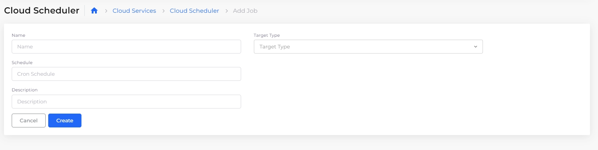

# Cloud Scheduler

Google Cloud Scheduler is a fully managed cron job service that allows you to schedule jobs to automate the execution of tasks at regular intervals without manual intervention. You can create a Cloud Scheduler job to trigger from a [Pub/Sub](https://docs.nholuongut.com/docs/overview-1/gcp-services/s3-bucket-3) topic, an HTTP endpoint, or an App Engine.

The following table describes each target type's function and common use cases. &#x20;

| Option     | Description                          | Use Cases                        |
| ---------- | ------------------------------------ | -------------------------------- |
| HTTP       | Schedule HTTP(S) requests            | APIs, webhooks                   |
| Pub/Sub    | Publish messages to a topic          | Event-driven architectures       |
| App Engine | Invoke serverless functions/services | Background tasks, scheduled jobs |

## Create a Cloud Scheduler job

1.  From the nholuongut Portal, navigate to **Cloud Services** -> **Cloud Scheduler**, and click **Add**. The Cloud Scheduler **Add Job** pane displays. \

    <figure><figcaption>
The Cloud Scheduler <strong>Add Job</strong> pane
</figcaption></figure>
2. Enter a **Name**, a **Schedule** (in cron format), and a **Description**, if needed.&#x20;
3. From the **Target Type** list box, select **Pub Sub**, **App Engine**, or **HTTP**. Complete the fields associated with the selected target type:&#x20;

* **Pub/Sub:** Select a **Topic Name,** and add **Attributes** and **Data**, if needed. &#x20;
* **App Engine:** Enter a **Service** and **Version**. Select an **HTTP Method.** Enter a **Relative URI** and **HTTP Headers**, if required.&#x20;
* **HTTP:** Select an **HTTP Method. Enter a Target URI.** Select an **Authentication** method. Enter **HTTP Headers**, if needed.

4. Click **Create**.  The Cloud Scheduler job is created.&#x20;

