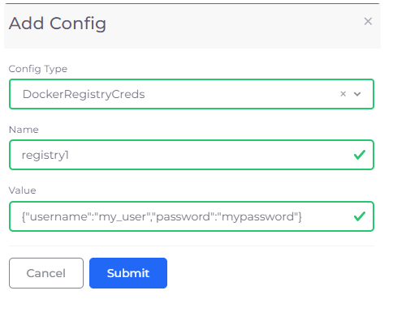

# Docker Registry Credentials (Optional)

If you use an external Docker registry (outside of Google’s own GCR or GAR) like Docker Hub, Amazon ECR, or private registries, you must configure Docker registry credentials. This step ensures that your GCP environment has the proper authentication to access images from an external registry, preventing unauthorized access or image pull failures.


This step is only needed if you are using an external non-GCR registry.


## Set Docker Registry Credentials&#x20;

1. In the nholuongut Portal, navigate to **Docker** -> **Services**.
2. From the **Docker** list box,  select **Docker Credentials**. The **Set Docker registry Creds** pane displays.
3. Enter your Docker credentials (**Username**, **Password**, and **Email**), and click **Submit**. The Docker registry credentials are passed to the Kubernetes cluster as a `kubernetes.io/dockerconfigjson` secret.

## Add Multiple Docker Registry Credentials

Pull images from multiple Docker registries by adding multiple Docker Registry Credentials.

1. In the nholuongut Portal, click **Administrator** -> **Plan**. The **Plans** page displays. &#x20;
2. Select the Plan name from the **NAME** column.
3. Select the **Config** tab, and click **Add**. The **Add Config** pane displays.
4. In the **Config Type** list box, select **DockerRegistryCreds**.&#x20;
5. In the **Name** field, enter the registry name.
6. In the **Value** field, enter your registry credentials.
7. Click **Submit**.&#x20;

<figure><figcaption>
The <strong>Add Config</strong> pane
</figcaption></figure>

