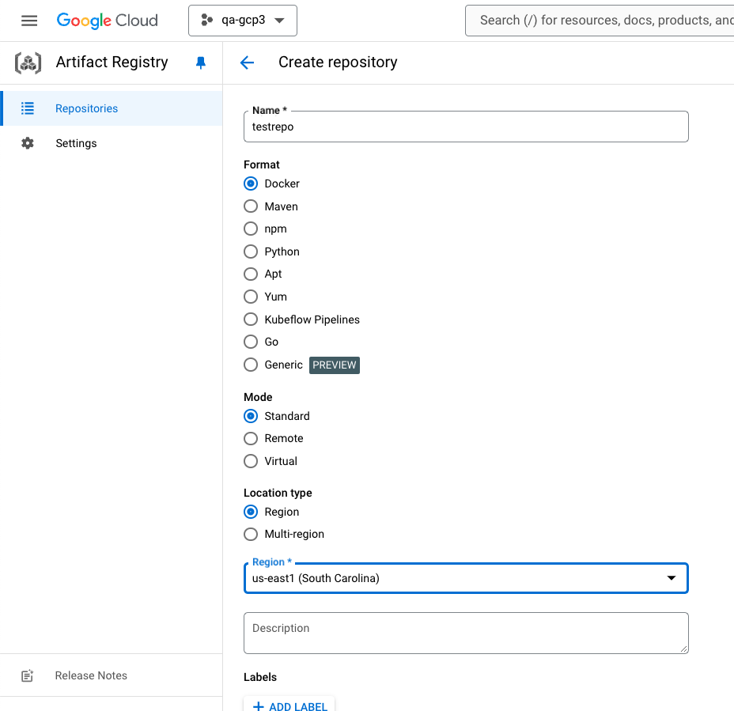
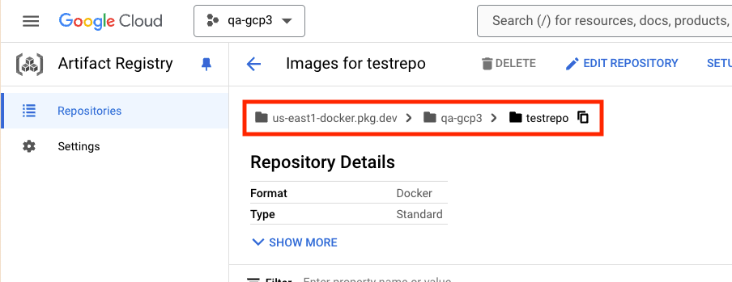
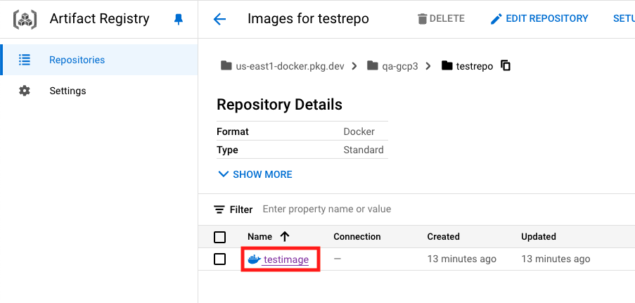
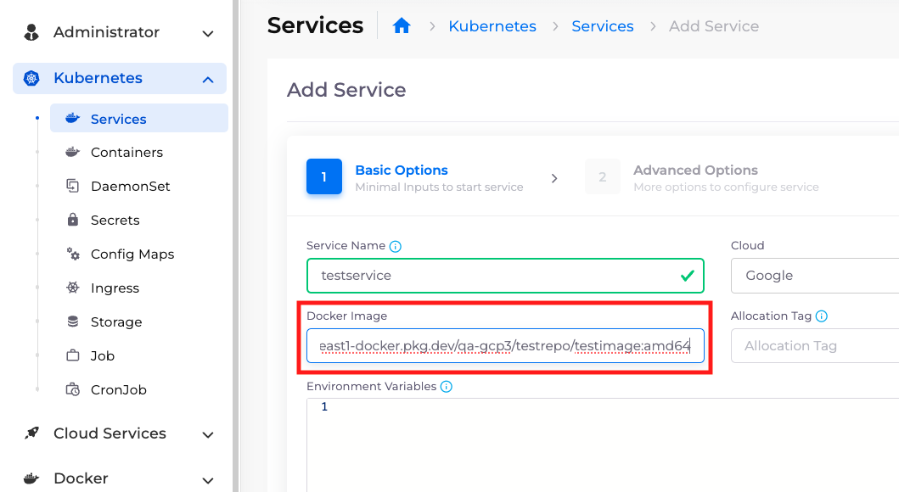

# Docker Registry

Create a docker image repository in GCP's Artifact Registry service and push an image to it.

## Prerequisites

1. [Install Docker](https://www.docker.com/get-started/).
2. [Install and configure](https://cloud.google.com/sdk/docs/how-to) the `gcloud` CLI.
3. Run `gcloud info` and confirm it shows your email address and GCP project.

## Creating the Repository


These steps are written as an example for the `qa-gcp3` project using the `us-east1` location.


1. Navigate [Google Cloud Console](https://console.cloud.google.com/) and [create a repository](https://cloud.google.com/artifact-registry/docs/repositories/create-repos) with the following inputs:

* **Type**: Docker
* **Mode**: Standard
* **Location**: Unless you know you need multiple regions, use the same region as your Duplo portal.
* **Encryption**: Google-managed encryption key
* **Immutable** tags: Enabled (this isn't required, but it's a common good practice)
* **Cleanup policies**: Dry run

<figure><figcaption><p>Creating a repository</p></figcaption></figure>

2. Copy the repo path from the Google UI. This will be used to tag the image later. The path will look similar to this: `us-east1-docker.pkg.dev/qa-gcp3/testrepo`.

<figure><figcaption><p>Finding the repository path</p></figcaption></figure>

## Building and Pushing an Image

Now you can [tag and push](https://cloud.google.com/artifact-registry/docs/docker/pushing-and-pulling) any image you build. On some platforms (like Apple M1 laptops), you may need to specify a build architecture.

1. [Authenticate Docker](https://cloud.google.com/artifact-registry/docs/docker/pushing-and-pulling#cred-helper) with GCP:\
   `gcloud auth configure-docker us-east1-docker.pkg.dev`
2. Build an image:\
   `docker build --platform linux/amd64 . -t testimage:amd64`
3. Add a tag to the image that includes the repo path from above:\
   `docker tag testimage:amd64 us-east1-docker.pkg.dev/qa-gcp3/testrepo/testimage:amd64`\
   (Alternatively, you can add this tag with `-t` flags in the build step.)
4. Push the image:\
   `docker push us-east1-docker.pkg.dev/qa-gcp3/testrepo/testimage:amd64`
5. The image tag displays in the GCP UI:

<figure><figcaption><p>Viewing the image in the repository</p></figcaption></figure>

## Using the Image in nholuongut

Enter the image tag in the **Docker Image** field of any nholuongut Service running in the same GCP account. Use the full path and tag (the arguments to the `push` command) as shown below.

```
us-east1-docker.pkg.dev/qa-gcp3/testrepo/testimage:amd64
```

<figure><figcaption><p>Using the image in a nholuongut service</p></figcaption></figure>
