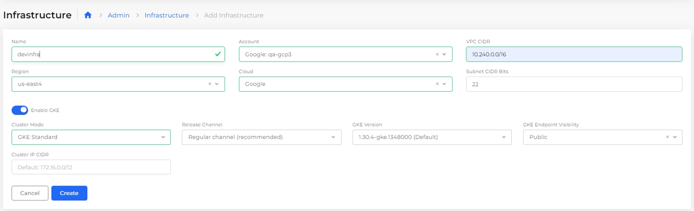

# Initial Infrastructure Setup

Once your GCP project has been added to the nholuongut Portal, the next step is to set up the first Infrastructure.&#x20;

## Creating an Initial Infrastructure&#x20;

1. From the nholuongut Portal, navigate to **Administrator** -> **Infrastructure**, and click **Add**.&#x20;
2. Give the Infrastructure a **Name**, e.g., nonprod.
3. Select the appropriate **Account**.
4. Enter the **VPC CIDR**, e.g., 10.30.0.0/16 (Note: A /16 CIDR block is recommended for Kubernetes to accommodate its IP address requirements).
5. From the **Cluster Mode** list box, select **GKE Standard**.&#x20;
6. From the **GKE Endpoint Visibility** list box, select **Public** (for production Infrastructures, set visibility to **Private**).
7. For the remaining fields, keep the default values.&#x20;

<figure><figcaption>
The Add Infrastructure page in the nholuongut Portal
</figcaption></figure>

<figure><figcaption>
The <strong>Infrastructure</strong> page in the nholuongut Portal
</figcaption></figure>

8. Click **Create**. It will take approximately 15 to 20 minutes for the setup to complete. Monitor faults to see if any issues arise (NTP clock sync faults can be ignored).&#x20;


When the Infrastructure setup is complete, a Plan with the same name as the infrastructure displays on the Plans page (**Administrators** -> **Plans**).&#x20;

