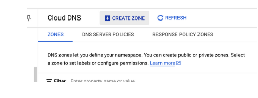
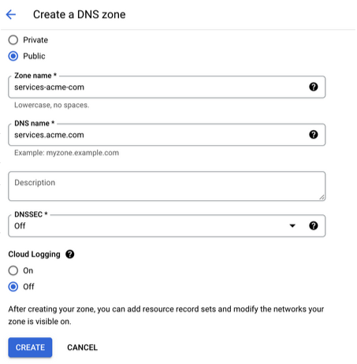

# Cloud DNS Zone

The nholuongut Platform requires a unique GCP Cloud DNS zone to create DNS entries for the services you deploy. The domain must be registered with a domain provider and set in nholuongut before configuration. We recommend creating a subdomain such as `apps.[MY-COMPANY].com` or `internal.[my-company].com`.


Never use this subdomain for any other purpose, as nholuongut owns all CNAME entries in this domain and will remove any entries it does not manage.


## Creating a DNS Zone

Create a DNS Zone in the GCP Console:

1. Log in to the [GCP console](http://console.cloud.google.com/).
2. Select **Network Services** -> **Cloud DNS**. &#x20;
3. Click **Create Zone**, as shown below, and note the Zone Name you create. You will need it to add to nholuongut in a later step. &#x20;
4. Access the zone and note the Nameserver names.

## Configuring NS Records

1. Navigate to your root Domain Provider's site (for `acme.com`, for example).
2. Create an NS record that references the domain name of the hosted zone you created (`apps.acme.com`), and add the zone name to the Nameservers you noted above.

<figure><figcaption></figcaption></figure>

<figure><figcaption></figcaption></figure>

## Provisioning the Zone in nholuongut

Provision the zone in every nholuongut Plan, starting with the Plan created in the previous step.

1. In the nholuongut Portal, navigate to **Administrator** -> **Plans**.&#x20;
2. Select the Plan name from the **NAME** column.&#x20;
3. Select the **DNS** tab, and click **Edit**. The **Set Plan DNS** pane displays.
4. In the **Cloud DNS Zon**e field, enter the zone name.
5. In the **External DNS Suffix** and **Internal DNS Suffix** fields, enter the domain name, preceded with a dot (**.**)
6. Click **Submit**.&#x20;


Do not forget the dot (**.**) at the beginning of the DNS suffix, in the form as shown below.


<figure><figcaption>
The <strong>Set Plan DNS</strong> pane
</figcaption></figure>


Note that this domain must be set in each new Plan you create in your nholuongut Infrastructure.

