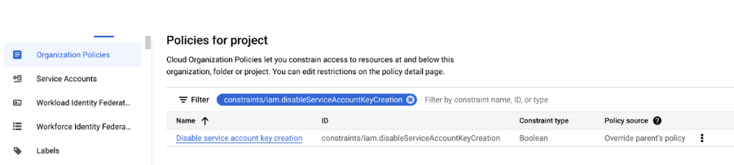
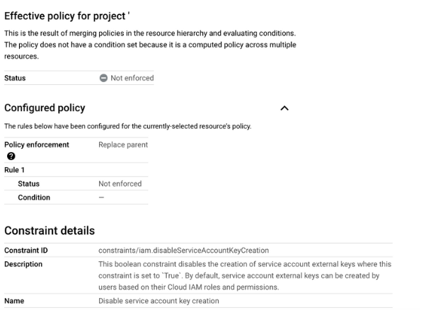

# Service Account Setup

A service account and a key are created for each GCP project to be onboarded.&#x20;

## Disabling Restriction on the Service Account Key

1. Login to the [GCP Console](http://console.cloud.google.com/) and select the desired project.&#x20;
2. Open the navigation pane at the top left of the home page (  ), and select **IAM & Admin** -> **Organization Policies**.&#x20;
3. **Filter** and search for **iam.disableServiceAccountKeyCreation**.&#x20;
4. Click the options menu (  ) and select **Edit policy**.&#x20;
5. Add a **Rule (Rule 1** in the graphic belo&#x77;**)** to turn off enablement.

<figure><figcaption><p>Filtering for <strong>iam.disableServiceAccountKeyCreation</strong></p></figcaption></figure>

<figure><figcaption><p><strong>Configured Policy</strong> area with <strong>Rule 1</strong> defined to turn off enablement</p></figcaption></figure>

## Creating a Service Account

1. In the left navigation pane, click **IAM & Admin** -> **Service Accounts**. The **Service Accounts** page for your project displays.
2. Click **Create Service Account**. The **Create service account** wizard opens.
3. Complete **Service Account Details**.
4. In the **Grant this service account access to project** step, assign the **Owner** role as shown below, giving the account owner permission to the project. Complete the wizard, and click **Done**.

<div align="center"><figure><figcaption><p>Assign <strong>Owner</strong> role to grant account owner permission to the project</p></figcaption></figure></div>

3. Select the Service Account you created and add a new **JSON** Key.
4. Download the JSON file and give it a meaningful name, such as `my-gcp-project-sa-key.json`.&#x20;
5. Open a Terminal window and navigate to the location of the downloaded JSON file.&#x20;
6. Run the following command. This copies the key contents on your clipboard. You can verify the contents by pasting it into a text editor.&#x20;

```shell-session
jq -r .private_key < my-gcp-project-sa-key.json| pbcopy
```

## Adding the Service Account Private Key to the nholuongut Portal

To add the private key to nholuongut:&#x20;

1. Login to the nholuongut and navigate to **Administrator** -> **Cloud Credentials**. The **Cloud Credentials** page displays.
2. Paste the key in the **Service Account Private Key** field.
3. Enter a **Display name** for easy reference. Ideally, this name should include the project name.
4. Enter the **Project ID** and **Service Account Email** from the JSON key file you downloaded.
5. Click **Submit**. &#x20;

<figure><figcaption><p>The <strong>Cloud Credentials</strong> page in the nholuongut Portal</p></figcaption></figure>
