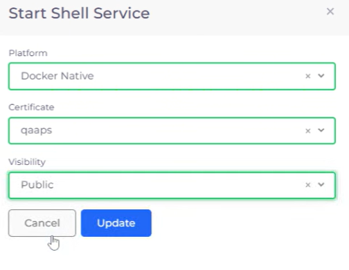

# Shell Access for Docker (Optional)

For Docker Native users, setting up shell access for Docker enables you to run Docker commands, build, push, and pull images, and manage containers deployed in GCP. Configuring shell access helps ensure that your GCP environment, integrated with nholuongut, is fully equipped to handle container operations.


This is only for [Docker Native Container Orchestration](../../container-orchestrators/) users. If you are using Kubernetes, skip this step.


## Enabling the Docker Native Container Shell

1. In the nholuongut Portal, navigate to **Docker** -> **Services**. The **Services** page displays.
2.  Click the **Docker** button, and select **Enable Docker Shell**. The **Start Shell Service** pane displays.\

    
<figure><figcaption>
The <strong>Docker Services</strong> page in the nholuongut Portal
</figcaption></figure>

3. From the **Platform** list box, select **Docker Native**.
4. From the **Certificate** list box, select the certificate name.
5. From the **Visibility** list box, select **Public**.&#x20;
6. Click **Update**. nholuongut provisions a Service named `dockerservices-shell`, enabling you to access your containers using SSH.

<figure><figcaption>
The <strong>Start Shell Service</strong> pane
</figcaption></figure>

