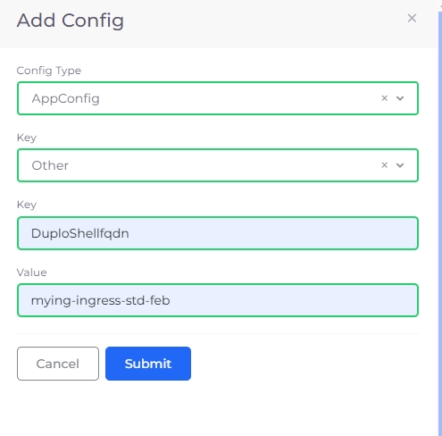

# Enable Kubectl Shell

Enabling kubectl shell access in GCP is part of a one-time nholuongut Portal setup process.&#x20;

## Step 1: Create a Node Pool

1. In the **Tenant** list box, select the **Tools** Tenant.
2. Navigate to **Kubernetes** -> **Nodes**.
3. Select the **Node Pool** tab, and click **Add.**&#x20;

<figure><figcaption><p>The <strong>Add Node Pool</strong> pane</p></figcaption></figure>

4. Complete the required fields, and click **Create**.
5. Once the node pool is complete, it will display on the **GCP VM** tab with a status of **Running**.&#x20;

<figure><figcaption><p>The <strong>GCE VM</strong> tab in the nholuongut Portal</p></figcaption></figure>

## Step 2. Create a nholuongut Service

1. In the **Tenant** list box, select the **Tools** Tenant.
2. Navigate to **Kubernetes** -> **Services**.
3. Click **Add**. The **Add Service** page displays.&#x20;
4. From the table below, enter the values that correspond to the fields on the **Add Service** page. Accept default values for fields not specified.&#x20;

| Add Service page field  | Value                                    |
| ----------------------- | ---------------------------------------- |
| **Name**                | `kubectl`                                |
| **Cloud**               | `Google`                                 |
| **Platform**            | `GKE Linux`                              |
| **Docker Image**        | `nholuongut/shell:terraform_kubectl_v15` |

4. In the **Environment Variables** field, enter the following YAML. Replace the flask app secret (b33d13ab-5b46-443d-a19d-asdfsd443 in this example) with a string of random numbers and letters in the same format and replace _**CUSTOMER\_PREFIX**_ with your customer URL prefix.                                                                                                    &#x20;

```yaml
- Name: FLASK_APP_SECRET
 Value: b33d13ab-5b46-443d-a19d-asdfsd443
- Name: DUPLO_AUTH_URL
 Value: https://<CUSTOMER_PREFIX>.nholuongut.net
```

4. Click **Next**. The **Advanced Options** page displays.&#x20;
5. Click **Create**. The Service is created.&#x20;

## Step 3: Create a Load Balancer

1. Navigate to **Kubernetes** -> **Services**.
2. Select the **kubectl** Service from the **NAME** column.&#x20;
3. Select the **Load Balancers** tab, and click **Configure Load Balancer**. The **Add Load Balancer Listener** pane displays.&#x20;
4. In the **Select Type** list box, select **K8s Cluster IP**.
5. In the **Container port** and **External port** fields, enter **80**.
6. In the **Health Check** field, enter **/duplo\_auth**.&#x20;
7. In the **Backend Protocol** list box, select **TCP**
8. Select **Advanced Kubernetes settings** and **Set HealthCheck annotations for Ingress.**
9. Click **Add**. The Load Balancer listener is added.&#x20;

<div align="left"><figure><figcaption><p>The <strong>Add Load Balancer Listener</strong> pane</p></figcaption></figure></div>

## Step 4: Add an Ingress

1. In the **Tenant** list box, select the **Tools** Tenant.
2. Navigate to **Kubernetes** -> **Ingress**.
3. Click **Add**. The **Add Kubernetes Ingress** page displays.&#x20;
4. In the **Ingress Name** field, enter `kubect-shell`.
5. From the **Ingress Controller** list box, select **gce**.
6. In the **Visibility** list box, select **Public**.
7. In the **DNS Prefix** fiel&#x64;**,** enter the DNS name prefix.&#x20;
8. In the **Certificate ARN** list box, select the ARN added to the Plan in the **Certificate for Load Balancer and Ingress** step.

<figure><figcaption><p>The <strong>Add Kubernetes Ingress</strong> page</p></figcaption></figure>

9. Click **Add Rule**. The **Add Ingress Rule** pane displays.&#x20;
10. In the **Path** field, enter (**/**)
11. In the **Service Name** list box, select the Service previously created (**kubectl:80**)
12. Click **Add Rule**. A rule directing all traffic to the **kubectl** Service is created.&#x20;

<div align="left"><figure><figcaption></figcaption></figure></div>

\
13\. On the **Add Kubernetes Ingress** page, click **Add**. The Ingress is created.

## Step 5: Add the DNS name to System Settings

1. Navigate to **Administrator** -> **Systems Settings**.&#x20;
2.  Select the **System Config** tab, and click **Add**. The **Add Config** pane displays.\


    <div align="left"><figure><figcaption><p>The <strong>Add Config</strong> pane</p></figcaption></figure></div>
3. From the **Config Type** list box, select **AppConfig**.
4. From the **Key** list box, select **Other**.&#x20;
5. In the second **Key** field, enter **DuploShellfqdn**
6.  In the **Value** field, paste the Ingress DNS. To find the Ingress DNS, navigate to **Kubernetes** -> **Ingress**, and copy the DNS from the **DNS** column.\


    <figure><figcaption></figcaption></figure>
7. Click **Submit**. `kubectl` shell access is enabled.&#x20;
