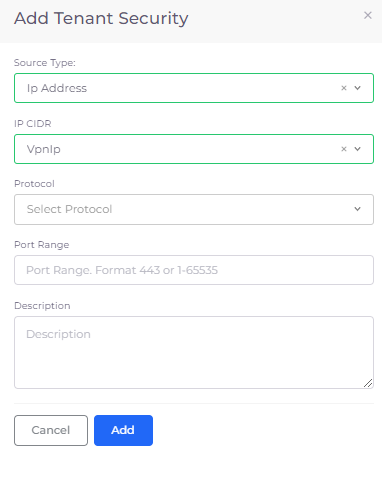

# VPN Setup

nholuongut integrates with OpenVPN by provisioning VPNs for users added through the nholuongut Portal. The OpenVPN setup involves a two-step process: accepting the OpenVPN agreement in the GCP Marketplace, and Provisioning a VPN in the nholuongut Portal.

## Accepting OpenVPN

Accept the OpenVPN Free Tier (Bring Your Own License) agreement in the GCP marketplace:&#x20;

1. Log into your GCP account.
2. In the Google Cloud Console, navigate to the [Marketplace](https://console.cloud.google.com/marketplace).
3. Search for **OpenVPN** in the Marketplace.
4. Select the product (OpenVPN Free Tier) and accept the agreement.

## Provisioning a VPN

1. In the nholuongut Portal, navigate to **Administrator** -> **System Settings**.
2. Select the **VPN** tab.
3. Click **Provision VPN.** Behind the scenes, nholuongut launches a cloud formation script to provision the OpenVPN. OpenVPN is ready to use.  &#x20;


You can find the OpenVPN admin password in the cloud formation stack in your GCP console.


## **Optional VPN Configurations**

### **Provisioning a VPN While Creating a User**

1. In the nholuongut Portal, navigate to **Administrator** -> **Users**.
2. Click **Add**. The **Create User** pane displays.
3. Enter the username in the **Username** field.
4. In the **Roles** field, select the appropriate role(s) for the user.
5. Select **Provision VPN**.
6. Click **Submit**.

<figure><figcaption>
The <strong>Create User</strong> pane
</figcaption></figure>

### Deleting VPN Access for a User

See [Deleting a VPN user](../../access-control/add-and-delete-vpn-access-for-users.md#deleting-a-vpn-user). To delete VPN access, you must have administrator privileges.&#x20;

### Opening a VPN Port

By default, users connected to a VPN can SSH or RDP into virtual machines (VMs). Users can also connect to internal Load Balancers and application endpoints. However, you must open a VPN port to connect to other Services, such as databases and ElastiCach.&#x20;

1. In the nholuongut Portal, navigate to **Administrator** -> **Tenants**.
2. Select the Tenant in the **NAME** column.
3. Select the **Security** tab.
4.  Click **Add**. The **Add Tenant Security** pane displays.\

    
<figure><figcaption>
The <strong>Add Tenant Security</strong> pane
</figcaption></figure>

5. In the **Source Type** field, select **Ip Address**.&#x20;
6. In the **IP CIDR** field, enter the VPN IP address range in CIDR notation, for example, `10.0.0.0/24` or `192.168.1.0/24`.
7. In the **Protocol** list box, select the protocol you wish to allow through the VPN port.
8. Enter the range in the **Port Range** field, specify the port or range of ports that need to be opened.
9. Enter a brief description of the security rule being added in the **Description** field.
10. Click **Add**. The VPN port is open.
