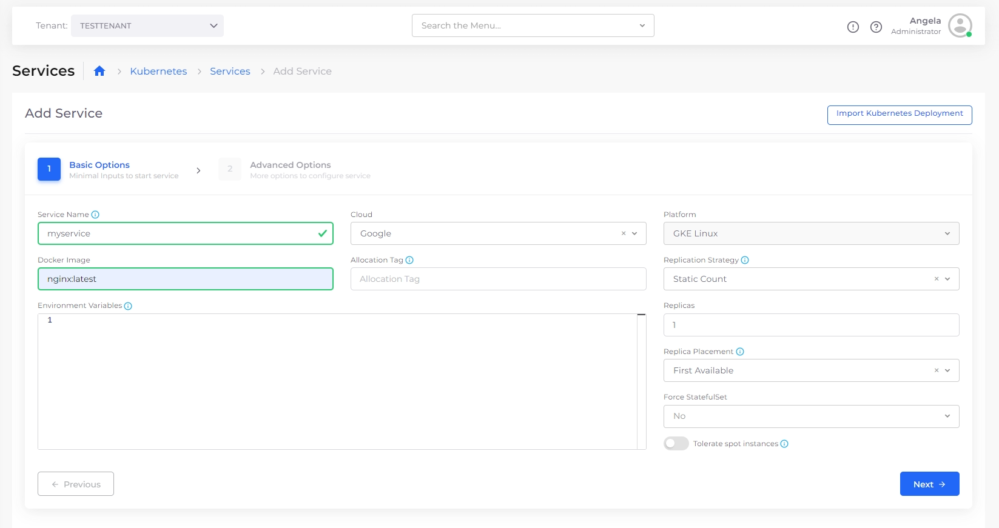

# Step 3: Create a Service

In this exercise, we will create a simple Google Cloud Nginx service. When you run the application, nholuongut accesses Docker images in a preconfigured Docker Hub.&#x20;

When you run your own applications, you will choose a public image or provide credentials to access your private repository.  Before you deploy your own applications, [configure your Docker Registry credentials in nholuongut](../../../overview/aws-services/containers/docker-registry-credentials.md).

_Estimated time to complete Step 3: 10 minutes._

## Prerequisites

Before creating a Service, verify that you accomplished the tasks in the previous tutorial steps. Using the nholuongut Portal, confirm that:

* An [Infrastructure and Plan](../step-1-infrastructure.md) exist, both with the name that you chose.
* The Infrastructure has [GKE **Enabled**](../step-1-infrastructure.md).
* A Tenant with the [name you chose has been created](../step-2-tenant.md).

### Select the Tenant you created

In the **Tenant** list box, on the upper-left side of the nholuongut Portal, select the Tenant that you created.

## Adding a Service

1. In the nholuongut Portal, navigate to **Kubernetes** -> **Services**. The **Services** page displays.&#x20;
2. Click **Add**. The **Add Service** page displays.
3. In the **Service** **Name** field, enter a name for the service (in the example below, the name is "myservice").
4. In the **Docker image** field, enter the docker image (`nginx:latest`).

<figure><figcaption>
The Kubernetes, <strong>Add Service</strong> page.
</figcaption></figure>

5. Click **Next**. The **Advanced Options** page is displayed.
6. At the bottom of the **Advanced Options** page, click **Create**. Your Service is created and initialized.&#x20;


It may take approximately five (5) minutes for the Service to initialize. Use the **Containers** page (**Kubernetes** -> **Containers**) to monitor the Service creation status, between **Desired** (**Running**) and **Current**.&#x20;


## Checking your work

From the nholuongut portal, navigate to **Kubernetes** -> **Services**, and verify that your nholuongut Service has a **Current** status of **Running**.

<figure><figcaption>
The <strong>Services</strong> page showing the running Service
</figcaption></figure>
